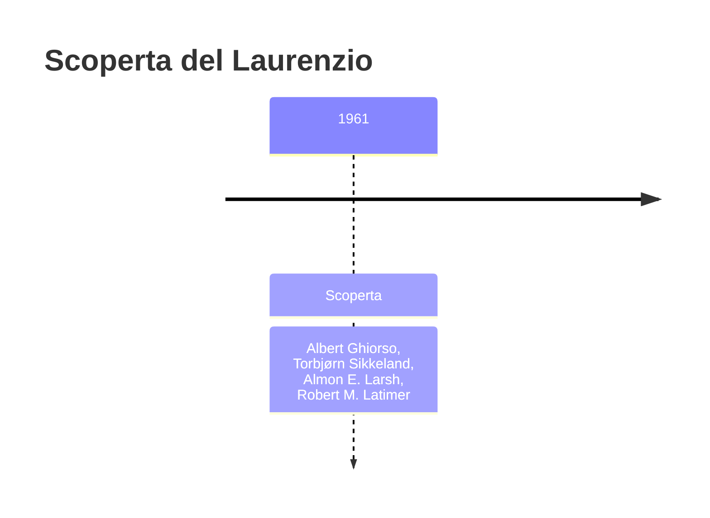
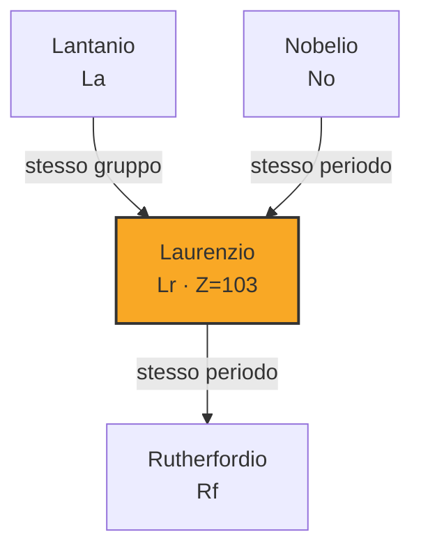
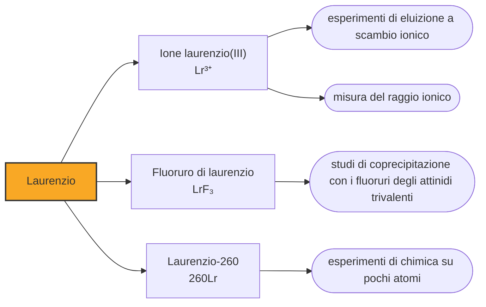

# Laurenzio (Lr)

> [!abstract] 103° elemento scoperto — 1961
> Il 14 febbraio 1961 Berkeley annunciò l'elemento 103 e sbagliò a dire quale isotopo avesse fatto. L'elemento è rimasto, l'isotopo no, e la scoperta è sopravvissuta all'errore.

Il laurenzio occupa l'ultima casella degli attinidi, e da lì guarda un confine che non è mai stato tracciato con sicurezza. È l'elemento con cui finisce una delle due file staccate in fondo alla tavola periodica, ed è anche quello su cui si discute se debba stare lì oppure risalire nel corpo principale, accanto allo scandio e all'ittrio.

## Cronologia della scoperta

> [!info] Nota sulla cronologia
> Rivendicato da Berkeley il 14 febbraio 1961 da Ghiorso, Sikkeland, Larsh e Latimer — la cronologia di riferimento li comprimeva in «Ghiorso et al.» — con l'isotopo indicato come laurenzio-257, attribuzione poi corretta in laurenzio-258. Dubna raggiunse l'elemento nel 1965 e ne dimostrò la chimica da attinide; nel 1992 il Transfermium Working Group ha assegnato a Berkeley e Dubna un credito condiviso. Il simbolo è passato da Lw a Lr nel 1963.

## Storia della scoperta

L'esperimento del 1961 usò un bersaglio di tre milligrammi di californio — una quantità enorme per gli standard di questa parte della tavola — composto da tre isotopi diversi, bombardato con ioni di boro-10 e boro-11 accelerati dall'acceleratore lineare per ioni pesanti di Berkeley. Gli atomi prodotti rinculavano su un nastro metallico che li portava davanti a una fila di rivelatori, un pezzo di nastro alla volta.

L'annuncio uscì il 14 febbraio 1961 a firma di Albert Ghiorso, Torbjørn Sikkeland, Almon Larsh e Robert Latimer. Il gruppo dichiarava di aver prodotto il laurenzio-257, riconosciuto da particelle alfa da 8,6 megaelettronvolt con un'emivita di otto secondi, e propose per l'elemento il nome del fondatore del laboratorio, Ernest Lawrence, morto nel 1958.

Il lavoro successivo dimostrò che quell'isotopo non poteva essere il laurenzio-257, perché il laurenzio-257 non si comporta così: l'attività osservata apparteneva quasi certamente al laurenzio-258. È una distinzione che sembra minima e non lo è, perché in questa parte della tavola l'identità di un elemento si stabilisce proprio riconoscendo l'isotopo e la sua catena di decadimento. La scoperta ha retto, l'identificazione no.

A Dubna il gruppo di Georgij Flërov arrivò all'elemento 103 nel 1965, per una strada diversa: americio-243 bombardato con ioni di ossigeno-18, che produce il laurenzio-256. I sovietici contestarono i dati americani, proposero per l'elemento il nome rutherfordium — che più tardi sarebbe finito sulla casella successiva — e negli anni seguenti condussero gli esperimenti di chimica che dimostrarono che il 103 è davvero l'ultimo degli attinidi.

Nel 1992 il Transfermium Working Group assegnò il credito della scoperta a entrambi i laboratori, riconoscendo che nessuna delle due rivendicazioni iniziali era conclusiva da sola e che la certezza era arrivata solo con gli esperimenti di Berkeley del 1971. Il nome, ormai in uso da trent'anni, restò quello proposto per primo; il simbolo invece cambiò, da Lw a Lr, nel 1963.

Resta invece aperta la domanda su dove vada messo. La tavola periodica che si trova nelle aule chiude gli attinidi con il laurenzio e mette il lutezio in fondo ai lantanidi, ma molti chimici sostengono che laurenzio e lutezio appartengano al gruppo 3, sotto lo scandio e l'ittrio, e che la fila separata debba finire una casella prima. La questione riguarda il disegno stesso della tavola, non un dettaglio di nomenclatura, e non è chiusa.

## Posizione nella tavola periodica

## Caratteristiche

In soluzione il laurenzio esiste soltanto come ione trivalente, e a differenza dei suoi vicini non si lascia portare né al +2 né a stati superiori: è l'unico stato di ossidazione che gli si conosca. Negli esperimenti di eluizione si comporta come gli altri attinidi trivalenti, con una particolarità: il suo raggio ionico, misurato in 88,1 picometri, è più grande di quanto l'andamento della serie facesse prevedere.

L'anomalia ha una spiegazione che riguarda la velocità degli elettroni. In un atomo così pesante gli elettroni più interni si muovono a una frazione notevole della velocità della luce, e la relatività cambia l'energia degli orbitali: nel laurenzio l'ultimo elettrone non va nell'orbitale d, come farebbe seguendo la regola che vale per il lutezio, ma in un orbitale p. La configurazione risulta [Rn] 5f14 7s2 7p1, ed è un caso raro di eccezione prevista dalla teoria prima di essere osservata.

Nel 2015 un gruppo giapponese è riuscito a misurare l'energia con cui il laurenzio perde il primo elettrone, lavorando su atomi singoli di laurenzio-256: 4,96 elettronvolt, il valore più basso fra tutti i lantanidi e tutti gli attinidi. Un elettrone così debolmente legato è esattamente ciò che ci si aspetta da un atomo con un guscio f completo e un solo elettrone sopra, ed è l'argomento sperimentale più forte a favore del laurenzio nel blocco d.

Si conoscono una quindicina di isotopi del laurenzio. Il più longevo è il laurenzio-266, che con circa undici ore di emivita è uno dei nuclidi più durevoli di questa regione della tavola, ma se ne producono pochissimi atomi; per la chimica si usa il laurenzio-260, che dura meno di tre minuti ma si ottiene in quantità sufficienti a fare un esperimento.

### Dati fisico-chimici

| Proprietà | Valore |
|---|---|
| Numero atomico | 103 |
| Massa atomica | 266,0 u |
| Categoria | Attinide |
| Gruppo | 3 |
| Periodo | 7 |
| Blocco | d |
| Configurazione elettronica | [Rn] 5f¹⁴ 7s² 7p¹ |
| Punto di fusione | 1626,9 °C |
| Punto di ebollizione | dato non disponibile |
| Densità | dato non disponibile |
| Stati di ossidazione | +3 |

## Struttura atomica

![[atomo-Laurenzio.svg]]

## Usi e presenza in natura

Del laurenzio non si è mai prodotta una quantità visibile e non se ne prevede alcun uso: serve unicamente agli esperimenti che lo riguardano. Il metallo non esiste, i composti si conoscono solo in soluzione e le proprietà fisiche tabulate sono calcoli.

Ma è uno degli elementi che più servono alla teoria. Il laurenzio è il punto in cui la relatività smette di essere una correzione e diventa la spiegazione principale del comportamento chimico, e ogni misura che gli si strappa — il raggio ionico, l'energia di ionizzazione, la resistenza a cambiare stato di ossidazione — mette alla prova i modelli che dovranno prevedere gli elementi ancora più pesanti, dove esperimenti come questi diventano quasi impossibili.

## Curiosità

Ernest Lawrence inventò il ciclotrone nel 1930, e con quella macchina cominciò la fabbricazione degli elementi: il tecnezio, il primo elemento artificiale, uscì da un pezzo del suo ciclotrone spedito a Palermo. Gli acceleratori che hanno prodotto tutti i transuranici discendono da quella invenzione, e l'elemento che porta il suo nome è stato fatto con uno di essi.

Il laurenzio è uno dei pochi elementi ad aver cambiato simbolo dopo il battesimo. Berkeley aveva scelto Lw, con la doppia v che in inglese si legge naturalmente, ma quella lettera non esiste nell'alfabeto latino classico e non compare in molte lingue: nel 1963 la IUPAC la sostituì con Lr, che è il simbolo in uso oggi. La stessa sorte era toccata al mendelevio, passato da Mv a Md sei anni prima.

## Nella cronologia

← Precedente: [[Nobelio]] (1958)
→ Successivo: [[Rutherfordio]] (1969)

Epoca: [[Era nucleare]] · Scopritori: [[Albert Ghiorso]], [[Torbjørn Sikkeland]], [[Almon E. Larsh]], [[Robert M. Latimer]]

## Fonti

- [Lawrencium](https://en.wikipedia.org/wiki/Lawrencium) — consultata il 09/09/2026
- [Lawrencium — Royal Society of Chemistry](https://periodic-table.rsc.org/element/103/lawrencium) — consultata il 09/09/2026
- [Group 3 element](https://en.wikipedia.org/wiki/Group_3_element) — consultata il 09/09/2026
