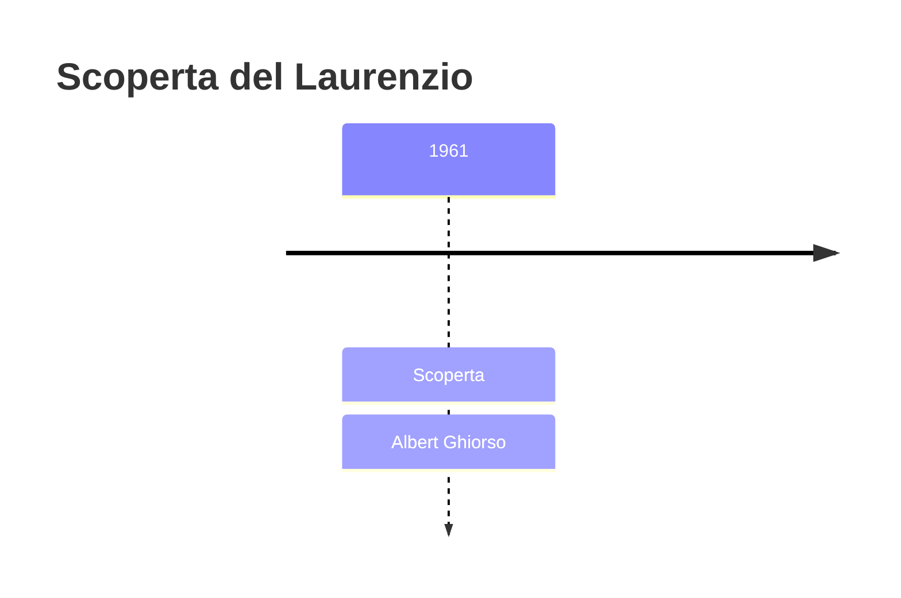
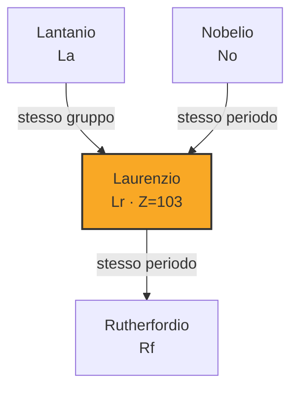

# Laurenzio (Lr)

> [!abstract] 103° elemento scoperto — 1961
> 

## Cronologia della scoperta

## Storia della scoperta

## Posizione nella tavola periodica

## Caratteristiche

### Dati fisico-chimici

| Proprietà | Valore |
|---|---|
| Numero atomico | 103 |
| Massa atomica | 266,0 u |
| Categoria | Attinide |
| Gruppo | 3 |
| Periodo | 7 |
| Blocco | d |
| Configurazione elettronica | [Rn] 5f¹⁴ 7s² 7p¹ |
| Punto di fusione | 1626,9 °C |
| Punto di ebollizione | dato non disponibile |
| Densità | dato non disponibile |
| Stati di ossidazione | — |

## Struttura atomica

![[atomo-Laurenzio.svg]]

## Usi e presenza in natura

## Nella cronologia

← Precedente: [[Nobelio]] (1958)
→ Successivo: [[Rutherfordio]] (1969)

Epoca: [[Era nucleare]] · Scopritore: [[Albert Ghiorso]]

## Fonti

