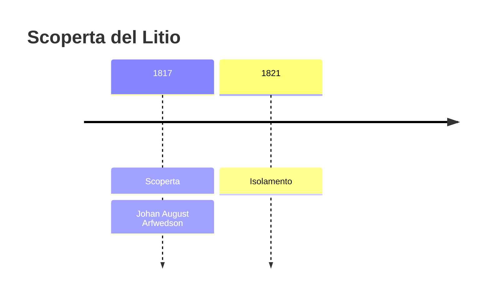
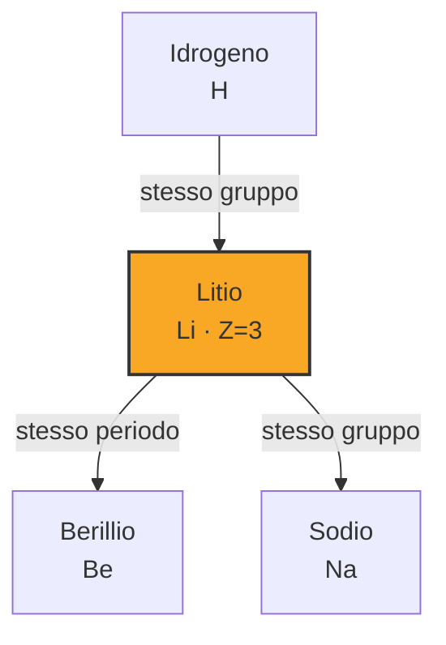
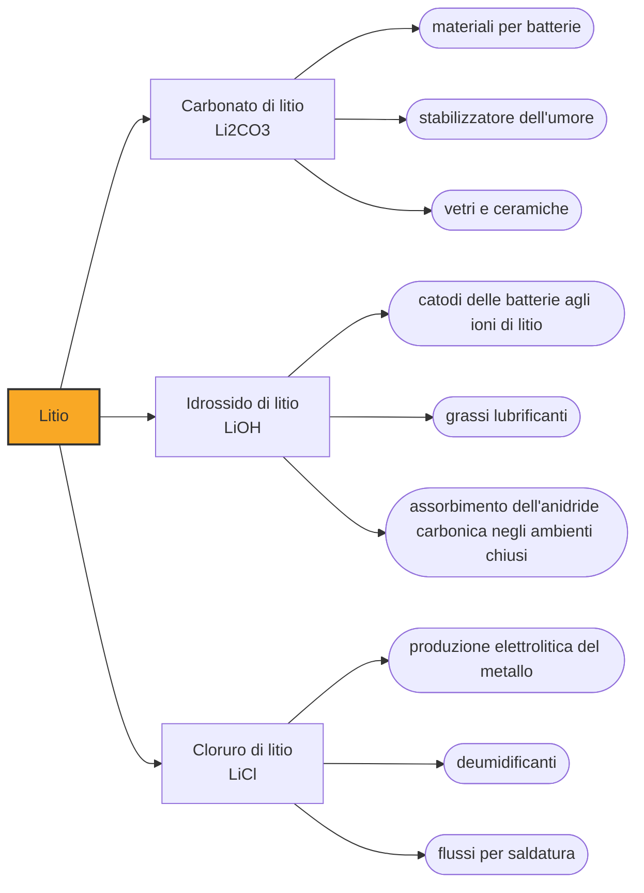

# Litio (Li)

> [!abstract] 51° elemento scoperto — 1817
> Una pietra grigia raccolta su un'isola svedese conteneva un alcali che non era né potassa né soda: le analisi di un venticinquenne senza stipendio aprirono la strada al terzo elemento della tavola.

Il litio è il metallo meno denso che esista: un blocchetto galleggia sull'acqua. Per un secolo e mezzo è rimasto una curiosità da laboratorio, buono per qualche vetro e qualche grasso lubrificante; oggi è il cuore delle batterie ricaricabili, e le sue miniere si contano fra le più corteggiate del pianeta.

## Cronologia della scoperta

> [!info] Nota sulla cronologia
> Isolato in forma metallica nel 1821 da William Thomas Brande.

## Storia della scoperta

Il minerale da cui parte tutto si chiama petalite, e fu individuato nel 1800 sull'isola di Utö, nell'arcipelago di Stoccolma, dal chimico e statista brasiliano José Bonifácio de Andrada e Silva. Era una roccia lucente e sfaldabile dall'aspetto poco memorabile, e passò quasi vent'anni negli armadi dei mineralogisti prima che qualcuno la analizzasse davvero.

Nel 1817 la petalite finì sul banco di Johan August Arfwedson, venticinque anni, che lavorava senza stipendio nel laboratorio privato di Jöns Jacob Berzelius a Stoccolma. Sommando i pesi di silice, allumina e ossidi che riusciva a separare, Arfwedson non arrivava mai al cento per cento del campione: mancava qualche punto percentuale, sempre lo stesso.

Quel residuo si comportava come un alcali, ma non era né potassa né soda: i suoi sali erano molto meno solubili, il carbonato precipitava dove quelli di sodio e potassio restavano in soluzione, e nessuna delle reazioni caratteristiche dei due alcali noti dava il risultato atteso. Arfwedson cercò e trovò lo stesso alcali anche in altri due minerali dello stesso giacimento, lo spodumene e la lepidolite.

Fu Berzelius a proporre il nome, dal greco lithos, «pietra». La scelta era un commento sui parenti già noti: il potassio veniva dalla cenere delle piante e il sodio era noto soprattutto per quanto ne contiene il sangue degli animali, mentre questo terzo alcali era stato trovato per la prima volta nel regno minerale, dentro una roccia.

Il metallo puro si fece attendere. Arfwedson non riuscì a ottenerlo, e l'elettrolisi che aveva liberato sodio e potassio, applicata ai sali di litio, restituiva quantità irrisorie. Nel 1821 William Thomas Brande, a Londra, elettrolizzò l'ossido di litio e ne ottenne quantità minime; solo nel 1855 Robert Bunsen e Augustus Matthiessen, elettrolizzando cloruro di litio fuso, ne produssero abbastanza da poterlo studiare.

Per più di un secolo il litio restò un elemento di nicchia: serviva a fare vetri e ceramiche resistenti agli sbalzi di temperatura e grassi lubrificanti per i motori aeronautici. La svolta arriva nel Novecento con la ricerca sugli accumulatori, che unisce due sue caratteristiche: il peso atomico più basso fra tutti i metalli e un potenziale di elettrodo elevato. È questa combinazione ad averlo reso il componente essenziale di elettrodi ed elettroliti delle batterie ricaricabili.

## Posizione nella tavola periodica

## Caratteristiche

Con 0,534 grammi per centimetro cubo il litio è il metallo meno denso e, in condizioni standard, l'elemento solido meno denso in assoluto. Come tutti gli alcalini va tenuto lontano dall'aria, sotto vuoto, in atmosfera inerte o immerso in cherosene purificato, perché all'aria umida si annerisce in fretta sotto una crosta di idrossido, nitruro e carbonato.

È il meno impetuoso dei metalli alcalini nella reazione con l'acqua, che libera idrogeno senza incendiarlo, ma è anche l'unico che aggredisce l'azoto dell'aria a temperatura ambiente, formando nitruro di litio. È uno degli effetti della relazione diagonale con il magnesio, l'elemento che gli sta in diagonale nella tavola e con cui condivide raggio ionico e comportamento chimico.

Nella pratica il litio esiste in un modo solo: cede l'unico elettrone di valenza e resta ione Li+, e lo stato negativo che pure gli è noto si ottiene soltanto in composti di sintesi. Alla prova alla fiamma tinge il fuoco di un rosso carminio che lo distingue a colpo d'occhio dal giallo del sodio e dal lilla del potassio.

Fonde a 180,5 °C, la temperatura più alta fra tutti i metalli alcalini, e a differenza dei suoi parenti più pesanti resta solido ben oltre il calore di una mano. Per il resto si comporta da metallo a tutti gli effetti: conduce bene calore ed elettricità ed è abbastanza tenero da tagliarsi con un coltello.

### Dati fisico-chimici

| Proprietà | Valore |
|---|---|
| Numero atomico | 3 |
| Massa atomica | 6,94 u |
| Categoria | Metallo alcalino |
| Gruppo | 1 |
| Periodo | 2 |
| Blocco | s |
| Configurazione elettronica | [He] 2s¹ |
| Punto di fusione | 180,5 °C |
| Punto di ebollizione | 1329,9 °C |
| Densità | 0,534 g/cm³ |
| Stati di ossidazione | -1, +1 |

## Struttura atomica

![[atomo-Litio.svg]]

## Usi e presenza in natura

Secondo il Servizio geologico degli Stati Uniti, nel 2025 l'88 per cento del litio consumato nel mondo è finito in batterie: auto elettriche, accumulatori di rete, utensili e apparecchi portatili. Il resto si divide fra ceramiche e vetri (4 per cento), grassi lubrificanti (2) e una manciata di impieghi minori, dal trattamento dell'aria negli ambienti chiusi alla farmaceutica.

La produzione mineraria mondiale, esclusi gli Stati Uniti, è stimata in circa 290.000 tonnellate di litio per il 2025, in crescita del 31 per cento in un anno, e arriva da due filiere molto diverse: le salamoie degli altopiani andini di Cile e Argentina, evaporate al sole in vasche enormi, e le rocce pegmatitiche di Australia e Zimbabwe, estratte e macinate come un minerale qualsiasi.

I sali di litio hanno inoltre un posto stabile in psichiatria: dal lavoro di John Cade nel 1949 il carbonato di litio è usato come stabilizzatore dell'umore nel disturbo bipolare, con un margine così stretto fra dose efficace e dose tossica da obbligare a misurarne periodicamente la concentrazione nel sangue.

## Curiosità

Il litio è uno dei pochissimi elementi già presenti nell'universo pochi minuti dopo il Big Bang, insieme a idrogeno ed elio. La quantità che si osserva nelle stelle più antiche, però, non corrisponde a quella prevista dai modelli di nucleosintesi primordiale: la discrepanza è nota come problema cosmologico del litio, e non si sa ancora se dipenda dalle misure o dalla teoria.

Fra la fine degli anni Cinquanta e la metà degli anni Ottanta gli Stati Uniti accumularono circa 42.000 tonnellate di idrossido di litio per ricavarne trizio destinato agli ordigni termonucleari, impoverendo quella scorta del 75 per cento del suo litio-6. Gli scarichi degli impianti di separazione isotopica finirono nelle falde, e il peso atomico misurato di alcuni prodotti chimici commerciali ne risultò alterato.

## Nella cronologia

← Precedente: [[Iodio]] (1811)
→ Successivo: [[Selenio]] (1817)

Epoca: [[L'età dell'elettrolisi]] · Scopritore: [[Johan August Arfwedson]]

## Fonti

- [Lithium](https://en.wikipedia.org/wiki/Lithium) — consultata il 07/09/2026
- [Lithium — Periodic Table, Royal Society of Chemistry](https://periodic-table.rsc.org/element/3/lithium) — consultata il 07/09/2026
- [Lithium — Mineral Commodity Summaries 2026, U.S. Geological Survey](https://pubs.usgs.gov/periodicals/mcs2026/mcs2026-lithium.pdf) — consultata il 07/09/2026

---

> [!warning] Avvertenza
> Questo progetto è stato realizzato con l'assistenza di sistemi di
> intelligenza artificiale. I contenuti sono verificati sulle fonti citate,
> ma **possono contenere errori e imprecisioni**: prima di riutilizzarli,
> controlla la fonte.
