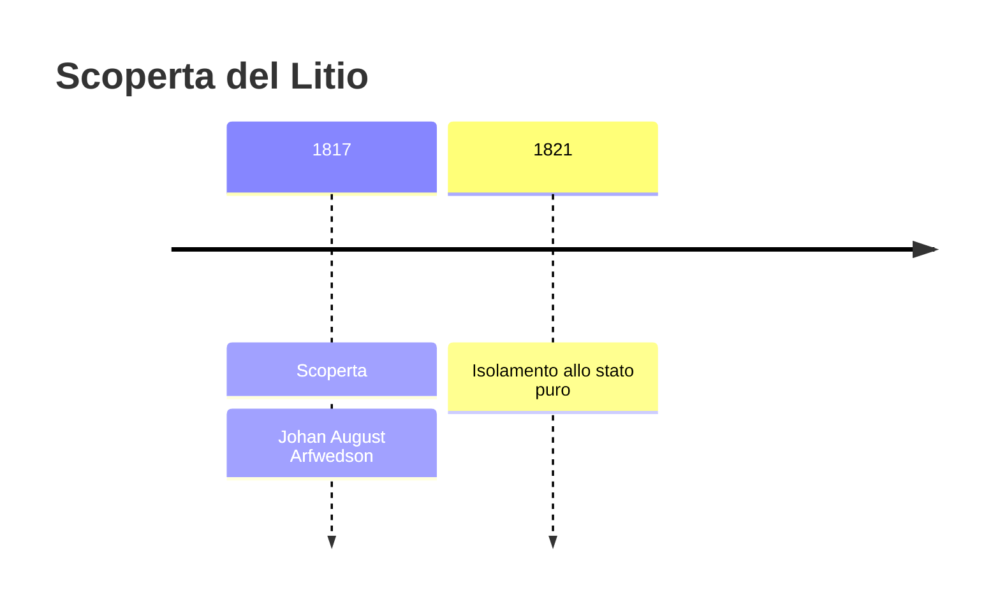
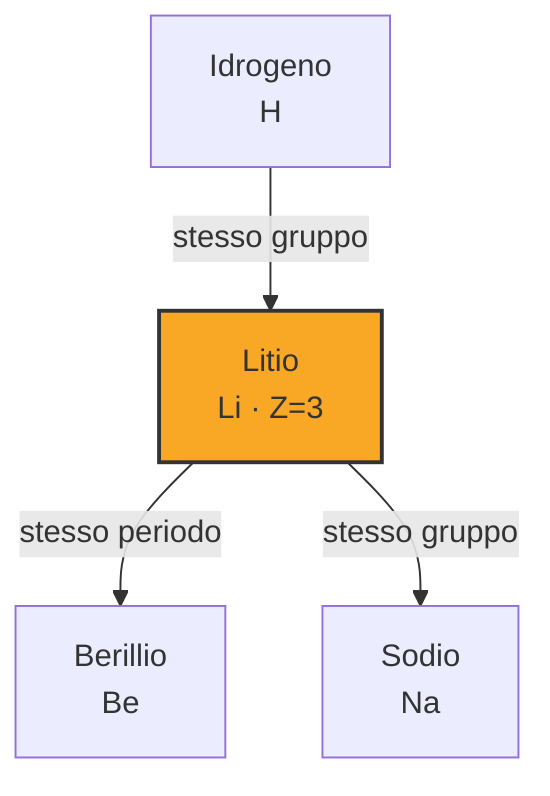

# Litio (Li)

> [!abstract] 51° elemento scoperto — 1817
> 

## Cronologia della scoperta

## Storia della scoperta

## Posizione nella tavola periodica

## Caratteristiche

### Dati fisico-chimici

| Proprietà | Valore |
|---|---|
| Numero atomico | 3 |
| Massa atomica | 6,94 u |
| Categoria | Metallo alcalino |
| Gruppo | 1 |
| Periodo | 2 |
| Blocco | s |
| Configurazione elettronica | [He] 2s¹ |
| Punto di fusione | 180,5 °C |
| Punto di ebollizione | 1329,9 °C |
| Densità | 0,534 g/cm³ |
| Stati di ossidazione | — |

## Struttura atomica

![[atomo-Litio.svg]]

## Usi e presenza in natura

## Nella cronologia

← Precedente: [[Iodio]] (1811)
→ Successivo: [[Selenio]] (1817)

Epoca: [[L'età dell'elettrolisi]] · Scopritore: [[Johan August Arfwedson]]

## Fonti

