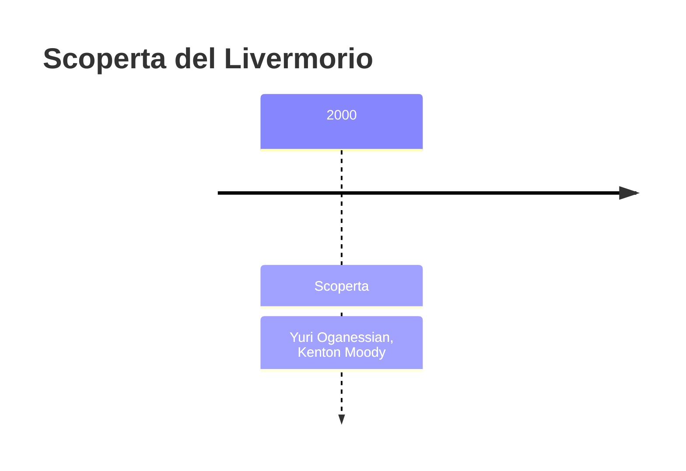
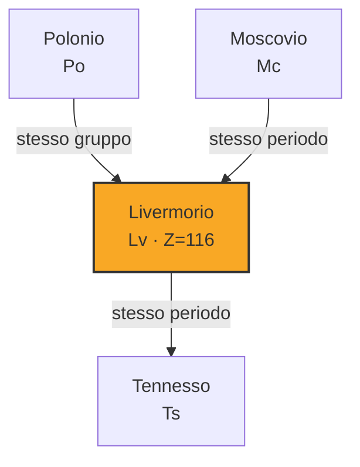
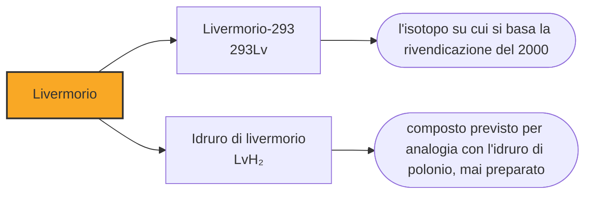

# Livermorio (Lv)

> [!abstract] 113° elemento scoperto — 2000
> Le ultime cinque caselle della tavola periodica sono state riempite sparando un isotopo che è meno di due parti su mille del calcio naturale. Separarlo dal resto è la parte cara dell'impresa.

Con il livermorio la storia della tavola periodica cambia di nuovo mano e di nuovo metodo. Le sei caselle precedenti erano tedesche e nate da urti a bassa energia; da qui in avanti si va a Dubna, con una tecnica diversa e una collaborazione russo-americana che porterà fino alla fine della riga.

## Cronologia della scoperta

## Storia della scoperta

Il 19 luglio 2000 un bersaglio di curio-248 fu bombardato con ioni di calcio-48, e un singolo atomo dell'elemento 116 comparve nei rivelatori. L'attribuzione iniziale, corretta due anni dopo, lo assegnava a un isotopo sbagliato; la conferma definitiva richiese altri esperimenti fra il 2004 e il 2006, e la IUPAC riconobbe la scoperta il primo giugno 2011.

Il metodo si chiama fusione calda, ed è l'opposto di quello di Darmstadt. Invece di un bersaglio di piombo e di un proiettile pesante, si usa un bersaglio di attinide — curio, americio, plutonio, californio — e un proiettile leggero. Il nucleo che si forma nasce più caldo e smaltisce l'energia espellendo tre o quattro neutroni invece di uno, il che di per sé è uno svantaggio; il vantaggio compensa abbondantemente, e sta tutto nel proiettile.

Il calcio-48 ha venti protoni e ventotto neutroni, due numeri che completano altrettanti gusci nucleari: è un nucleo compatto e difficile da rompere, e insieme è straordinariamente ricco di neutroni per un elemento così leggero. Sparato contro un attinide produce nuclei che quei neutroni in eccesso se li portano dietro, e più neutroni ci sono, più il nucleo prodotto resiste alla fissione. È la ragione per cui questa strada arriva dove l'altra si era fermata.

Il problema è procurarselo. Il calcio-48 è lo 0,187 per cento del calcio naturale, e per usarlo come fascio va separato dagli altri isotopi in impianti specializzati: è il materiale più costoso di tutta la catena, si consuma a ogni campagna e la sua disponibilità mondiale è uno dei fattori che decidono quali esperimenti si possono davvero tentare. Curiosamente non è nemmeno stabile: decade, ma con un'emivita di decine di miliardi di miliardi di anni.

La divisione dei compiti è rimasta la stessa per vent'anni: l'acceleratore e i rivelatori stanno a Dubna, i bersagli di attinide vengono dai pochi reattori al mondo capaci di produrli — quello del tennesso arriverà da Oak Ridge, negli Stati Uniti — e l'analisi dei dati si fa insieme. È una collaborazione fra i due paesi che si erano contesi per trent'anni ogni casella della tavola, e che da allora hanno firmato insieme tutti gli elementi nuovi tranne uno, il nihonio, arrivato dal Giappone.

Nel 1999 il laboratorio di Berkeley aveva annunciato di aver prodotto gli elementi 118 e 116 per un'altra via. L'annuncio fu ritirato: i dati erano stati fabbricati dallo stesso ricercatore che aveva inventato un atomo di darmstadtio cinque anni prima. Quando il livermorio comparve davvero, un anno dopo e in Russia, la vicenda era ancora aperta.

Il nome, adottato nel maggio del 2012, riconosce il laboratorio nazionale Lawrence Livermore, in California, che alla scoperta aveva collaborato. Dubna avrebbe voluto per questa casella il nome della propria regione: moscovium finì invece sulla casella 115, e il 116 andò al partner americano. Anche i nomi, in questa collaborazione, sono stati divisi a metà.

## Posizione nella tavola periodica

## Caratteristiche

Del livermorio non è stata misurata alcuna proprietà, e i valori di questa nota sono calcoli. Sta nel gruppo 16, sotto ossigeno, zolfo, selenio, tellurio e polonio, e le previsioni gli attribuiscono come stato più stabile il +2.

Il +2 al posto del +4 o del +6 è una conseguenza di ciò che i chimici chiamano effetto della coppia inerte: due degli elettroni esterni sono trattenuti così saldamente da non partecipare quasi mai al legame. Nel livermorio l'effetto è portato all'estremo dalla relatività, al punto che il +6 — lo stato normale dello zolfo — dovrebbe essergli semplicemente precluso, e il +4 raggiungibile solo con leganti fortemente elettronegativi come il fluoro.

Si conoscono sei isotopi del livermorio e nessuno arriva al decimo di secondo: il più longevo, il livermorio-293, dura una sessantina di millesimi di secondo. In vent'anni ne sono stati prodotti in tutto una trentina di atomi, il che rende qualunque esperimento di chimica fuori questione: il tempo per portare l'atomo dalla camera di reazione a una colonna è già più lungo della sua vita.

### Dati fisico-chimici

| Proprietà | Valore |
|---|---|
| Numero atomico | 116 |
| Massa atomica | 293,0 u |
| Categoria | Metallo post-transizione |
| Gruppo | 16 |
| Periodo | 7 |
| Blocco | p |
| Configurazione elettronica | [Rn] 5f¹⁴ 6d¹⁰ 7s² 7p⁴ |
| Punto di fusione | 435,9 °C |
| Punto di ebollizione | 811,9 °C |
| Densità | 12,9 g/cm³ |
| Stati di ossidazione | -2, +2, +4 |

## Struttura atomica

![[atomo-Livermorio.svg]]

## Usi e presenza in natura

Il livermorio non ha usi e non ne avrà: non esiste in natura, ne esistono in tutto poche decine di atomi mai prodotti e ciascuno è durato meno di un battito di ciglia.

Il valore di questa casella sta nella strada che ha aperto. Con il calcio-48 e i bersagli di attinide sono state riempite cinque delle sei caselle rimaste, dalla 114 alla 118, e la tavola periodica ha finito la settima riga. La stessa strada ha però un limite netto: oltre il californio non esistono attinidi producibili in quantità sufficiente a fare un bersaglio, e per andare oltre il 118 bisognerà cambiare ancora proiettile.

## Curiosità

Con il livermorio la California arriva a tre caselle nella tavola periodica: il berkelio per la città dell'università, il californio per lo stato e il livermorio per il laboratorio di Livermore, che da Berkeley dista una cinquantina di chilometri. Un solo altro luogo al mondo ha fatto meglio, e non è un laboratorio: la cava di Ytterby, in Svezia, che di nomi ne ha lasciati quattro.

Trenta atomi in vent'anni fa poco più di un atomo all'anno. È un ritmo che obbliga a ripensare che cosa significhi «esistere» per un elemento chimico: il livermorio è nella tavola periodica accanto all'ossigeno e allo zolfo, che compongono buona parte del mondo, e la quantità complessiva mai esistita sulla Terra sta in un numero che si può contare a voce.

## Nella cronologia

← Precedente: [[Copernicio]] (1996)
→ Successivo: [[Moscovio]] (2003)

Epoca: [[Era nucleare]] · Scopritori: [[Yuri Oganessian]], [[Kenton Moody]]

## Fonti

- [Livermorium](https://en.wikipedia.org/wiki/Livermorium) — consultata il 10/09/2026
- [Livermorium — Royal Society of Chemistry](https://periodic-table.rsc.org/element/116/livermorium) — consultata il 10/09/2026
- [Calcium-48](https://en.wikipedia.org/wiki/Calcium-48) — consultata il 10/09/2026
