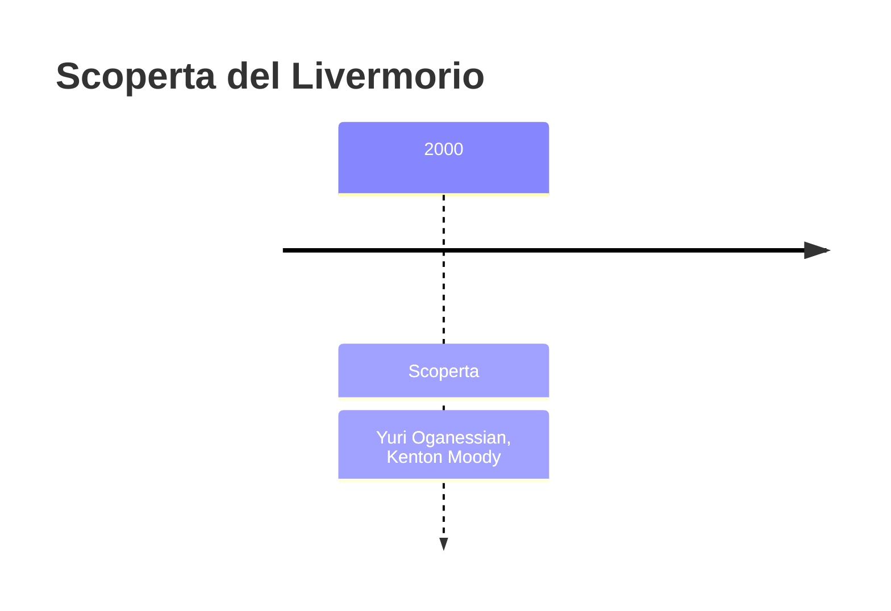
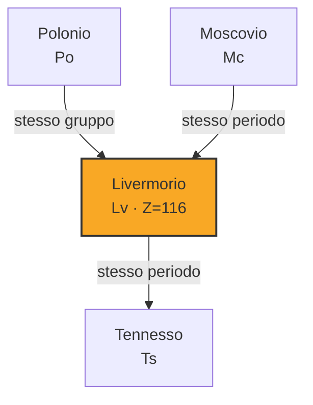

# Livermorio (Lv)

> [!abstract] 113° elemento scoperto — 2000
> 

## Cronologia della scoperta

## Storia della scoperta

## Posizione nella tavola periodica

## Caratteristiche

### Dati fisico-chimici

| Proprietà | Valore |
|---|---|
| Numero atomico | 116 |
| Massa atomica | 293,0 u |
| Categoria | Metallo post-transizione |
| Gruppo | 16 |
| Periodo | 7 |
| Blocco | p |
| Configurazione elettronica | *[Rn] 5f¹⁴ 6d¹⁰ 7s² 7p⁴ |
| Punto di fusione | 435,9 °C |
| Punto di ebollizione | 811,9 °C |
| Densità | 12,9 g/cm³ |
| Stati di ossidazione | — |

## Struttura atomica

![[atomo-Livermorio.svg]]

## Usi e presenza in natura

## Nella cronologia

← Precedente: [[Copernicio]] (1996)
→ Successivo: [[Moscovio]] (2003)

Epoca: [[Era nucleare]] · Scopritore: [[Yuri Oganessian]], [[Kenton Moody]]

## Fonti

