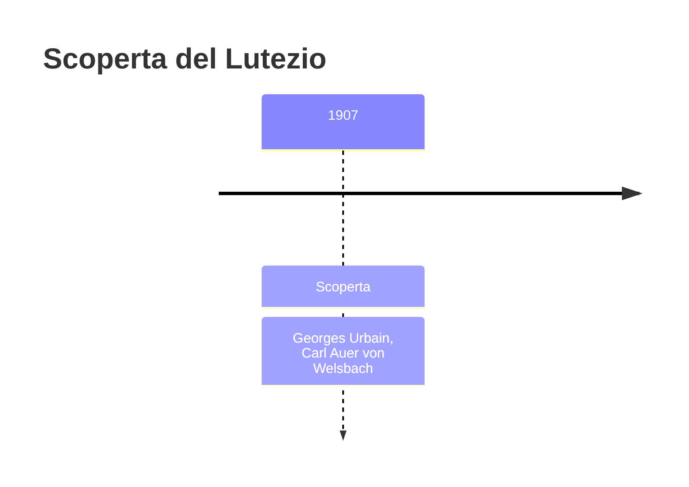
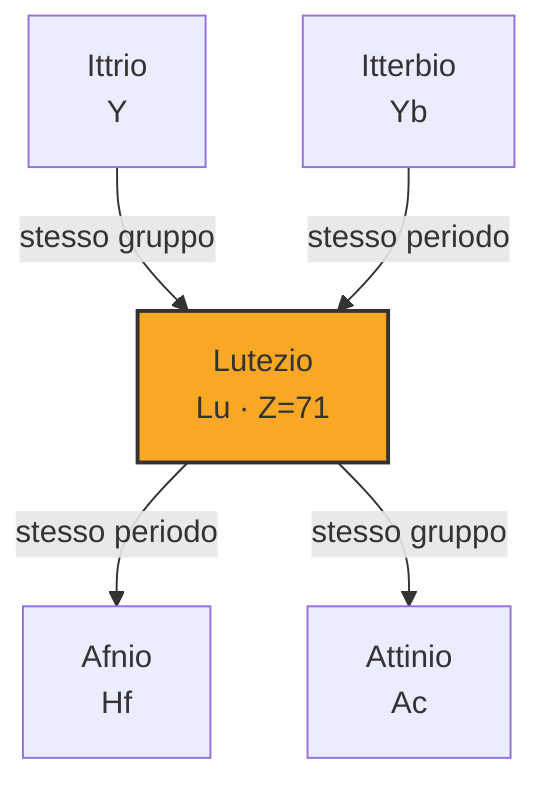

# Lutezio (Lu)

> [!abstract] 85° elemento scoperto — 1907
> 

## Cronologia della scoperta

## Storia della scoperta

## Posizione nella tavola periodica

## Caratteristiche

### Dati fisico-chimici

| Proprietà | Valore |
|---|---|
| Numero atomico | 71 |
| Massa atomica | 174,96681 u |
| Categoria | Lantanide |
| Gruppo | 3 |
| Periodo | 6 |
| Blocco | d |
| Configurazione elettronica | [Xe] 4f¹⁴ 5d¹ 6s² |
| Punto di fusione | 1651,9 °C |
| Punto di ebollizione | 3401,9 °C |
| Densità | 9,841 g/cm³ |
| Stati di ossidazione | — |

## Struttura atomica

![[atomo-Lutezio.svg]]

## Usi e presenza in natura

## Nella cronologia

← Precedente: [[Europio]] (1901)
→ Successivo: [[Protoattinio]] (1913)

Epoca: [[Spettroscopia e radioattività]] · Scopritori: [[Georges Urbain]], [[Carl Auer von Welsbach]]

## Fonti

