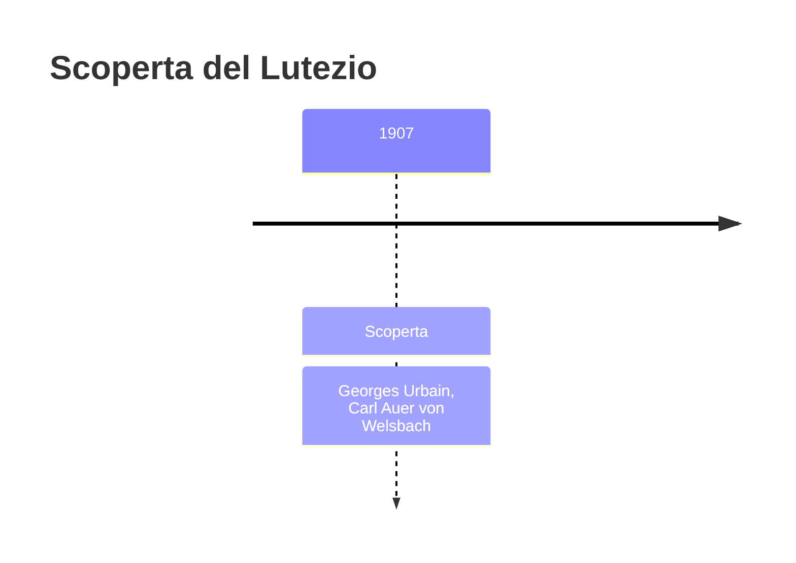
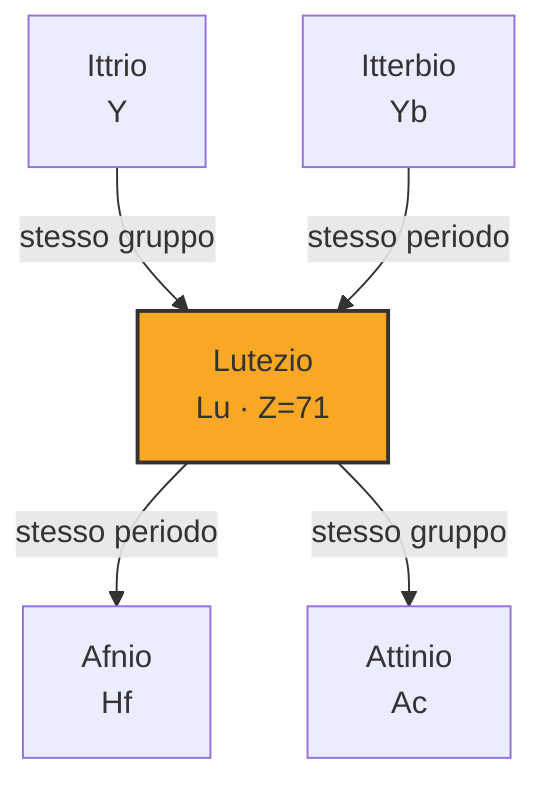
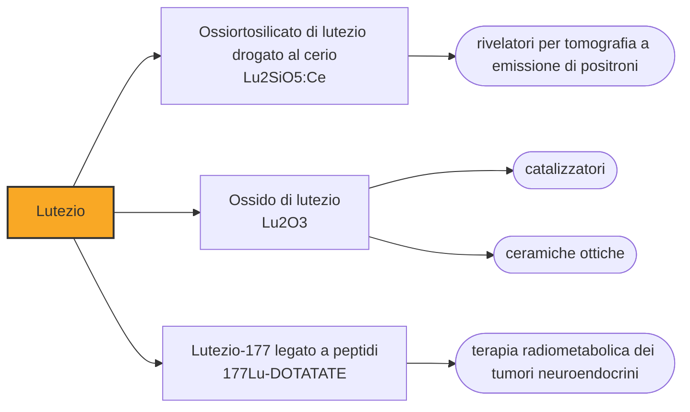

# Lutezio (Lu)

> [!abstract] 85° elemento scoperto — 1907
> Tre uomini in tre paesi trovarono lo stesso elemento nello stesso anno. Uno pubblicò per primo, uno propose un altro nome, il terzo rinunciò senza pubblicare: la disputa si chiuse due anni dopo, a maggioranza.

Il lutezio chiude la serie dei lantanidi ed è quello che meno le somiglia: ha il guscio f completo, ed è il più duro, il più denso e quello che fonde più in alto di tutta la famiglia. È anche uno dei più cari, non perché sia scarso in assoluto ma perché nei minerali che lo contengono sta in proporzioni minime.

## Cronologia della scoperta

> [!info] Nota sulla cronologia
> Charles James, che era arrivato al risultato per conto proprio, rinunciò a pubblicare. La Commissione internazionale per i pesi atomici assegnò la priorità a Urbain nel 1909, e la IUPAC fissò il nome lutetium solo nel 1949.

## Storia della scoperta

Nel 1907 restava un solo pezzo da assestare nella vicenda delle terre rare: l'itterbia che Marignac aveva separato nel 1878 dava ancora segni di non essere una sostanza sola. Tre chimici, in tre paesi diversi, ci stavano lavorando contemporaneamente e senza saperlo.

Georges Urbain, a Parigi, divise l'itterbia in due componenti e le chiamò neoitterbia e lutecia, dal nome latino della propria città; il barone Carl Auer von Welsbach, a Vienna, arrivò allo stesso risultato e propose i nomi aldebaranio e cassiopeio; l'americano Charles James, nel New Hampshire, aveva il materiale pronto per pubblicare quando venne a sapere del lavoro di Urbain, e rinunciò.

La disputa la chiuse nel 1909 la Commissione internazionale per i pesi atomici, che assegnò la priorità a Urbain e ne adottò il nome. In Germania e in Austria cassiopeium restò in uso per decenni, e ci volle il 1949 perché la IUPAC raccomandasse lutetium come nome unico, correggendo anche l'ortografia originale di Urbain, che era lutecium.

Il comportamento di Charles James è il dettaglio che si ricorda meno e che vale di più: aveva in mano il campione, il metodo e i risultati, e scelse di non rivendicare nulla. Il suo metodo di cristallizzazione frazionata, con cui aveva già ottenuto il tulio puro dopo quindicimila passaggi, restò lo standard per decenni ed è quello con cui si sono preparate le terre rare fino allo scambio ionico.

Con il lutezio la serie dei lantanidi era completa, e con essa si chiudeva la stagione cominciata nel 1794 con la pietra nera di Ytterby. Erano serviti centotredici anni, quattro generazioni di chimici e tre strumenti diversi — la cristallizzazione frazionata, lo spettroscopio, poi lo scambio ionico — per estrarre quindici elementi da quella che all'inizio sembrava una sola terra.

## Posizione nella tavola periodica

## Caratteristiche

Il lutezio ha la durezza Brinell più alta, la densità maggiore e il punto di fusione più elevato dell'intera serie dei lantanidi: è l'effetto della contrazione lantanidica, che scendendo lungo la serie stringe gli atomi e li lega più saldamente. Con il guscio f pieno, poi, la sua chimica è semplice e somiglia a quella dell'ittrio più che a quella dei vicini.

Nei composti sta esclusivamente nello stato +3, con ioni incolori e diamagnetici: non avendo elettroni f spaiati non ha né colore né magnetismo, il che lo rende l'eccezione ottica e magnetica della famiglia. È stabile all'aria in condizioni normali e si dissolve negli acidi diluiti.

Nella monazite il lutezio sta in proporzioni dell'ordine di un decimillesimo di punto percentuale, ed è questo, più dell'abbondanza nella crosta, a determinarne il prezzo: intorno ai diecimila dollari al chilogrammo, fra i più alti delle terre rare. Si ottiene alla fine di una catena di separazioni che deve prima togliere tutti gli altri quattordici lantanidi.

Il 2,6 per cento del lutezio naturale è lutezio-176, radioattivo con un'emivita di decine di miliardi di anni. Decade in afnio-176, e questa coppia è alla base della datazione lutezio-afnio, con cui si stabilisce l'età dei minerali e dei meteoriti più antichi: la stessa logica del rubidio-stronzio, applicata a due elementi che restano insieme anche quando la roccia si trasforma.

### Dati fisico-chimici

| Proprietà | Valore |
|---|---|
| Numero atomico | 71 |
| Massa atomica | 174,96681 u |
| Categoria | Lantanide |
| Gruppo | 3 |
| Periodo | 6 |
| Blocco | d |
| Configurazione elettronica | [Xe] 4f¹⁴ 5d¹ 6s² |
| Punto di fusione | 1651,9 °C |
| Punto di ebollizione | 3401,9 °C |
| Densità | 9,841 g/cm³ |
| Stati di ossidazione | +3 |

## Struttura atomica

![[atomo-Lutezio.svg]]

## Usi e presenza in natura

L'impiego che oggi ne consuma di più è la medicina nucleare: l'ossiortosilicato di lutezio drogato al cerio è il cristallo scintillatore preferito per i rivelatori della tomografia a emissione di positroni, perché è denso — e quindi ferma i fotoni gamma in poco spazio — veloce a smaltire il segnale e abbastanza luminoso da permettere di localizzare l'emissione con precisione. Ogni macchina PET ne contiene decine di chilogrammi, disposti ad anello attorno al paziente.

Il resto si divide fra la catalisi — il lutezio stabile serve nei catalizzatori del cracking del petrolio — e la terapia radioisotopica: il lutezio-177, legato a molecole che si attaccano a specifici recettori tumorali, irradia il tumore dall'interno con particelle beta a corto raggio, ed è alla base di terapie approvate per alcuni tumori neuroendocrini e prostatici.

## Curiosità

Il nome cassiopeium, proposto da von Welsbach e sconfitto nel 1909, è rimasto in uso nella letteratura chimica tedesca fino agli anni Cinquanta: per mezzo secolo lo stesso elemento ha avuto due nomi a seconda della lingua in cui se ne scriveva, come era accaduto al niobio con il columbium.

Lutetia era il nome romano dell'insediamento sulla Senna da cui è nata Parigi, e Urbain lo scelse per la propria città. Nella tavola periodica il lutezio fa così compagnia al gallio, al germanio, allo scandio e all'europio: una geografia in cui ogni chimico ha piantato la bandiera di casa propria.

## Nella cronologia

← Precedente: [[Europio]] (1901)
→ Successivo: [[Protoattinio]] (1913)

Epoca: [[Spettroscopia e radioattività]] · Scopritori: [[Georges Urbain]], [[Carl Auer von Welsbach]]

## Fonti

- [Lutetium](https://en.wikipedia.org/wiki/Lutetium) — consultata il 09/09/2026
- [Lutetium — Royal Society of Chemistry](https://periodic-table.rsc.org/element/71/lutetium) — consultata il 09/09/2026
- [Lutetium–hafnium dating](https://en.wikipedia.org/wiki/Lutetium%E2%80%93hafnium_dating) — consultata il 09/09/2026
