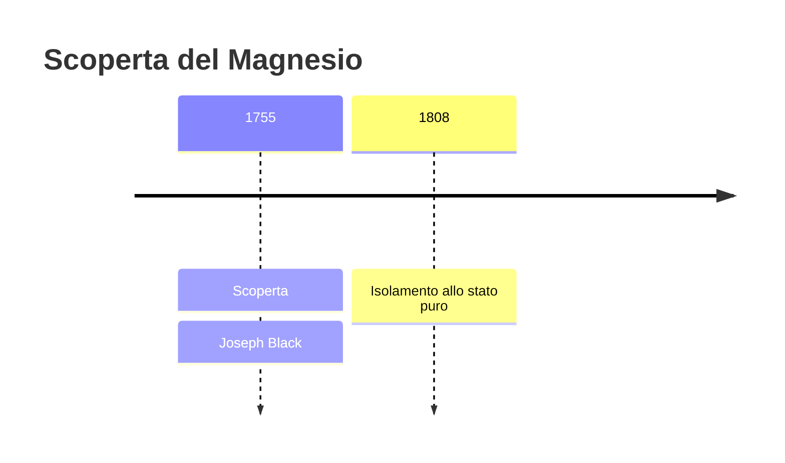
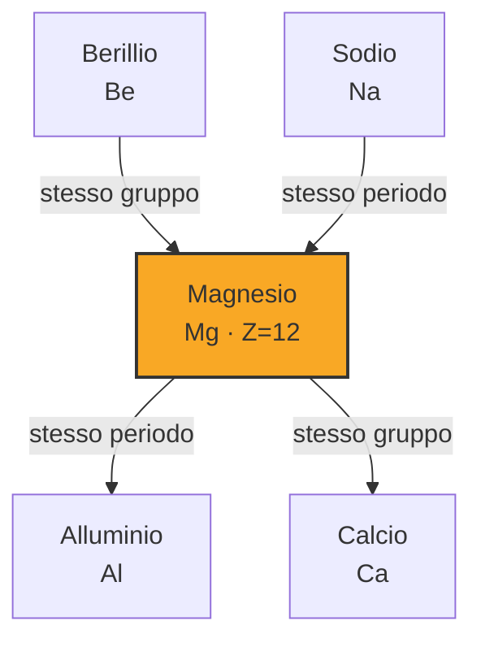

# Magnesio (Mg)

> [!abstract] 22° elemento scoperto — 1755
> 

## Cronologia della scoperta

## Storia della scoperta

## Posizione nella tavola periodica

## Caratteristiche

### Dati fisico-chimici

| Proprietà | Valore |
|---|---|
| Numero atomico | 12 |
| Massa atomica | 24,305 u |
| Categoria | Metallo alcalino terroso |
| Gruppo | 2 |
| Periodo | 3 |
| Blocco | s |
| Configurazione elettronica | [Ne] 3s² |
| Punto di fusione | 649,9 °C |
| Punto di ebollizione | 1089,9 °C |
| Densità | 1,738 g/cm³ |
| Stati di ossidazione | — |

## Struttura atomica

![[atomo-Magnesio.svg]]

## Usi e presenza in natura

## Nella cronologia

← Precedente: [[Nichel]] (1751)
→ Successivo: [[Manganese]] (1770)

Epoca: [[Chimica pneumatica]] · Scopritore: [[Joseph Black]]

## Fonti

