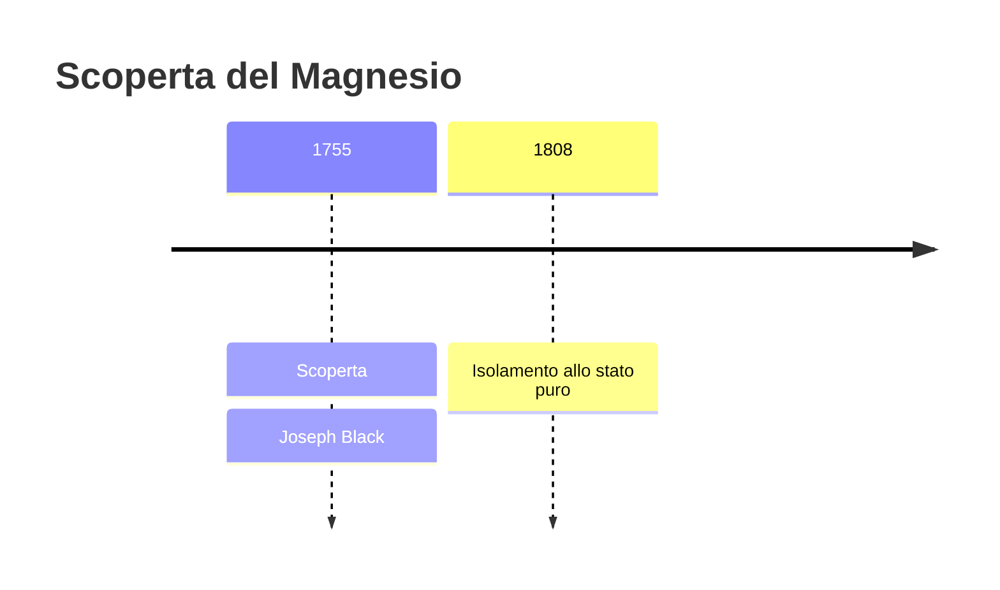
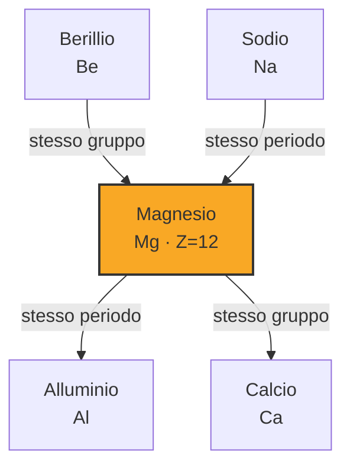
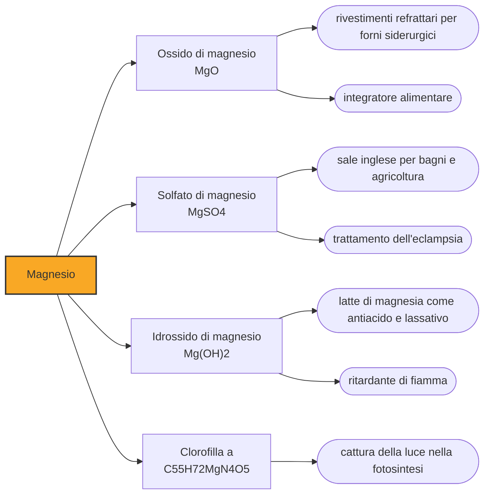

# Magnesio (Mg)

> [!abstract] 22° elemento scoperto — 1755
> Uno studente di medicina cercava un rimedio per i calcoli renali. Trovò invece che l'aria può stare chiusa dentro una pietra, e con quella scoperta aprì la chimica dei gas.

Il magnesio è un metallo bianco-argenteo così leggero da galleggiare quasi nell'immaginazione: pesa due terzi dell'alluminio ed è il più leggero fra i metalli che si possano usare per costruire qualcosa. È l'ottavo elemento più abbondante della crosta terrestre, sta al centro di ogni molecola di clorofilla e quindi, indirettamente, di quasi tutto il cibo del pianeta. Eppure la sua storia comincia da una domanda di medicina.

## Cronologia della scoperta

## Storia della scoperta

Prima di essere un elemento, la magnesia era una confusione. Con quel nome, preso dalla regione greca di Magnesia in Tessaglia, si indicavano sostanze diverse e incompatibili: la magnesia alba, una polvere bianca e leggera usata come lassativo, e la magnesia nera, un minerale scuro e pesante che i vetrai adoperavano per schiarire il vetro. Sono due materiali senza alcuna parentela — la prima porta al magnesio, la seconda al manganese — accomunati soltanto da un nome geografico e da un equivoco secolare.

Nel 1754 Joseph Black discute a Edimburgo una tesi di laurea in medicina che di medico ha soprattutto il pretesto. Il problema di partenza è concreto: si cercava un farmaco per sciogliere i calcoli renali, e la calce viva sembrava promettente ma era troppo caustica per un paziente. Black si mette a studiare la magnesia alba sperando in un'alternativa più mite, e comincia a fare una cosa che in chimica non era ancora abitudine: pesare tutto, prima e dopo.

Scaldando la magnesia alba, Black osserva che perde quasi metà del proprio peso e diventa una sostanza diversa; e che, trattando quella sostanza con un alcali, riottiene esattamente la magnesia di partenza. La conclusione è rivoluzionaria nella sua semplicità: quel peso mancante non è svanito, è un'aria che era imprigionata nel solido ed è uscita. La chiama aria fissa. È l'anidride carbonica, ed è la prima volta che qualcuno dimostra che esiste un gas distinto dall'aria comune.

La conseguenza è più grande dell'elemento. Fino a quel momento l'aria era una sostanza sola, e i gas erano esalazioni indistinte; dopo Black sono materia pesabile, che entra e esce dalle reazioni obbedendo alla bilancia. Nel giro di trent'anni Priestley, Scheele, Cavendish e Lavoisier smontano l'aria nei suoi componenti e riscrivono la chimica da zero. In mezzo a tutto questo, la magnesia alba resta soltanto il campione da cui era partita la domanda.

Black aveva identificato una terra distinta, non un metallo: dentro la magnesia c'era qualcosa, ma nessuno sapeva tirarlo fuori. Ci riesce Humphry Davy nel 1808, con la pila elettrica, lo stesso strumento con cui in quegli anni sta spezzando una dopo l'altra le terre considerate elementari. Ottiene però solo tracce impure; per avere magnesio metallico in quantità maneggiabile bisogna aspettare Antoine Bussy nel 1831, e la produzione industriale arriverà solo alla fine dell'Ottocento.

## Posizione nella tavola periodica

## Caratteristiche

La densità del magnesio è di poco superiore a una volta e tre quarti quella dell'acqua, il che ne fa il metallo strutturale più leggero disponibile. Il rovescio della medaglia è che si corrode con facilità e che, in polvere o in trucioli, brucia. Per decenni queste due debolezze ne hanno limitato l'uso; le leghe moderne le tengono a bada aggiungendo zinco e terre rare, e il magnesio è tornato competitivo là dove ogni grammo risparmiato conta.

Acceso, il magnesio brucia con una luce bianca accecante a temperature vicine ai tremila gradi, e non si lascia spegnere facilmente: continua a bruciare nell'anidride carbonica e reagisce con l'acqua, così che estintori e secchiate peggiorano la situazione invece di risolverla. Questa fiamma è stata per mezzo secolo la sorgente luminosa della fotografia, e il lampo al magnesio che immobilizzava i soggetti dell'Ottocento non era una metafora ma una vera combustione.

In chimica il magnesio è un elemento monotono — praticamente sempre allo stato più due, con gli stati zero e più uno confinati a composti di laboratorio — e proprio questa affidabilità lo rende prezioso per la vita. Un adulto ne contiene poco più di venti grammi, e quel poco fa da cofattore a oltre trecento enzimi e accompagna ogni molecola di ATP che entra in una reazione. Al centro della clorofilla c'è un atomo di magnesio: senza di esso nessuna pianta catturerebbe la luce.

### Dati fisico-chimici

| Proprietà | Valore |
|---|---|
| Numero atomico | 12 |
| Massa atomica | 24,305 u |
| Categoria | Metallo alcalino terroso |
| Gruppo | 2 |
| Periodo | 3 |
| Blocco | s |
| Configurazione elettronica | [Ne] 3s² |
| Punto di fusione | 649,9 °C |
| Punto di ebollizione | 1089,9 °C |
| Densità | 1,738 g/cm³ |
| Stati di ossidazione | 0, +1, +2 |

## Struttura atomica

![[atomo-Magnesio.svg]]

## Usi e presenza in natura

L'impiego principale del magnesio metallico sono le leghe leggere, per pressofusione di componenti d'auto, scocche di apparecchi portatili e strutture aeronautiche, e come additivo che rende più lavorabile l'alluminio. Il magnesio serve anche come agente riducente per produrre altri metalli, il titanio in testa, e come anodo sacrificale: un blocco di magnesio bullonato allo scafo di una nave si corrode al posto dell'acciaio, perché cede elettroni più volentieri.

I composti hanno una carriera altrettanto lunga. L'ossido di magnesio resiste a temperature altissime senza fondere ed è il rivestimento dei forni siderurgici; il solfato è il sale inglese dei pediluvi e degli usi agricoli; l'idrossido in sospensione è il latte di magnesia dei mal di stomaco, che agisce neutralizzando l'acido gastrico. È la stessa funzione blandamente lassativa che aveva incuriosito Black quasi tre secoli fa.

## Curiosità

Il magnesio è uno dei pochi metalli che si estraggono dall'acqua di mare. Ce ne sono più di mille tonnellate in ogni chilometro cubo di oceano, e il procedimento — precipitare l'idrossido con calce ricavata da conchiglie, poi riportarlo a metallo — fu messo a punto su scala industriale durante la seconda guerra mondiale, quando servivano scocche leggere per gli aerei. Per un periodo, buona parte del magnesio americano è letteralmente uscita dal mare.

Joseph Black non pubblicò quasi nulla dopo i trent'anni, e la sua fama poggia su due sole idee: l'aria fissa e il calore latente, cioè il fatto che sciogliere il ghiaccio consuma calore senza alzarne la temperatura. La seconda gli arrivò guardando lo stesso fenomeno da un'altra angolazione. A Glasgow, dove Black insegnava, aveva bottega un giovane costruttore di strumenti di nome James Watt, che sperimentando per conto proprio sul vapore si imbatté nello stesso effetto e andò a chiedere spiegazioni: fu Black a dargli il nome e la teoria. Il condensatore separato nacque da quella conversazione.

## Nella cronologia

← Precedente: [[Nichel]] (1751)
→ Successivo: [[Manganese]] (1770)

Epoca: [[Chimica pneumatica]] · Scopritore: [[Joseph Black]]

## Fonti

- [Magnesium](https://en.wikipedia.org/wiki/Magnesium) — consultata il 07/09/2026
- [Joseph Black](https://en.wikipedia.org/wiki/Joseph_Black) — consultata il 07/09/2026
- [Timeline of chemical element discoveries](https://en.wikipedia.org/wiki/Timeline_of_chemical_element_discoveries) — consultata il 07/09/2026
