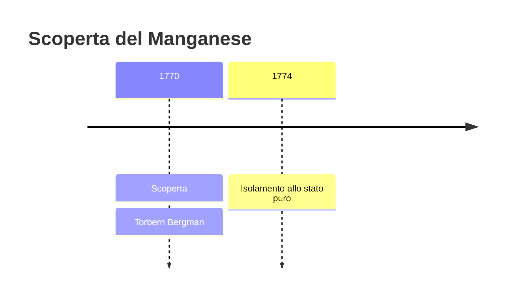
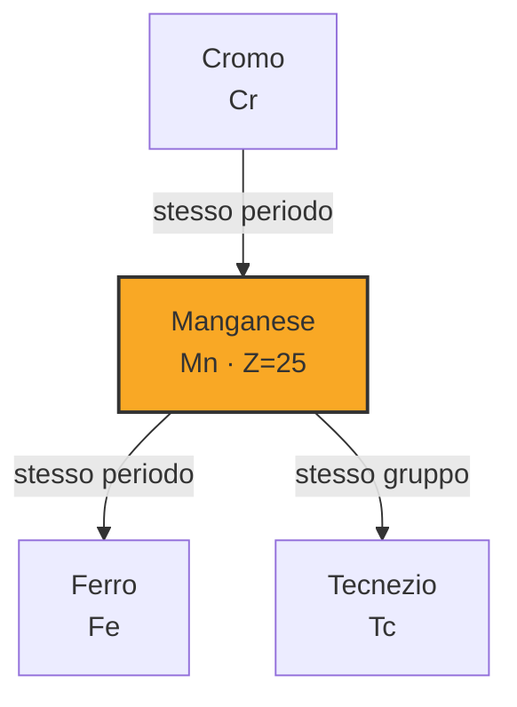

# Manganese (Mn)

> [!abstract] 23° elemento scoperto — 1770
> 

## Cronologia della scoperta

## Storia della scoperta

## Posizione nella tavola periodica

## Caratteristiche

### Dati fisico-chimici

| Proprietà | Valore |
|---|---|
| Numero atomico | 25 |
| Massa atomica | 54,9380443 u |
| Categoria | Metallo di transizione |
| Gruppo | 7 |
| Periodo | 4 |
| Blocco | d |
| Configurazione elettronica | [Ar] 3d⁵ 4s² |
| Punto di fusione | 1245,9 °C |
| Punto di ebollizione | 2060,9 °C |
| Densità | 7,21 g/cm³ |
| Stati di ossidazione | — |

## Struttura atomica

![[atomo-Manganese.svg]]

## Usi e presenza in natura

## Nella cronologia

← Precedente: [[Magnesio]] (1755)
→ Successivo: [[Ossigeno]] (1771)

Epoca: [[Chimica pneumatica]] · Scopritore: [[Torbern Bergman]]

## Fonti

