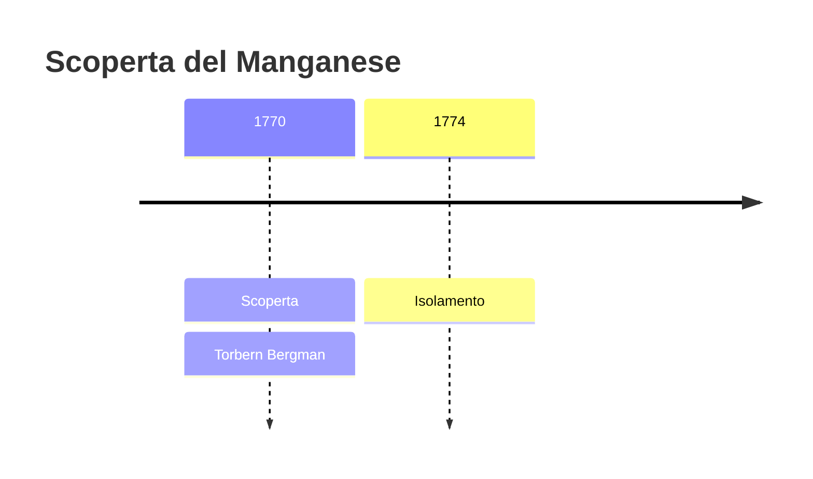
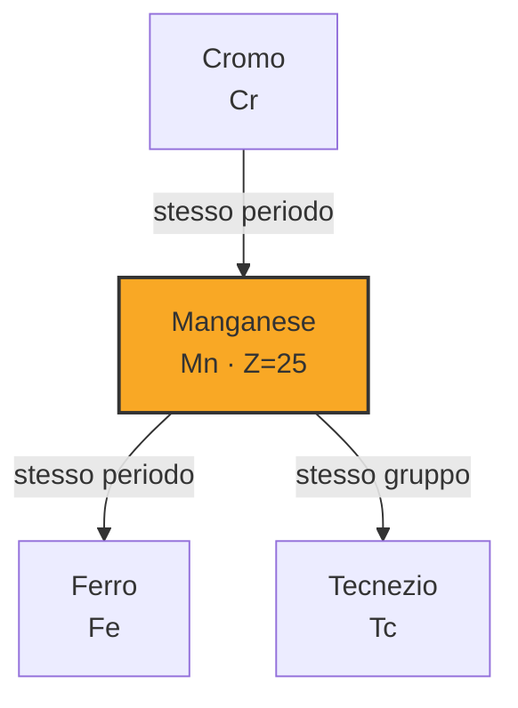
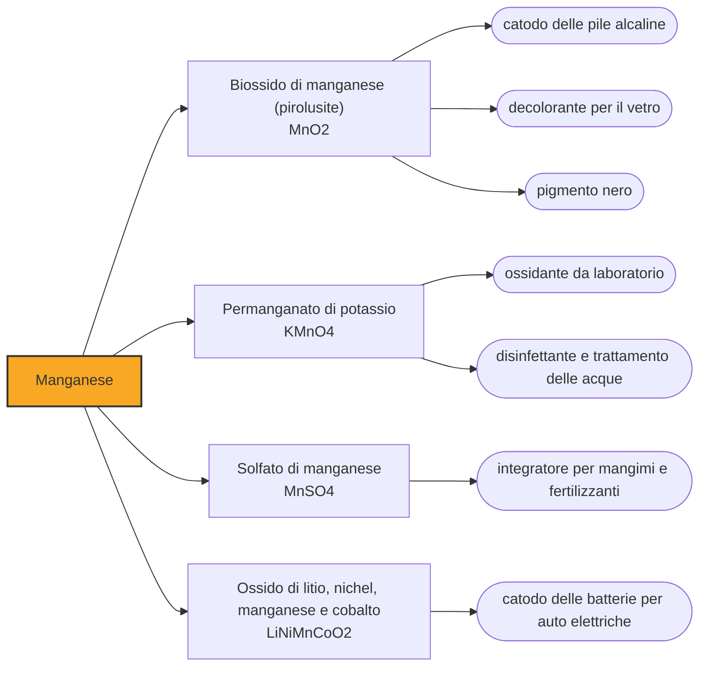

# Manganese (Mn)

> [!abstract] 23° elemento scoperto — 1770
> Con questo minerale gli uomini hanno dipinto i bisonti sulle pareti delle grotte e schiarito il vetro dei Romani. Che dentro ci fosse un metallo lo si capì solo nel 1770.

Il manganese è un metallo grigio, duro e fragile, che praticamente nessuno ha mai visto e senza il quale non esisterebbe l'acciaio. È il dodicesimo elemento per abbondanza nella crosta terrestre e il quarto metallo più usato al mondo, eppure non compare mai da solo in un oggetto: lavora sempre dentro qualcos'altro, disciolto in una lega o mascherato in un ossido, il che spiega perché la sua fama sia sproporzionatamente piccola rispetto alla sua importanza.

## Cronologia della scoperta

## Storia della scoperta

Il biossido di manganese è uno dei più antichi materiali con cui l'uomo abbia lasciato un segno. I neri delle pitture rupestri sono in buona parte ossidi di manganese: nella grotta di Gargas, nei Pirenei, li si trova in opere datate fra i trentamila e i ventiquattromila anni fa, e lo stesso pigmento compare a Lascaux. I Neanderthal ne raccoglievano piccoli blocchi, alcuni dei quali portano segni di abrasione, e sulla destinazione di quei blocchi gli archeologi discutono ancora: la spiegazione tradizionale è la decorazione del corpo, ma è stato proposto che servissero ridotti in polvere per accendere il fuoco, perché il biossido di manganese abbassa la temperatura di accensione del legno.

Il secondo mestiere del minerale è l'opposto del primo: invece di annerire, schiarisce. Il ferro presente come impurità nella sabbia colora il vetro di un verde bottiglia che i vetrai egizi e romani volevano eliminare, e una piccola aggiunta di pirolusite lo neutralizza otticamente, restituendo un vetro incolore. La tecnica attraversò il Medioevo e arrivò intatta all'età moderna con un nome che dice tutto, sapone dei vetrai.

Il nome viene da un equivoco antico. La pirolusite somiglia alla magnetite ed era chiamata anch'essa magnes, pietra di Magnesia, dalla regione della Tessaglia da cui provenivano entrambi i minerali neri; per distinguerle si prese a dire che l'una era di sesso maschile e l'altra femminile. Da quella confusione linguistica sono usciti tre termini che oggi indicano cose diverse: magnete, magnesio e manganese, imparentati fra loro e non con ciò che nominano.

Che nella pirolusite ci fosse un metallo sconosciuto lo sostiene intorno al 1770 Torbern Bergman, il professore di chimica di Uppsala, che però non riesce a cavarlo dal minerale. Nel 1774 Carl Wilhelm Scheele ne esamina un campione, vi ritrova calce, silice e ferro, e conferma che oltre a questi c'è un elemento nuovo, ma neanche lui riesce a separarlo. A risolvere il problema è nello stesso anno Johan Gottlieb Gahn, che scalda il biossido con il carbone in un crogiolo e ottiene un granulo di metallo impuro.

La vicenda mostra una divisione del lavoro che nel Settecento svedese si ripete spesso: c'è chi individua l'anomalia, chi la circoscrive analiticamente e chi trova l'espediente tecnico per portarla a compimento. Le fonti attribuiscono infatti il riconoscimento dell'elemento a Bergman, a Scheele e ad altri, e l'isolamento a Gahn, che era un metallurgista di mestiere e possedeva le fornaci giuste. Nessuno dei tre avrebbe concluso da solo.

## Posizione nella tavola periodica

## Caratteristiche

Il manganese è il campione degli stati di ossidazione: la letteratura ne registra una gamma che va da meno tre a più sette, e i più comuni nella pratica sono più due, più quattro e più sette. A ciascuno corrisponde un colore diverso, il che rende i suoi composti un catalogo cromatico da manuale, dal rosa pallido dello ione più due al viola intenso del permanganato, uno degli ossidanti più usati nei laboratori didattici di tutto il mondo.

Come metallo puro è quasi inservibile: durissimo e talmente fragile da polverizzarsi sotto il martello, si ossida in superficie all'aria e reagisce lentamente con l'acqua. Il paradosso della sua utilità sta qui, perché tutto ciò che di prezioso fa lo fa in soluzione solida dentro il ferro, dove pochi punti percentuali bastano a cambiare la natura meccanica della lega.

In biologia il manganese occupa un posto che nessun altro elemento potrebbe prendere. Al centro del fotosistema II delle piante c'è un complesso di quattro atomi di manganese e uno di calcio: è la struttura che rompe la molecola d'acqua e libera l'ossigeno, cioè il punto esatto in cui la fotosintesi produce l'aria che respiriamo. L'ossigeno dell'atmosfera esce, letteralmente, da un catalizzatore al manganese.

### Dati fisico-chimici

| Proprietà | Valore |
|---|---|
| Numero atomico | 25 |
| Massa atomica | 54,9380443 u |
| Categoria | Metallo di transizione |
| Gruppo | 7 |
| Periodo | 4 |
| Blocco | d |
| Configurazione elettronica | [Ar] 3d⁵ 4s² |
| Punto di fusione | 1245,9 °C |
| Punto di ebollizione | 2060,9 °C |
| Densità | 7,21 g/cm³ |
| Stati di ossidazione | -3, -2, -1, +1, +2, +3, +4, +5, +6, +7 |

## Struttura atomica

![[atomo-Manganese.svg]]

## Usi e presenza in natura

Fino al novanta per cento del manganese consumato nel mondo va all'industria dell'acciaio, e vi svolge due mestieri: durante l'affinazione cattura l'ossigeno e soprattutto lo zolfo, che altrimenti renderebbero il metallo fragile a caldo, e come elemento di lega ne aumenta tenacità e resistenza. Ne bastano dai sei ai nove chilogrammi per tonnellata di acciaio, e il servizio geologico degli Stati Uniti registra che per questo impiego non esiste sostituto soddisfacente.

Il secondo impiego per volume è dentro le pile che si comprano al supermercato: il biossido di manganese è il materiale catodico delle pile alcaline e delle vecchie zinco-carbone, dove riceve gli elettroni che lo zinco cede. La chimica delle batterie gliene sta assegnando un altro, perché i catodi al litio-nichel-manganese-cobalto delle auto elettriche sostituiscono con il manganese, abbondante ed economico, parte del cobalto che non lo è.

## Curiosità

Sui fondali oceanici, a migliaia di metri di profondità, il manganese si raccoglie da solo in concrezioni tondeggianti grandi come patate, i noduli polimetallici, che crescono di pochi millimetri per milione di anni attorno a un frammento di conchiglia o a un dente di squalo. Contengono anche nichel, rame e cobalto, e sono l'oggetto del dibattito sull'estrazione mineraria in mare profondo, dove il giacimento coincide con un ecosistema che nessuno ha ancora finito di descrivere.

Nel 1882 Robert Hadfield brevettò un acciaio con circa il dodici per cento di manganese che si comporta in modo contrario all'intuizione: è relativamente tenero finché lo si lascia stare, ma quando viene percosso la superficie si incrudisce e diventa durissima, mentre il cuore resta tenace. Più lo si martella, più resiste. Da allora è il materiale delle mascelle dei frantoi, dei cingoli delle scavatrici e degli scambi ferroviari.

## Nella cronologia

← Precedente: [[Magnesio]] (1755)
→ Successivo: [[Ossigeno]] (1771)

Epoca: [[Chimica pneumatica]] · Scopritore: [[Torbern Bergman]]

## Fonti

- [Manganese](https://en.wikipedia.org/wiki/Manganese) — consultata il 07/09/2026
- [USGS, Manganese — It Turns Iron Into Steel (Fact Sheet 2014-3087)](https://pubs.usgs.gov/fs/2014/3087/pdf/fs2014-3087.pdf) — consultata il 07/09/2026
- [USGS, Mineral Commodity Summaries 2025 — Manganese](https://pubs.usgs.gov/periodicals/mcs2025/mcs2025-manganese.pdf) — consultata il 07/09/2026
- [Manganese (Los Alamos National Laboratory, Periodic Table of Elements)](https://periodic.lanl.gov/25.shtml) — consultata il 07/09/2026
- [P. J. Heyes et al., Selection and Use of Manganese Dioxide by Neanderthals, Scientific Reports 6 (2016), 22159](https://doi.org/10.1038/srep22159) — consultata il 07/09/2026
