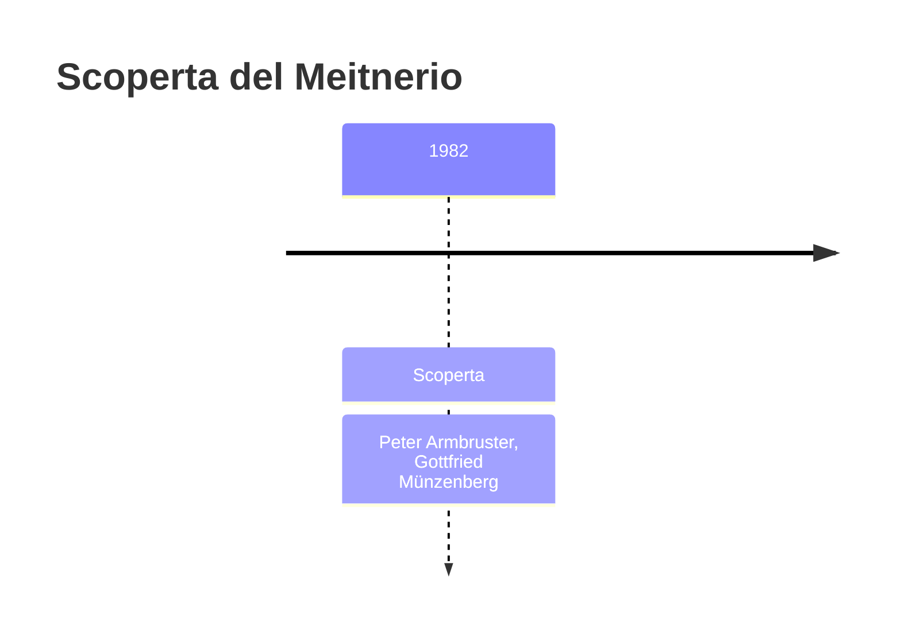
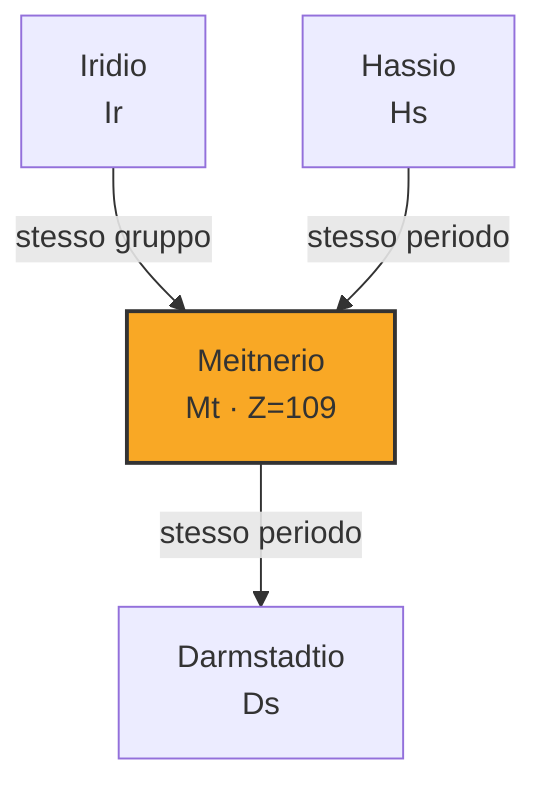
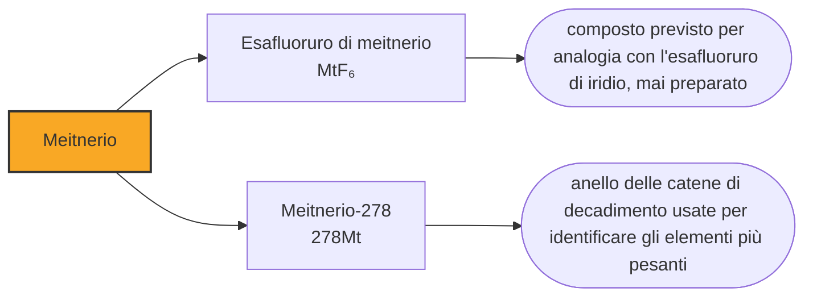

# Meitnerio (Mt)

> [!abstract] 108° elemento scoperto — 1982
> Il 29 agosto 1982 un rivelatore di Darmstadt registrò un atomo, uno solo. Di quell'elemento, più di quarant'anni dopo, non è ancora stata misurata una singola proprietà chimica.

Il meitnerio è una casella che contiene un nome, una manciata di eventi registrati e una colonna di previsioni. Non se ne conosce il colore, la densità, il comportamento in soluzione né alcun composto: tutto ciò che si sa con certezza è che esiste, quanto dura e in che cosa decade. In compenso il nome che porta è l'unico della tavola periodica dedicato specificamente a una donna realmente esistita.

## Cronologia della scoperta

## Storia della scoperta

L'atomo arrivò il 29 agosto 1982. Il gruppo di Peter Armbruster e Gottfried Münzenberg bombardava bismuto-209 con ioni di ferro-58, e il separatore consegnò ai rivelatori un nucleo di meitnerio-266, che decadde subito. Fu l'unico dell'intera campagna sperimentale.

Che un evento singolo basti a dichiarare un elemento nuovo sembra temerario, e non lo è, perché quell'evento non è un impulso isolato. Il nucleo si conficca in un rivelatore a stato solido che ne registra la posizione con precisione di frazioni di millimetro; poi decade, e la particella emessa parte dallo stesso punto; poi decade il figlio, e così via lungo una catena. Una sequenza di segnali nella stessa posizione, con gli intervalli e le energie giuste, ha una probabilità trascurabile di essere prodotta dal caso.

Lise Meitner aveva lavorato trent'anni a Berlino accanto a Otto Hahn, con cui nel 1917 aveva individuato il protoattinio. Ebrea di origine austriaca, nel 1938 dovette fuggire dalla Germania nazista e riparare in Svezia, e da lì continuò a corrispondere con il collega rimasto a Berlino.

Fu in quell'esilio che arrivò il risultato più importante della sua vita. Hahn e Fritz Strassmann avevano trovato bario in un campione di uranio bombardato con neutroni e non sapevano spiegarselo; Meitner, in Svezia, ne discusse con il nipote Otto Frisch e insieme capirono che il nucleo di uranio si era spezzato in due, calcolando l'energia che il processo doveva liberare. La loro interpretazione uscì su Nature nel febbraio del 1939, e da lì in poi il mondo seppe che cos'era la fissione nucleare.

Il premio Nobel per la chimica del 1944 fu assegnato al solo Hahn. Meitner, che aveva impostato la ricerca e fornito la spiegazione fisica, restò fuori: è uno dei casi più discussi nella storia del premio. Quando gli americani le proposero di lavorare al progetto della bomba rifiutò seccamente, dicendo che non voleva avere nulla a che fare con un ordigno, e più tardi disse di essere dispiaciuta che la bomba avesse dovuto essere inventata.

Il GSI propose meitnerium nel 1992. In una riga della tavola periodica in cui quasi ogni casella ha avuto la propria disputa di nomenclatura, questo nome non è mai stato contestato da nessuno: la IUPAC lo raccomandò nel 1994 e lo confermò nel 1997 senza che alcun laboratorio avanzasse alternative.

## Posizione nella tavola periodica

## Caratteristiche

Della chimica del meitnerio non si è misurato nulla, e la tabella dei dati di questa nota riporta previsioni teoriche, non risultati sperimentali. Il calcolo lo colloca nel gruppo 9, sotto cobalto, rodio e iridio, e ne fa un metallo nobile con lo stato di ossidazione +3 come più stabile in soluzione, accompagnato da un +1 e da un +6 possibili.

Il motivo per cui il bohrio e l'hassio hanno una chimica e il meitnerio no sta nei numeri: gli isotopi del meitnerio che si sanno produrre durano pochi secondi e se ne ottiene qualche atomo per settimana di macchina. Per fare chimica servono più atomi e più tempo di quanto questa casella conceda, e finora non è stato possibile ottenere né gli uni né l'altro.

Si conoscono una decina di isotopi del meitnerio, tutti prodotti in quantità minime. Il più longevo fra quelli confermati è il meitnerio-278, che arriva a quattro secondi e mezzo, e non si fabbrica direttamente: compare come anello intermedio nella catena di decadimenti del nihonio e degli elementi più pesanti. Gli isotopi leggeri, quelli ottenuti per fusione diretta, si misurano in millisecondi.

### Dati fisico-chimici

| Proprietà | Valore |
|---|---|
| Numero atomico | 109 |
| Massa atomica | 278,0 u |
| Categoria | Metallo di transizione |
| Gruppo | 9 |
| Periodo | 7 |
| Blocco | d |
| Configurazione elettronica | [Rn] 5f¹⁴ 6d⁷ 7s² |
| Punto di fusione | dato non disponibile |
| Punto di ebollizione | dato non disponibile |
| Densità | 37,4 g/cm³ |
| Stati di ossidazione | +1, +3, +6 |

## Struttura atomica

![[atomo-Meitnerio.svg]]

## Usi e presenza in natura

Il meitnerio non ha alcun uso e non ne avrà: non esiste in natura, se ne producono singoli atomi che spariscono in secondi, e la quantità complessiva mai esistita starebbe comodamente in una frase.

La sua utilità è indiretta ma reale: gli isotopi del meitnerio sono anelli delle catene di decadimento con cui si identificano gli elementi più pesanti. Quando un laboratorio dichiara di aver prodotto il 113 o il 115, la prova è la sequenza di decadimenti che ne segue, e in quella sequenza il meitnerio compare come tappa. Conoscerne bene le emivite e le energie significa poter riconoscere ciò che sta più in alto.

## Curiosità

Lise Meitner ha un cratere sulla Luna, uno su Venere, un asteroide della fascia principale e, dal 2000, un premio biennale della Società europea di fisica dedicato alla ricerca nucleare. L'elemento 109 ha preso il suo nome nel 1992, ventiquattro anni dopo la sua morte, ed è il riconoscimento che più somiglia a quello che i colleghi le avevano negato in vita.

Nella tavola periodica la casella 109 è l'unica intitolata specificamente a una donna realmente esistita. Il curio è dedicato a Pierre e Marie Curie insieme, non a lei sola, e gli altri nomi femminili della tavola appartengono alla mitologia o all'astronomia — il cerio a Cerere, il palladio a Pallade, il niobio a Niobe, il vanadio a Vanadís, uno dei nomi della dea nordica Freyja. Su centodiciotto caselle, una.

## Nella cronologia

← Precedente: [[Bohrio]] (1981)
→ Successivo: [[Hassio]] (1984)

Epoca: [[Era nucleare]] · Scopritori: [[Peter Armbruster]], [[Gottfried Münzenberg]]

## Fonti

- [Meitnerium](https://en.wikipedia.org/wiki/Meitnerium) — consultata il 10/09/2026
- [Meitnerium — Royal Society of Chemistry](https://periodic-table.rsc.org/element/109/meitnerium) — consultata il 10/09/2026
- [Lise Meitner](https://en.wikipedia.org/wiki/Lise_Meitner) — consultata il 10/09/2026
