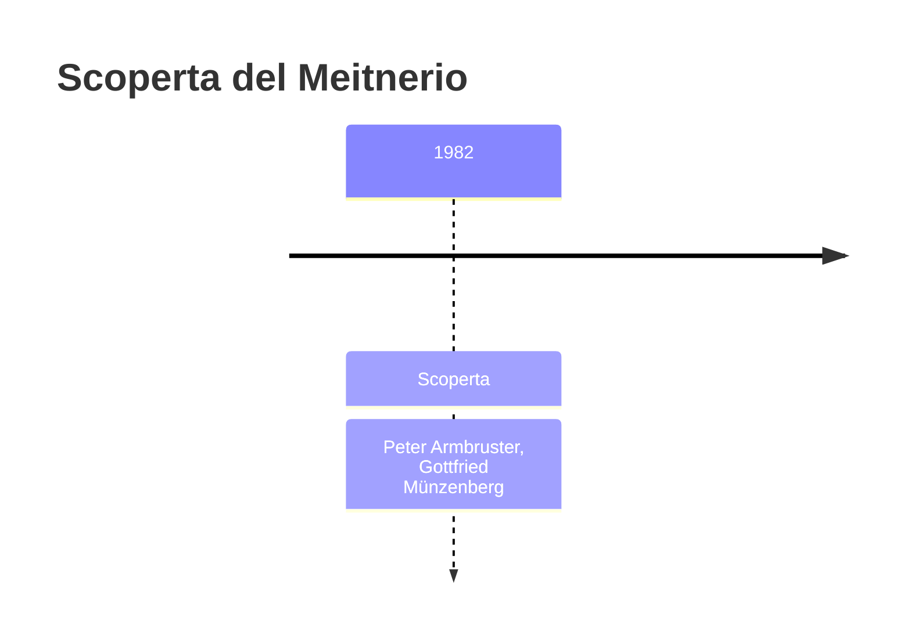
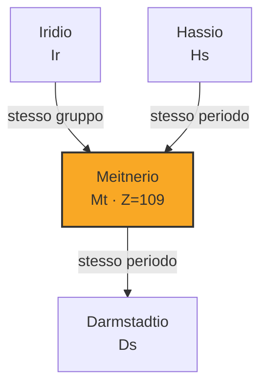

# Meitnerio (Mt)

> [!abstract] 108° elemento scoperto — 1982
> 

## Cronologia della scoperta

## Storia della scoperta

## Posizione nella tavola periodica

## Caratteristiche

### Dati fisico-chimici

| Proprietà | Valore |
|---|---|
| Numero atomico | 109 |
| Massa atomica | 278,0 u |
| Categoria | Metallo di transizione |
| Gruppo | 9 |
| Periodo | 7 |
| Blocco | d |
| Configurazione elettronica | [Rn] 5f¹⁴ 6d⁷ 7s² |
| Punto di fusione | dato non disponibile |
| Punto di ebollizione | dato non disponibile |
| Densità | 37,4 g/cm³ |
| Stati di ossidazione | — |

## Struttura atomica

![[atomo-Meitnerio.svg]]

## Usi e presenza in natura

## Nella cronologia

← Precedente: [[Bohrio]] (1981)
→ Successivo: [[Hassio]] (1984)

Epoca: [[Era nucleare]] · Scopritori: [[Peter Armbruster]], [[Gottfried Münzenberg]]

## Fonti

