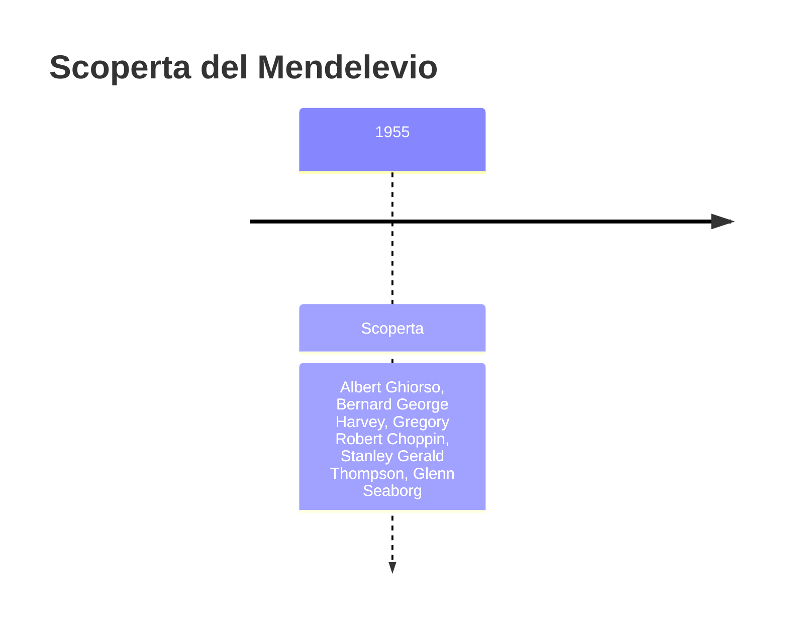
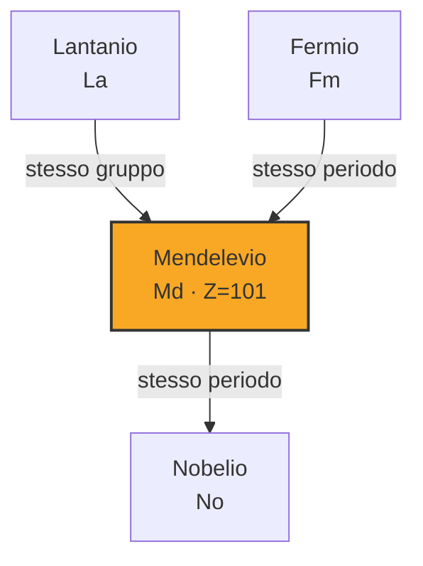
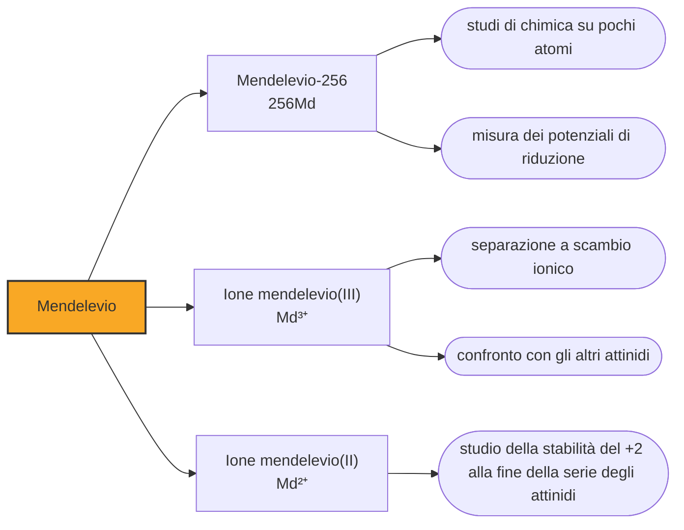

# Mendelevio (Md)

> [!abstract] 101° elemento scoperto — 1955
> Il bersaglio conteneva un miliardo di atomi, cioè un granello invisibile. Alla fine dell'esperimento gli atomi del nuovo elemento erano diciassette, e ciascuno di loro è stato contato uno per uno mentre moriva.

Il mendelevio è il primo elemento della tavola periodica a essere stato identificato un atomo alla volta. Fino al fermio si lavorava su quantità che, per quanto minuscole, si potevano ancora pesare o almeno vedere in soluzione; dalla casella 101 in avanti la chimica cambia mestiere e diventa il conteggio di eventi singoli, ciascuno dei quali va riconosciuto per quello che è nel momento in cui accade.

## Cronologia della scoperta

> [!info] Nota sulla cronologia
> Primo elemento identificato un atomo alla volta: diciassette atomi di mendelevio-256 riconosciuti fra il 18 e il 19 febbraio 1955 a Berkeley, bombardando con particelle alfa un bersaglio di einsteinio-253 di circa un miliardo di atomi. Gli autori documentati sono cinque — Ghiorso, Harvey, Choppin, Thompson e Seaborg — e la cronologia di riferimento li comprimeva in «Seaborg et al.». Il nome fu approvato nel 1955 con il simbolo Mv, sostituito da Md nel 1957.

## Storia della scoperta

Nel 1955 il gruppo di Berkeley si trovò davanti a un problema di quantità. Per fabbricare l'elemento 101 serviva un bersaglio di einsteinio, e di einsteinio al mondo ne esisteva quanto se ne era riusciti a produrre in reattore: circa un miliardo di atomi, una quantità che non si vede, non si pesa e si maneggia solo perché è radioattiva e quindi si può seguire. Quel miliardo di atomi fu depositato per via elettrolitica su una sottilissima lamina d'oro, e quella lamina divenne il bersaglio.

L'idea che rese possibile l'esperimento fu di non cercare il nuovo elemento nel bersaglio. Quando una particella alfa del ciclotrone da sessanta pollici colpisce un nucleo di einsteinio e vi si fonde, il nucleo prodotto rincula in avanti per l'urto: basta mettere una seconda lamina d'oro dietro il bersaglio e gli atomi nuovi vi si conficcano da soli, separati da tutto il resto. Quella lamina di raccolta si poteva sciogliere in pochi minuti, senza dover smontare il bersaglio prezioso, che restava intatto per la serie successiva.

Fra il ciclotrone e la stanza dei contatori c'erano alcune centinaia di metri di collina, e gli isotopi da riconoscere duravano un'ora e poco più. I campioni furono portati da un edificio all'altro in automobile, di corsa, mentre l'esperimento andava avanti: ogni bombardamento produceva un campione, ogni campione partiva subito, e i rivelatori cominciavano a contare prima che la serie successiva fosse finita.

Il conteggio decisivo è del 19 febbraio 1955. Il mendelevio-256 non fu visto direttamente: decade per cattura elettronica in fermio-256, che si spezza da solo in due frammenti, e sono quelle fissioni spontanee — impulsi enormi, impossibili da confondere con il fondo — che i rivelatori registravano. In tutto furono diciassette, e a ciascuna il gruppo riunito attorno alla strumentazione rispose con un urlo di gioia: gli «hooray» finirono registrati insieme agli impulsi.

Contare gli eventi non bastava a dire che l'elemento fosse il 101. La prova arrivò dalla separazione a scambio ionico: gli attinidi escono da una colonna cromatografica in un ordine che dipende dal numero atomico, e da anni quell'ordine era noto e prevedibile. L'attività comparve esattamente nella posizione che spettava all'elemento successivo al fermio, in una frazione dove nessuna altra cosa nota poteva trovarsi. È il metodo che aveva già identificato il berkelio e il californio, spinto qui al limite di una manciata di atomi.

Il gruppo propose di dedicare l'elemento a Dmitrij Mendeleev, l'autore della tavola periodica. Nel 1955, in piena guerra fredda, intitolare a un russo un elemento fabbricato in un laboratorio americano non era una scelta neutra: Seaborg dovette chiedere il permesso al governo degli Stati Uniti, che lo concesse, e ricordò poi che il gesto non era piaciuto a tutti in patria. La IUPAC accettò il nome nello stesso anno con il simbolo Mv, cambiato in Md nel 1957.

## Posizione nella tavola periodica

## Caratteristiche

Si conoscono una ventina di isotopi del mendelevio, tutti radioattivi. Il più longevo è il mendelevio-258, che dura poco meno di cinquantadue giorni; il mendelevio-260 ne dura ventotto. Quello che si usa davvero in laboratorio è il mendelevio-256 dell'esperimento originale, che con i suoi settantotto minuti scarsi è il meno stabile dei tre ma anche il più facile da produrre in quantità sufficienti a fare un esperimento.

In soluzione il mendelevio si comporta come ci si aspetta da un attinide della fine della serie: lo stato normale è il +3, ma si lascia ridurre al +2 con facilità crescente rispetto ai vicini più leggeri, ed è proprio su di lui che questa tendenza comincia a diventare la regola invece dell'eccezione. È stato riportato anche uno stato +1, che sarebbe unico fra gli attinidi, ma gli esperimenti successivi non l'hanno confermato e la questione resta aperta.

Il metallo non è mai stato preparato, e i valori di densità e punto di fusione che compaiono nelle tabelle sono stime teoriche, non misure. Le quantità prodotte in una campagna sperimentale si contano in milioni di atomi, cioè in miliardesimi di miliardesimo di grammo: quanto basta per una misura radiochimica, non per vedere alcunché.

### Dati fisico-chimici

| Proprietà | Valore |
|---|---|
| Numero atomico | 101 |
| Massa atomica | 258,0 u |
| Categoria | Attinide |
| Gruppo | 3 |
| Periodo | 7 |
| Blocco | f |
| Configurazione elettronica | [Rn] 5f¹³ 7s² |
| Punto di fusione | 826,9 °C |
| Punto di ebollizione | dato non disponibile |
| Densità | dato non disponibile |
| Stati di ossidazione | +2, +3 |

## Struttura atomica

![[atomo-Mendelevio.svg]]

## Usi e presenza in natura

Il mendelevio non ha usi pratici e non ne avrà: si produce in pochi laboratori al mondo, in quantità che non permettono nulla al di fuori della misura, e scompare nel giro di ore o di settimane. Tutto quello che se ne fa è ricerca fondamentale sulla chimica degli attinidi pesanti, cioè sul modo in cui gli elettroni si dispongono quando il nucleo è così carico da deformare le regole che valgono nel resto della tavola.

La domanda a cui serve rispondere è quanto la fine della serie degli attinidi assomigli alla fine della serie dei lantanidi. Se il +2 diventa stabile perché il guscio 5f si sta riempiendo, allora il comportamento degli ultimi attinidi si può prevedere per analogia; se non è così, i modelli vanno rifatti. Misurare i potenziali di riduzione del mendelevio su poche migliaia di atomi è uno dei modi in cui questa domanda viene messa alla prova, ed è il motivo per cui a un elemento senza applicazioni si dedicano campagne sperimentali intere.

## Curiosità

Mendeleev fu candidato al premio Nobel per la chimica e non lo ottenne mai: nel 1906 l'Accademia svedese gli preferì Henri Moissan, e l'anno dopo Mendeleev morì. L'elemento 101 è arrivato quasi mezzo secolo più tardi, ed è un riconoscimento di natura diversa: la tavola che porta il suo nome aveva previsto le caselle vuote del suo tempo, e adesso lo ospitava in una casella che nel suo tempo nessuno immaginava esistesse.

L'esperimento del 1955 ha inaugurato un mestiere. Da allora la chimica degli elementi pesantissimi si fa su campioni che contengono un numero di atomi leggibile a mente, con tecniche pensate per dare una risposta statistica su eventi rari invece che una misura su una sostanza. Tutti gli elementi delle caselle successive sono stati studiati così, e il metodo del rinculo su lamina di raccolta è ancora oggi il modo standard di separare un atomo appena nato dal bersaglio che lo ha generato.

## Nella cronologia

← Precedente: [[Fermio]] (1952)
→ Successivo: [[Nobelio]] (1958)

Epoca: [[Era nucleare]] · Scopritori: [[Albert Ghiorso]], [[Bernard George Harvey]], [[Gregory Robert Choppin]], [[Stanley Gerald Thompson]], [[Glenn Seaborg]]

## Fonti

- [Mendelevium](https://en.wikipedia.org/wiki/Mendelevium) — consultata il 09/09/2026
- [Mendelevium — Royal Society of Chemistry](https://periodic-table.rsc.org/element/101/mendelevium) — consultata il 09/09/2026
- [Ion exchange](https://en.wikipedia.org/wiki/Ion_exchange) — consultata il 09/09/2026
