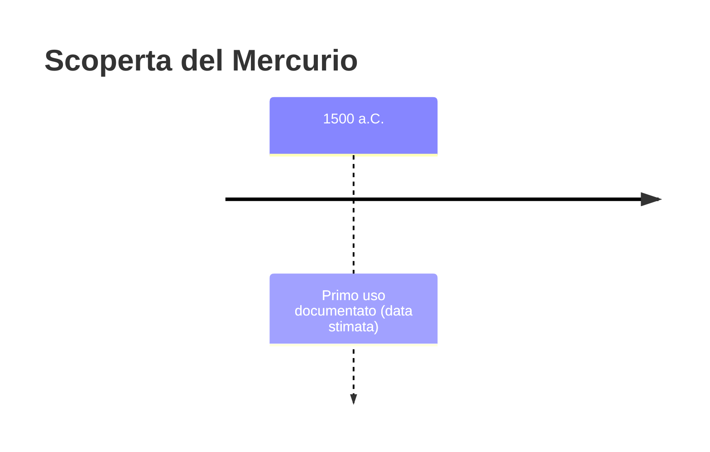
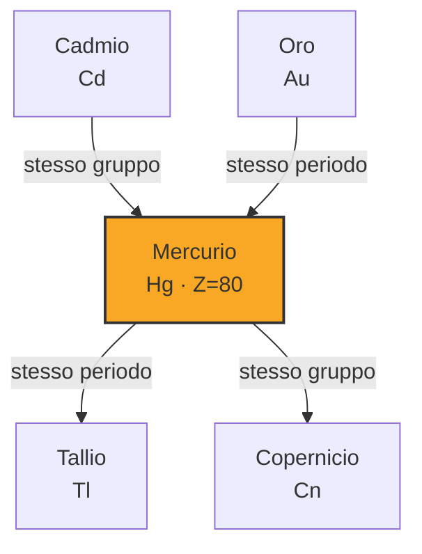
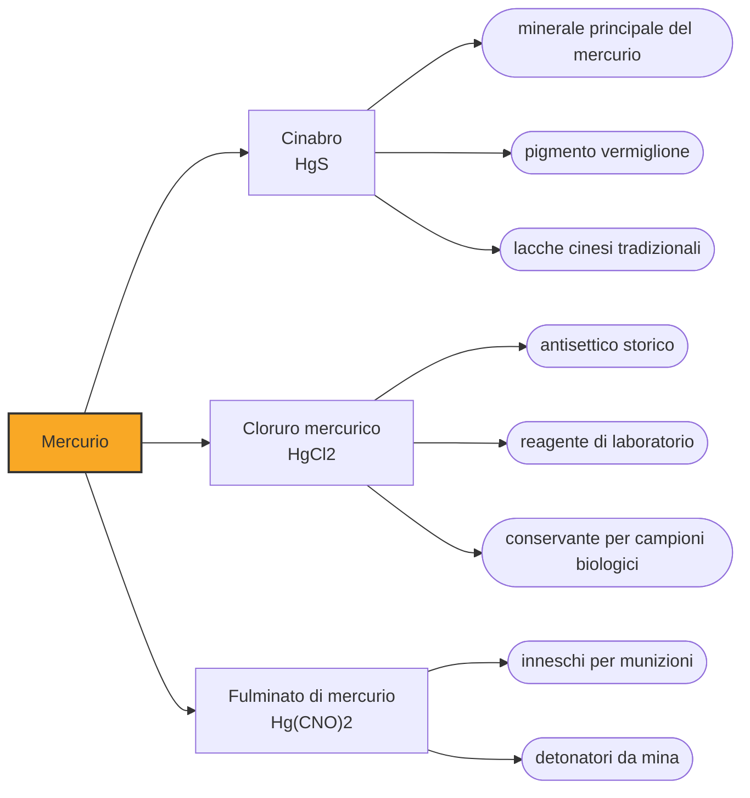

# Mercurio (Hg)

> [!abstract] 10° elemento scoperto — 1500 a.C.
> Un metallo che si versa. Per tremila anni il mercurio è stato l'anomalia che nessuna teoria della materia riusciva a sistemare, e la sostanza su cui l'umanità ha riposto le sue speranze più assurde: fare oro, non morire mai.

Il mercurio è l'unico metallo liquido a temperatura ambiente, e questo lo ha reso fin dall'inizio un oggetto scandaloso. Pesa quasi quattordici volte l'acqua, non bagna ciò che tocca, si spezza in goccioline che corrono e si riuniscono: un materiale che sembra vivo, e che per millenni è stato trattato come tale.

## Cronologia della scoperta

## Storia della scoperta

La storia del mercurio comincia dal suo minerale. Il cinabro, solfuro di mercurio, è una pietra rosso acceso, macinata come pigmento fin dal Neolitico: quel rosso è il vermiglione, il colore più prezioso della pittura antica. Riscaldandolo, però, il minerale si decompone e il metallo se ne stacca come vapore che ricondensa in gocce: un passaggio semplicissimo da eseguire e difficilissimo da immaginare.

Del metallo liquido si sono trovate tracce in tombe egizie del XVI-XV secolo a.C., ed è a questi reperti che si riferisce la data convenzionale usata qui. Il ritrovamento però non spiega l'uso: non sappiamo se servisse a un rituale o alla cosmesi, e la scarsità dei reperti non consente di dire che gli egizi lo usassero correntemente.

La testimonianza antica più spettacolare arriva dalla Cina. Le Memorie di uno storico di Sima Qian raccontano che nel mausoleo del primo imperatore Qin Shi Huang, morto nel 210 a.C., i cento fiumi della Cina e il grande mare fossero riprodotti in mercurio corrente, sotto una volta di costellazioni. La camera sepolcrale non è mai stata aperta, ma dagli anni Ottanta le indagini geochimiche del tumulo misurano concentrazioni di mercurio enormemente superiori a quelle dei terreni circostanti: il racconto, per una volta, ha un riscontro fisico.

Lo stesso imperatore che si fece seppellire fra i fiumi di mercurio lo assumeva da vivo. L'alchimia cinese contava il cinabro fra gli ingredienti dell'elisir di lunga vita, sul ragionamento che una sostanza incorruttibile trasmettesse la propria incorruttibilità a chi la beveva. Le storie ufficiali registrano una lunga sequenza di imperatori e funzionari morti per questi preparati, almeno cinque nella sola dinastia Tang. Del caso meglio ricostruito, Xianzong morto nell'820, le cronache descrivono collera incontrollabile e paranoia crescente: sintomi che oggi si leggono come intossicazione.

In Occidente il mercurio ha una posizione teorica altrettanto centrale: gli alchimisti lo consideravano la materia prima da cui tutti i metalli sono formati, e facevano dipendere le differenze fra piombo, argento e oro da quanto zolfo vi si fosse combinato. È una teoria sbagliata ma non stupida, perché giustifica il progetto della trasmutazione: se i metalli sono tutti la stessa cosa mal cotta, basta correggere la ricetta.

C'è un motivo pratico per cui il mercurio conta tanto: scioglie l'oro e l'argento in amalgami, leghe pastose da cui il metallo prezioso si recupera per evaporazione. Il processo del patio, del 1558, applica il principio all'argento americano e rende il mercurio una materia prima strategica dell'impero spagnolo: la sola miniera peruviana di Huancavelica ne produrrà oltre centomila tonnellate in tre secoli, in condizioni di lavoro che uccidevano gli operai indigeni con regolarità.

## Posizione nella tavola periodica

## Caratteristiche

Perché il mercurio è liquido, mentre lo zinco e il cadmio che gli stanno sopra nel gruppo sono solidi normalissimi? La risposta sta nella relatività. In un atomo così pesante gli elettroni interni viaggiano a una frazione consistente della velocità della luce, e questo contrae gli orbitali esterni legando gli elettroni di valenza troppo strettamente perché li si possa condividere con gli atomi vicini. Il legame metallico ne esce indebolito: il mercurio fonde a meno trentanove gradi, il punto più basso di ogni metallo stabile.

Chimicamente il mercurio è avaro. Tutti i suoi composti comuni stanno in due soli stati di ossidazione, più uno e più due, e il primo ha una particolarità: nello ione mercuroso gli atomi restano attaccati fra loro a coppie, cosa che nessun altro metallo comune fa. La letteratura elenca anche un meno due, che il mercurio raggiunge nei mercuriuri, composti esotici in cui è un metallo ancora più elettropositivo, il cesio, a cedere elettroni a lui; le pretese di valenze superiori, riproposte fino al 2007, restano contestate.

La tossicità del mercurio dipende dalla forma. Il metallo liquido ingerito attraversa l'intestino quasi indisturbato, ma i suoi vapori, che si sviluppano già a temperatura ambiente, passano dai polmoni al cervello e vi si accumulano. I peggiori di tutti sono i composti organici come il metilmercurio, che i batteri producono nelle acque inquinate: risalgono la catena alimentare e si concentrano nei pesci grandi. È la via che a Minamata, in Giappone, negli anni Cinquanta ha avvelenato un'intera baia.

### Dati fisico-chimici

| Proprietà | Valore |
|---|---|
| Numero atomico | 80 |
| Massa atomica | 200,5923 u |
| Categoria | Metallo di transizione |
| Gruppo | 12 |
| Periodo | 6 |
| Blocco | d |
| Configurazione elettronica | [Xe] 4f¹⁴ 5d¹⁰ 6s² |
| Punto di fusione | -38,8 °C |
| Punto di ebollizione | 356,7 °C |
| Densità | 13,534 g/cm³ |
| Stati di ossidazione | -2, +1, +2 |

## Struttura atomica

![[atomo-Mercurio.svg]]

## Usi e presenza in natura

Per due secoli il mercurio è stato lo strumento di misura per eccellenza. Termometri, barometri e sfigmomanometri sfruttavano la stessa combinazione di doti: una densità che tiene corta la colonna, una dilatazione regolare su un intervallo ampio e la proprietà di non bagnare il vetro, che lascia il menisco netto e la lettura ripetibile. Nessun altro liquido le aveva tutte insieme, ed è per questo che la pressione del sangue si misura ancora oggi in millimetri di mercurio.

Poi si è smesso, e in fretta. Il mercurio è uscito prima dagli ospedali, poi dalle case, infine dai processi industriali che lo usavano a tonnellate, sostituito da sensori elettronici che costano meno e non versano nulla se cadono. La Convenzione di Minamata, in vigore dal 2017, ha reso il ritiro un obbligo di legge, e le miniere occidentali hanno chiuso, l'ultima statunitense nel 1992. Il grosso del mercurio che finisce oggi nell'ambiente non viene però dagli oggetti, ma dalla combustione del carbone e dall'estrazione artigianale dell'oro, dove i cercatori lo maneggiano a mani nude come quattro secoli fa.

## Curiosità

Il simbolo Hg non c'entra nulla con il nome italiano: viene da hydrargyrum, latinizzazione del greco hydrargyros, argento liquido. Il nome che usiamo è invece quello del pianeta, e prima ancora del dio messaggero, per la rapidità con cui il metallo sfugge di mano. Delle due promesse affidategli non ne ha mantenuta nessuna: non ha fatto oro, e ha accorciato la vita a chi contava di allungarla. Ha però dato alla scienza lo strumento con cui, alla lettera, si è misurata per tre secoli.

L'espressione inglese matto come un cappellaio ha una base occupazionale precisa. Dalla metà del Settecento la feltratura dei cappelli usava una soluzione di nitrato mercurico, e i lavoranti esposti per anni ai vapori sviluppavano tremori, timidezza patologica e irritabilità estrema: un quadro clinico che porta il nome di eretismo mercuriale. Negli Stati Uniti la pratica fu vietata solo nel dicembre del 1941.

## Nella cronologia

← Precedente: [[Zolfo]] (2000 a.C.)
→ Successivo: [[Zinco]] (1000 a.C.)

Epoca: [[Antichità]]

## Fonti

- [Mercury (element)](https://en.wikipedia.org/wiki/Mercury_(element)) — consultata il 07/09/2026
- [Flowing rivers of mercury (Chemistry World)](https://www.chemistryworld.com/features/flowing-rivers-of-mercury/8122.article) — consultata il 07/09/2026
- [Mercury as a Geophysical Tracer Gas: Emissions from the Emperor Qin Tomb in Xi'an Studied by Laser Radar (Scientific Reports, 2020)](https://www.nature.com/articles/s41598-020-67305-x) — consultata il 07/09/2026
- [Elixirs of Immortal Life Were a Deadly Obsession (JSTOR Daily)](https://daily.jstor.org/elixir-immortal-life-deadly-obsessions/) — consultata il 07/09/2026
