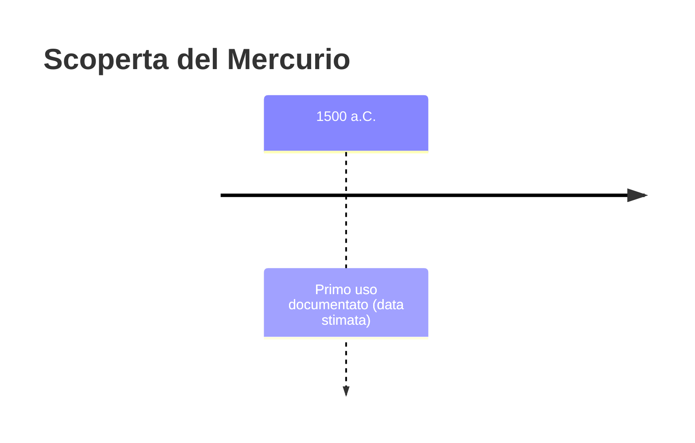
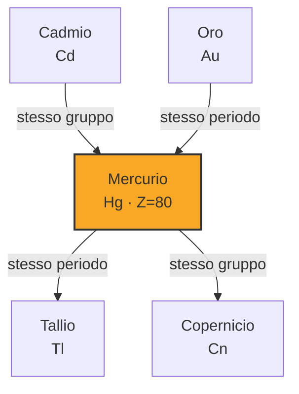

# Mercurio (Hg)

> [!abstract] 10° elemento scoperto — 1500 a.C.
> 

## Cronologia della scoperta

## Storia della scoperta

## Posizione nella tavola periodica

## Caratteristiche

### Dati fisico-chimici

| Proprietà | Valore |
|---|---|
| Numero atomico | 80 |
| Massa atomica | 200,5923 u |
| Categoria | Metallo di transizione |
| Gruppo | 12 |
| Periodo | 6 |
| Blocco | d |
| Configurazione elettronica | [Xe] 4f¹⁴ 5d¹⁰ 6s² |
| Punto di fusione | -38,8 °C |
| Punto di ebollizione | 356,7 °C |
| Densità | 13,534 g/cm³ |
| Stati di ossidazione | — |

## Struttura atomica

![[atomo-Mercurio.svg]]

## Usi e presenza in natura

## Nella cronologia

← Precedente: [[Zolfo]] (2000 a.C.)
→ Successivo: [[Zinco]] (1000 a.C.)

Epoca: [[Antichità]]

## Fonti

