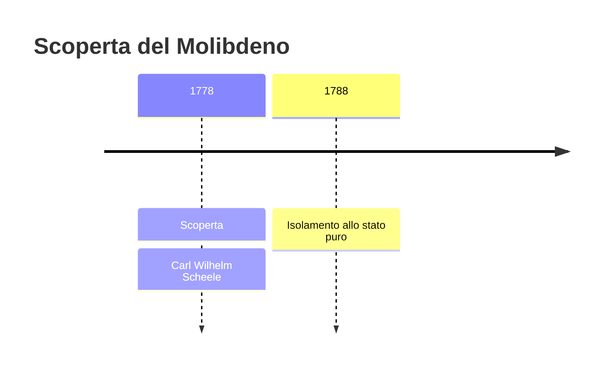
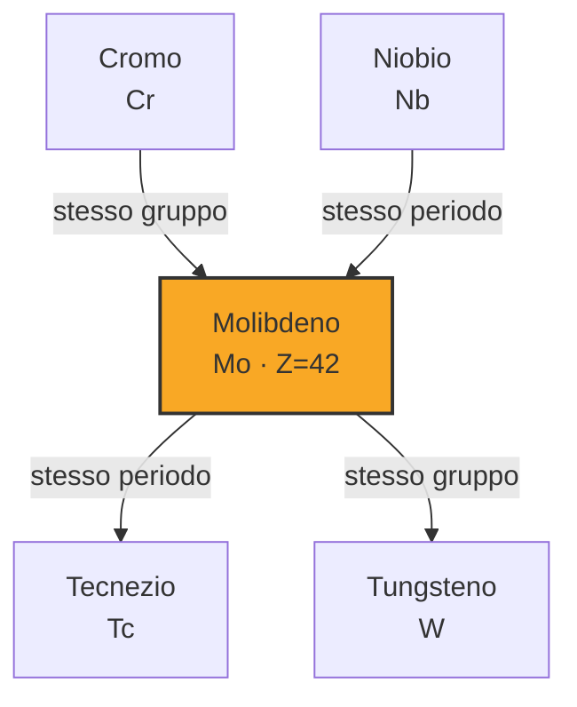

# Molibdeno (Mo)

> [!abstract] 29° elemento scoperto — 1778
> 

## Cronologia della scoperta

## Storia della scoperta

## Posizione nella tavola periodica

## Caratteristiche

### Dati fisico-chimici

| Proprietà | Valore |
|---|---|
| Numero atomico | 42 |
| Massa atomica | 95,951 u |
| Categoria | Metallo di transizione |
| Gruppo | 6 |
| Periodo | 5 |
| Blocco | d |
| Configurazione elettronica | [Kr] 4d⁵ 5s¹ |
| Punto di fusione | 2622,9 °C |
| Punto di ebollizione | 4638,9 °C |
| Densità | 10,28 g/cm³ |
| Stati di ossidazione | — |

## Struttura atomica

![[atomo-Molibdeno.svg]]

## Usi e presenza in natura

## Nella cronologia

← Precedente: [[Cloro]] (1774)
→ Successivo: [[Tungsteno]] (1781)

Epoca: [[Chimica pneumatica]] · Scopritore: [[Carl Wilhelm Scheele]]

## Fonti

