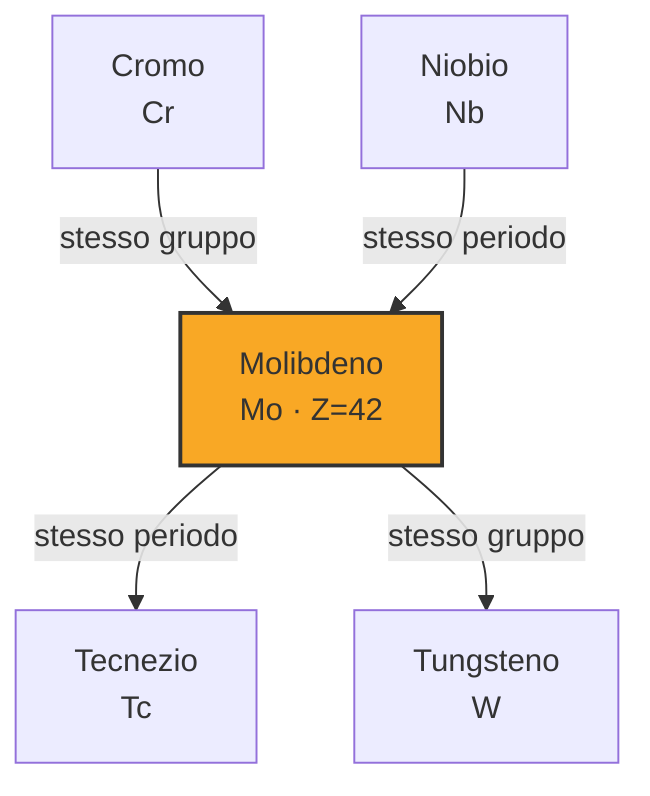
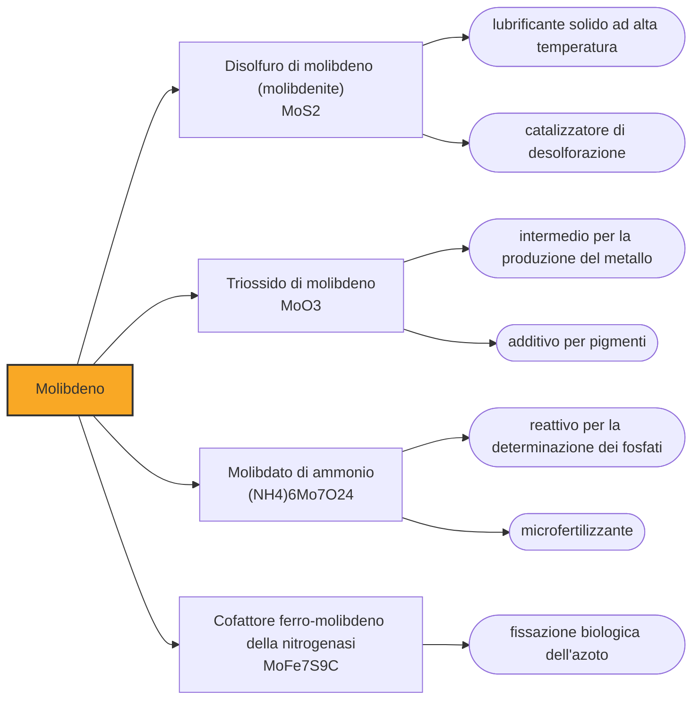

# Molibdeno (Mo)

> [!abstract] 29° elemento scoperto — 1778
> Per secoli fu scambiato per piombo, e il nome che porta è ancora quello dello sbaglio. Ci volle un farmacista svedese per accorgersi che quella pietra scrivente non conteneva nulla di noto.

Il molibdeno è un metallo grigio argenteo che fonde intorno ai 2620 gradi, uno dei più refrattari della tavola periodica, e che quasi nessuno vede mai allo stato puro: quasi tutto ciò che se ne estrae finisce dentro l'acciaio, dove basta una frazione di punto percentuale a cambiare il carattere della lega. È il primo di una serie di elementi che il Settecento tira fuori non dall'aria, ma dai minerali smontati pezzo per pezzo.

## Cronologia della scoperta

## Storia della scoperta

La storia comincia da un equivoco durato secoli. Esisteva una categoria di pietre morbide, grigie e untuose, che lasciavano un segno scuro sulla carta e che si chiamavano tutte allo stesso modo: molybdaena, dal greco molybdos, piombo. Sotto quel nome finivano la grafite, la galena e quella che oggi chiamiamo molibdenite, tre minerali che non hanno nulla in comune se non l'aspetto e il fatto di sporcare le dita.

Il primo colpo all'equivoco arriva nel 1754, quando lo svedese Bengt Andersson Qvist esamina una di quelle pietre e stabilisce che di piombo non ne contiene affatto. È una notizia negativa, che dice che cosa la sostanza non è senza dire che cosa sia, e come tutte le notizie negative resta lì per un quarto di secolo senza che nessuno sappia farne qualcosa.

Nel 1778 Carl Wilhelm Scheele riprende il problema e lo chiude dal lato dell'analisi. Tratta il minerale con acido nitrico e ottiene una polvere bianca che non è né grafite né un composto di piombo: è un acido nuovo, l'acido molibdico, e il metallo che gli sta dentro non corrisponde a nessuno di quelli noti. Distinguere fra loro tre minerali che si somigliano è, in quegli anni, un risultato più difficile che trovarne uno nuovo.

Scheele si ferma esattamente dove si ferma sempre. Lavora dietro il banco di una farmacia di provincia, con storte e fornelli che chiunque potrebbe permettersi, e in pochi anni mette le mani su un numero di sostanze nuove che nessun accademico d'Europa riesce a eguagliare; ma ridurre a metallo un acido terroso richiede fornaci che una farmacia non ha. Manda dunque il suo ossido a chi quelle fornaci le possiede.

Il destinatario è Peter Jacob Hjelm, saggiatore del Collegio delle miniere di Stoccolma, che nel 1781 impasta l'ossido con olio di lino e lo scalda con il carbone in un crogiolo chiuso. L'olio tiene insieme la polvere e porta altro carbonio esattamente dove serve; quel che resta sul fondo è un metallo grigio che nessuno aveva mai visto. Hjelm riconosce a Scheele il credito della scoperta, e la coppia analista-metallurgista diventa il modo svedese di fare elementi nuovi.

Il nome resta quello dell'errore. Molibdeno viene da molybdos, piombo, cioè dalla sostanza che il minerale non contiene e per la quale era stato scambiato per secoli; e il minerale, ribattezzato molibdenite, porta la stessa impronta. È il contrario di quel che ci si aspetterebbe da una nomenclatura razionale, ma nella tavola periodica i nomi non registrano la natura delle cose: registrano la storia di chi le ha guardate.

## Posizione nella tavola periodica

## Caratteristiche

Il molibdeno appartiene al piccolo gruppo dei metalli refrattari, quelli che restano solidi dove tutti gli altri colano. Fonde intorno ai 2620 gradi, fra i valori più alti di tutti gli elementi che si trovano in natura, e conserva rigidità e resistenza a temperature alle quali l'acciaio comune si affloscia. Ha però un difetto che ne limita l'uso allo stato puro: oltre il mezzo migliaio di gradi, all'aria, si ossida in fretta e il suo ossido è volatile, quindi il metallo va protetto o tenuto sotto vuoto.

Il suo talento vero è agire in piccola dose dentro un altro metallo. Aggiunto all'acciaio in quantità dell'ordine di qualche decimo di punto percentuale ne affina la struttura e ne alza tenacità, durezza a caldo e resistenza alla corrosione, ed è per questo che quasi ogni acciaio da impiego severo, dai tubi delle condotte alle lame degli utensili, ne contiene un poco. Il molibdeno è l'esempio classico di elemento che conta non per quanto ce n'è, ma per dove lo si mette.

A dispetto dell'aria da metallo pesante, il molibdeno è indispensabile alla vita. Sta al centro di decine di enzimi e soprattutto della nitrogenasi, la macchina molecolare con cui certi batteri rompono il triplo legame dell'azoto atmosferico e lo rendono utilizzabile dalle piante: senza quel cofattore di ferro e molibdeno la catena alimentare terrestre non avrebbe da dove cominciare.

### Dati fisico-chimici

| Proprietà | Valore |
|---|---|
| Numero atomico | 42 |
| Massa atomica | 95,951 u |
| Categoria | Metallo di transizione |
| Gruppo | 6 |
| Periodo | 5 |
| Blocco | d |
| Configurazione elettronica | [Kr] 4d⁵ 5s¹ |
| Punto di fusione | 2622,9 °C |
| Punto di ebollizione | 4638,9 °C |
| Densità | 10,28 g/cm³ |
| Stati di ossidazione | -4, -2, -1, +1, +2, +3, +4, +5, +6 |

## Struttura atomica

![[atomo-Molibdeno.svg]]

## Usi e presenza in natura

La destinazione dominante resta la metallurgia, che assorbe la gran parte della produzione: acciai basso-legati, inossidabili per ambienti aggressivi, superleghe per turbine, elettrodi e schermature per forni ad alta temperatura. Il resto si divide fra la chimica e la lubrificazione, con un ruolo di rilievo nei catalizzatori che tolgono lo zolfo dai carburanti prima che finisca nei motori e nell'aria.

Il disolfuro di molibdeno chiude il cerchio con il minerale di partenza. È fatto di strati che scivolano l'uno sull'altro come le carte di un mazzo, e proprio per questo lascia il segno sulla carta e lubrifica dove gli oli non reggono: alle temperature estreme, nel vuoto dello spazio, sotto carichi che schiaccerebbero via qualunque velo di liquido. La proprietà che per secoli lo aveva fatto confondere con la grafite è oggi la ragione per cui lo si usa.

## Curiosità

Negli stessi anni in cui si occupava della molibdenite, Scheele mise a punto un prodotto che gli sopravvisse molto più a lungo dei suoi elementi: il verde all'arsenito di rame che porta il suo nome, più brillante e più stabile di ogni verde di rame precedente, la cui preparazione pubblicò nel 1778 e che l'Ottocento avrebbe steso su carte da parati e tessuti di mezza Europa. Lo stesso uomo che in pochi anni riconosce ossigeno, cloro, molibdeno e tungsteno trovava anche il tempo di risolvere un problema dei tintori.

Scheele morì a quarantatré anni, nel maggio del 1786, e sulla causa si è costruita una storia esemplare: che a ucciderlo sia stata l'abitudine, comune ai chimici del suo tempo, di annusare e assaggiare ogni sostanza nuova per riconoscerla, arsenico e composti di mercurio compresi. Il registro parrocchiale però indica la consunzione, cioè la tubercolosi; chi lo assistette riferì segni compatibili con un avvelenamento da mercurio, e negli ultimi mesi soffriva ai reni. Che il mestiere lo abbia logorato è verosimile, e non è mai stato dimostrato.

## Nella cronologia

← Precedente: [[Cloro]] (1774)
→ Successivo: [[Tungsteno]] (1781)

Epoca: [[Chimica pneumatica]] · Scopritore: [[Carl Wilhelm Scheele]]

## Fonti

- [Molybdenum](https://en.wikipedia.org/wiki/Molybdenum) — consultata il 07/09/2026
- [Peter Jacob Hjelm — Scientist of the Day (Linda Hall Library)](https://www.lindahall.org/about/news/scientist-of-the-day/peter-jacob-hjelm/) — consultata il 07/09/2026
- [Carl Wilhelm Scheele — the Uppsala chemist who discovered oxygen and chlorine](https://www.uu.se/en/about-uu/history/prominent-people/carl-scheele) — consultata il 07/09/2026
- [Scheele's green](https://en.wikipedia.org/wiki/Scheele%27s_green) — consultata il 07/09/2026
