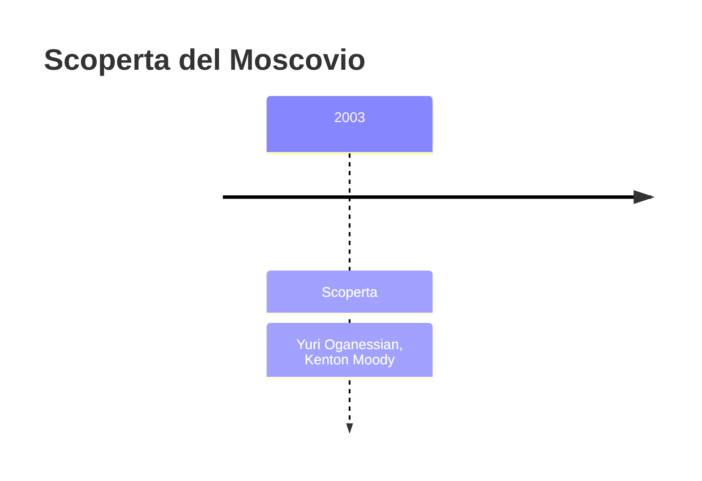
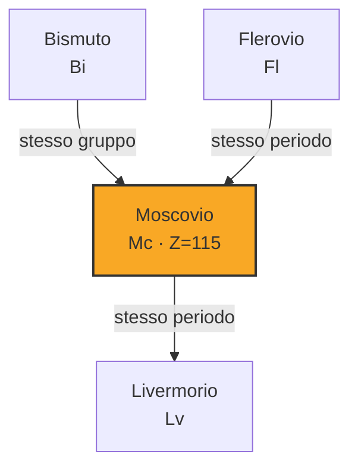
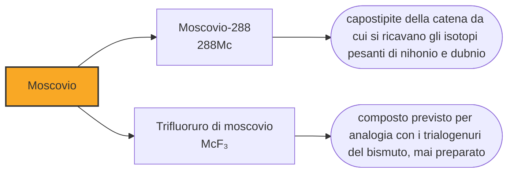

# Moscovio (Mc)

> [!abstract] 114° elemento scoperto — 2003
> Di tutte le caselle della tavola periodica, la 115 è quella con la doppia vita più netta: quattro atomi prodotti in un laboratorio russo nel 2003, e una carriera parallela, cominciata prima, come carburante dei dischi volanti.

Il moscovio è la casella 115, e nella cultura popolare l'«elemento 115» ha una vita propria, del tutto scollegata dai quattro atomi che ne sono stati prodotti a Dubna nel 2003. Vale la pena raccontare entrambe le storie, perché il contrasto fra le due dice qualcosa su come funziona la scienza reale.

## Cronologia della scoperta

> [!info] Nota sulla cronologia
> La data è quella della sintesi, nell'agosto del 2003; il riconoscimento IUPAC è del dicembre 2015, dopo le conferme indipendenti arrivate da Lund nel 2013 e da Berkeley nel 2015. Il nome, ufficiale dal 28 novembre 2016, viene dall'oblast' di Mosca, la regione in cui si trova Dubna, e non dalla città.

## Storia della scoperta

L'agosto del 2003 il gruppo di Jurij Oganesjan bombardò un bersaglio di americio-243 con ioni di calcio-48 e ottenne quattro atomi dell'elemento 115, in due isotopi. Ciascuno visse circa un decimo di secondo prima di emettere una particella alfa e diventare nihonio, che a sua volta decadde in roentgenio e poi giù lungo la catena.

Quell'esperimento produsse in realtà due elementi. Ogni atomo di 115, decadendo, diventava un atomo di 113, e la collaborazione russo-americana rivendicò entrambe le caselle. Per il 115 la rivendicazione ha retto; per il 113 no, perché la catena finiva su nuclei mai osservati prima e non permetteva di risalire con certezza al numero atomico. Dodici anni dopo la casella 113 è stata assegnata a un laboratorio giapponese che l'aveva fabbricata direttamente, un atomo alla volta.

A differenza di altre caselle di questa riga, il moscovio è stato confermato in fretta e da più parti. Nel 2013 un gruppo dell'università di Lund, in Svezia, ripeté l'esperimento al GSI e ritrovò la stessa catena di decadimenti; altre conferme arrivarono da Berkeley nel 2015. Nel dicembre di quell'anno la IUPAC riconobbe la scoperta alla collaborazione russo-americana.

Il nome fu proposto nel 2016 e ufficializzato il 28 novembre. Non viene dalla città di Mosca ma dall'oblast', la regione amministrativa in cui Dubna si trova: è il riconoscimento del territorio che ospita l'istituto, dopo che la stessa collaborazione aveva già intitolato la casella 116 al laboratorio americano.

L'altra storia comincia nel 1989. Un uomo di nome Bob Lazar sostenne di aver lavorato in una struttura militare segreta nel Nevada su veicoli di origine extraterrestre, alimentati da un elemento 115 stabile che secondo lui generava onde gravitazionali: bombardato con protoni sarebbe passato all'elemento 116, e i prodotti di quel decadimento avrebbero prodotto pura gravità. Nel 1989 l'elemento 115 non era ancora stato fabbricato, e questo rendeva la storia inattaccabile.

Quattordici anni dopo l'elemento 115 è stato fatto davvero, e non assomiglia in nulla al racconto: gli isotopi noti durano decine o centinaia di millesimi di secondo, ne sono stati prodotti pochissimi atomi e non esiste alcun isotopo stabile né alcuna previsione che ne indichi uno. Il racconto è comunque sopravvissuto all'elemento vero, ed è entrato in videogiochi e serie televisive, dove l'«elemento 115» è una sostanza immaginaria con proprietà a piacere.

## Posizione nella tavola periodica

## Caratteristiche

Del moscovio non è stata misurata alcuna proprietà chimica, e i valori di questa nota sono calcoli. Sta nel gruppo 15, sotto azoto, fosforo, arsenico, antimonio e bismuto, e le previsioni gli attribuiscono gli stati di ossidazione +1 e +3.

L'aspetto interessante è che il moscovio non dovrebbe somigliare granché al bismuto, che gli sta sopra nella colonna. Lo ione a carica uno previsto per lui assomiglia piuttosto a quello del tallio, che appartiene a un altro gruppo: gli effetti relativistici trattengono gli elettroni esterni al punto da avvicinare elementi che la tavola tiene distanti. È lo stesso fenomeno già visto sul dubnio, che negli esperimenti seguiva il niobio invece del tantalio.

Si conoscono pochi isotopi del moscovio, e il più longevo non arriva al secondo. Sono però abbastanza longevi da servire ad altro: il moscovio è la fabbrica da cui si ricavano gli isotopi pesanti del nihonio e del dubnio, che nascono lungo la sua catena di decadimenti e che non si saprebbero produrre in altro modo. La chimica del dubnio in soluzione esiste grazie a questo.

### Dati fisico-chimici

| Proprietà | Valore |
|---|---|
| Numero atomico | 115 |
| Massa atomica | 289,0 u |
| Categoria | Metallo post-transizione |
| Gruppo | 15 |
| Periodo | 7 |
| Blocco | p |
| Configurazione elettronica | [Rn] 5f¹⁴ 6d¹⁰ 7s² 7p³ |
| Punto di fusione | 396,9 °C |
| Punto di ebollizione | 1126,9 °C |
| Densità | 13,5 g/cm³ |
| Stati di ossidazione | +1, +3 |

## Struttura atomica

![[atomo-Moscovio.svg]]

## Usi e presenza in natura

Il moscovio non ha usi: non esiste in natura, se ne producono singoli atomi che durano frazioni di secondo, e nessuna applicazione è concepibile. Ciò che se ne ricava, in laboratorio, sono gli elementi in cui decade.

Serve poi come banco di prova per le previsioni. Il gruppo 15 comprende l'azoto e il fosforo, cioè elementi la cui chimica è nota fin nei minimi dettagli; sapere quanto l'ultimo membro della famiglia si scosti dagli altri misura fino a che punto le colonne della tavola periodica restino uno strumento di previsione, e in questo caso la risposta sembra essere: non fino in fondo.

## Curiosità

Perché proprio il 115? Nel 1989 la tavola periodica si fermava alla casella 109, e tutto ciò che stava oltre era previsto ma non ancora fatto. Il 115 aveva quindi il vantaggio decisivo: un nome già presente nei manuali e privo di proprietà misurate, cioè lo spazio ideale per attribuirgliene di inventate. È un meccanismo ricorrente: la scienza lascia caselle vuote, e le caselle vuote attirano storie.

Con il moscovio l'istituto di Dubna ha completato il proprio autoritratto nella tavola periodica: il dubnio per la città, il flerovio per il laboratorio e per il suo fondatore, il moscovio per la regione. Tre caselle su centodiciotto raccontano un solo indirizzo, un centinaio di chilometri a nord di Mosca.

## Nella cronologia

← Precedente: [[Livermorio]] (2000)
→ Successivo: [[Nihonio]] (2004)

Epoca: [[Era nucleare]] · Scopritori: [[Yuri Oganessian]], [[Kenton Moody]]

## Fonti

- [Moscovium](https://en.wikipedia.org/wiki/Moscovium) — consultata il 10/09/2026
- [Moscovium — Royal Society of Chemistry](https://periodic-table.rsc.org/element/115/moscovium) — consultata il 10/09/2026
- [Materials science in science fiction](https://en.wikipedia.org/wiki/Materials_science_in_science_fiction) — consultata il 10/09/2026
