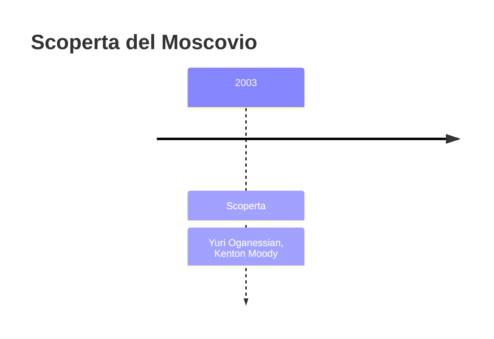
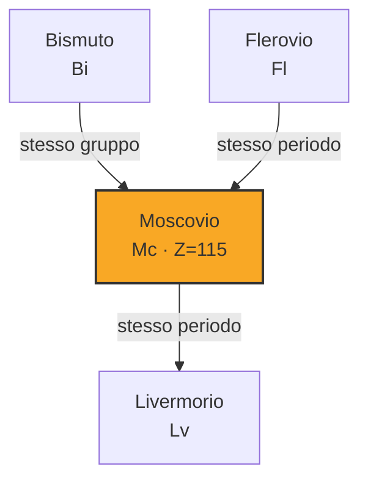

# Moscovio (Mc)

> [!abstract] 114° elemento scoperto — 2003
> 

## Cronologia della scoperta

## Storia della scoperta

## Posizione nella tavola periodica

## Caratteristiche

### Dati fisico-chimici

| Proprietà | Valore |
|---|---|
| Numero atomico | 115 |
| Massa atomica | 289,0 u |
| Categoria | Metallo post-transizione |
| Gruppo | 15 |
| Periodo | 7 |
| Blocco | p |
| Configurazione elettronica | *[Rn] 5f¹⁴ 6d¹⁰ 7s² 7p³ |
| Punto di fusione | 396,9 °C |
| Punto di ebollizione | 1126,9 °C |
| Densità | 13,5 g/cm³ |
| Stati di ossidazione | — |

## Struttura atomica

![[atomo-Moscovio.svg]]

## Usi e presenza in natura

## Nella cronologia

← Precedente: [[Livermorio]] (2000)
→ Successivo: [[Nihonio]] (2004)

Epoca: [[Era nucleare]] · Scopritori: [[Yuri Oganessian]], [[Kenton Moody]]

## Fonti

