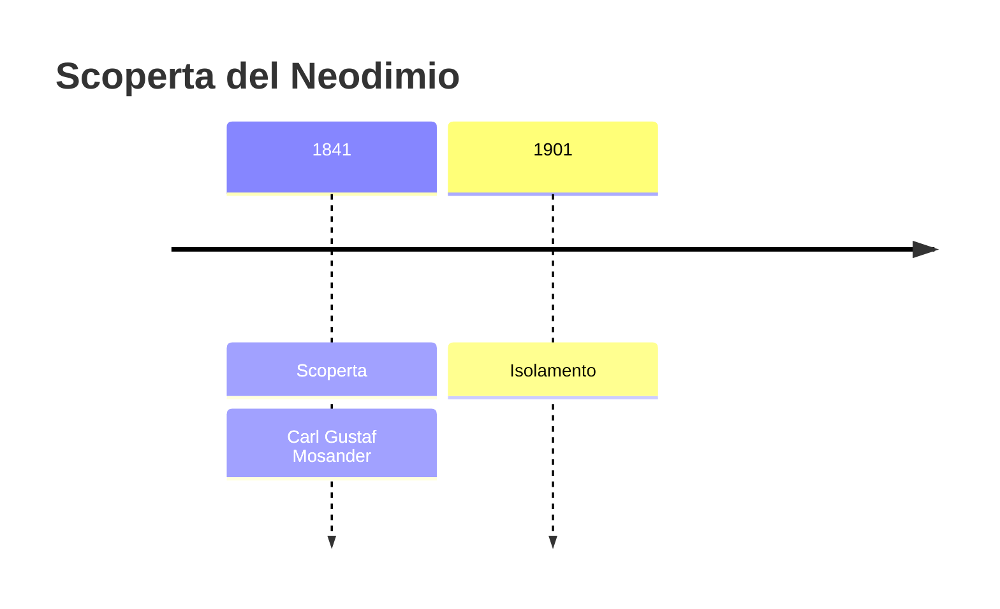
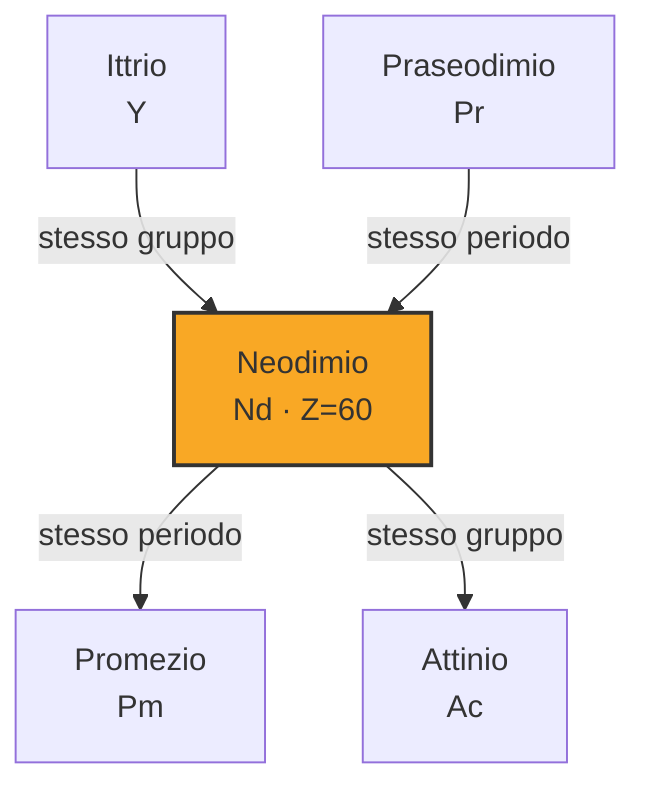
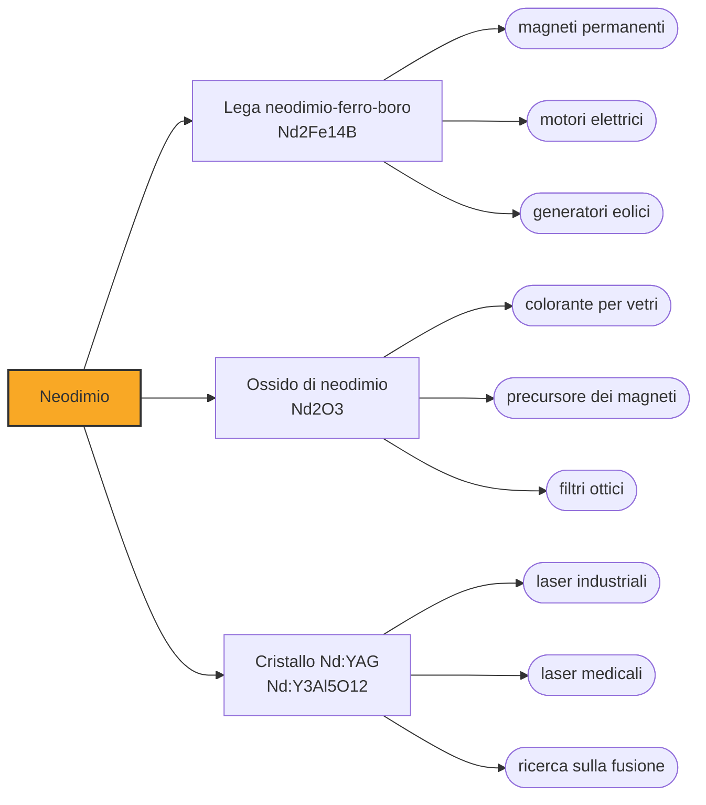

# Neodimio (Nd)

> [!abstract] 57° elemento scoperto — 1841
> Per quarantaquattro anni il didimio fu un elemento come gli altri, con il suo posto nelle tavole e il suo peso atomico. Poi qualcuno lo guardò allo spettroscopio e ne trovò due.

Il neodimio è l'elemento che tiene insieme il mondo elettrico contemporaneo: la lega di neodimio, ferro e boro fa i magneti permanenti più potenti che si sappiano produrre, e da lì passa ai motori delle automobili elettriche, alle turbine eoliche, agli altoparlanti e ai dischi rigidi. Un magnete da poche decine di grammi solleva mille volte il proprio peso.

## Cronologia della scoperta

## Storia della scoperta

Nel 1841 Carl Gustaf Mosander, che due anni prima aveva cavato il lantanio dalla ceria, spinse la separazione un passo più in là e ne ricavò una terza terra. La chiamò didimio, dal greco didymos, «gemello», perché accompagnava il lantanio ovunque e sembrava impossibile da staccargli di dosso.

Il didimio entrò nei manuali come elemento a pieno titolo, con il simbolo Di e un posto nelle prime tavole periodiche. Aveva un colore proprio, un suo spettro di assorbimento e applicazioni pratiche: i vetri al didimio servivano già ai soffiatori per proteggere gli occhi dal giallo del sodio.

I dubbi cominciarono presto. Le righe spettrali del didimio non si comportavano come quelle di un elemento singolo, e nel 1874 Per Teodor Cleve sostenne che ne contenesse almeno due; nel 1879 Lecoq de Boisbaudran ne staccò il samario. Quel che restava continuava a chiamarsi didimio.

La divisione vera la fece Carl Auer von Welsbach a Vienna nel 1885, con cristallizzazioni frazionate ripetute del nitrato doppio di ammonio, portate avanti finché i due sali non si separarono per colore: uno verde, uno rosa. Li chiamò praseodimio, «gemello verde», e neodimio, «gemello nuovo». Il didimio smise di esistere, i manuali dovettero riscrivere una riga, e il nome che gli era stato dato per la sua inseparabilità dal lantanio finì per descrivere la coppia in cui si era diviso.

Il metallo restò a lungo un obiettivo separato. La cronologia di riferimento colloca nel 1901 il primo campione, ottenuto da Wilhelm Muthmann con i suoi collaboratori; altre fonti datano al 1925 il primo neodimio davvero puro, e la produzione su scala industriale arrivò solo negli anni Cinquanta con le resine a scambio ionico, che fecero in poche ore ciò che a von Welsbach costava mesi.

## Posizione nella tavola periodica

## Caratteristiche

In soluzione il neodimio è il consueto ione trivalente dei lantanidi, ma con una particolarità visibile: i suoi sali sono di un rosa-lilla che cambia tonalità secondo la luce che li illumina, perché le righe di assorbimento degli elettroni f sono strette e tagliano lo spettro in punti precisi invece di smorzarlo in modo uniforme.

Il metallo è argenteo e lucente appena tagliato, ma si ossida in fretta: in aria umida si copre di uno strato di ossido che si sfoglia, mettendo a nudo altro metallo da ossidare. È il motivo per cui i magneti al neodimio si vendono sempre rivestiti di nichel, zinco o resina, e per cui, senza rivestimento, si sbriciolano nel giro di stagioni.

Nella crosta terrestre è a 41 parti per milione, quanto il cobalto e più del piombo: la scarsità del neodimio è un fatto di mercato e di geopolitica, non di geologia. Si estrae da monazite e bastnäsite insieme al cerio e al lantanio, e la separazione dagli altri lantanidi resta il passaggio caro.

### Dati fisico-chimici

| Proprietà | Valore |
|---|---|
| Numero atomico | 60 |
| Massa atomica | 144,2423 u |
| Categoria | Lantanide |
| Gruppo | 3 |
| Periodo | 6 |
| Blocco | f |
| Configurazione elettronica | [Xe] 4f⁴ 6s² |
| Punto di fusione | 1023,9 °C |
| Punto di ebollizione | 3073,9 °C |
| Densità | 7,01 g/cm³ |
| Stati di ossidazione | +3 |

## Struttura atomica

![[atomo-Neodimio.svg]]

## Usi e presenza in natura

Il magnete Nd₂Fe₁₄B, messo a punto nel 1984 in modo indipendente da General Motors e da Sumitomo, è il più potente prodotto su scala industriale, ed è più economico e più leggero di quelli al samario-cobalto che l'avevano preceduto. Da allora è entrato ovunque serva molta forza in poco spazio: i motori delle automobili elettriche, i generatori delle turbine eoliche, gli altoparlanti delle cuffie, i motori dei dischi rigidi, le chiusure di mille oggetti. Un magnete di questo tipo si attacca a un altro con forza sufficiente a rompere un dito, e va maneggiato con la stessa cautela di un utensile.

Il neodimio drogato nei cristalli di ittrio-alluminio granato fa il laser Nd:YAG, che emette nell'infrarosso intorno ai 1064 nanometri ed è il cavallo da tiro dell'industria: taglia lamiere, salda, incide, e negli impianti di ricerca sulla fusione arriva a energie di megajoule distribuite su decine di fasci. Nei vetri, l'ossido dà quel colore che cambia con l'illuminazione e serve a filtrare la riga gialla del sodio.

Il rovescio di quella diffusione è che il neodimio, una volta dentro un motore o un disco rigido, è difficilissimo da recuperare: sta in leghe sinterizzate, rivestite e incollate dentro assiemi progettati per non essere smontati, e le quote di riciclo restano basse rispetto a quelle dei metalli tradizionali. Ogni turbina eolica di grande taglia ne porta centinaia di chilogrammi, che alla fine della vita dell'impianto qualcuno dovrà tornare a separare.

## Curiosità

Il neodimio è l'elemento che ha reso «terre rare» un termine di politica industriale: la domanda di magneti per motori elettrici e turbine ha spostato l'interesse su una filiera che resta concentrata in pochi paesi, e ha reso strategico un metallo che nella crosta è comune quanto il cobalto.

Gli occhiali dei soffiatori di vetro contengono ancora neodimio, ed è lo stesso impiego che aveva il didimio prima che si scoprisse di essere due elementi: l'assorbimento stretto e selettivo taglia la riga gialla del sodio che il vetro incandescente emette, e lascia vedere il pezzo su cui si lavora.

## Nella cronologia

← Precedente: [[Lantanio]] (1838)
→ Successivo: [[Terbio]] (1843)

Epoca: [[L'età dell'elettrolisi]] · Scopritore: [[Carl Gustaf Mosander]]

## Fonti

- [Neodymium](https://en.wikipedia.org/wiki/Neodymium) — consultata il 09/09/2026
- [Neodymium — Royal Society of Chemistry](https://periodic-table.rsc.org/element/60/neodymium) — consultata il 09/09/2026
- [Didymium](https://en.wikipedia.org/wiki/Didymium) — consultata il 09/09/2026
