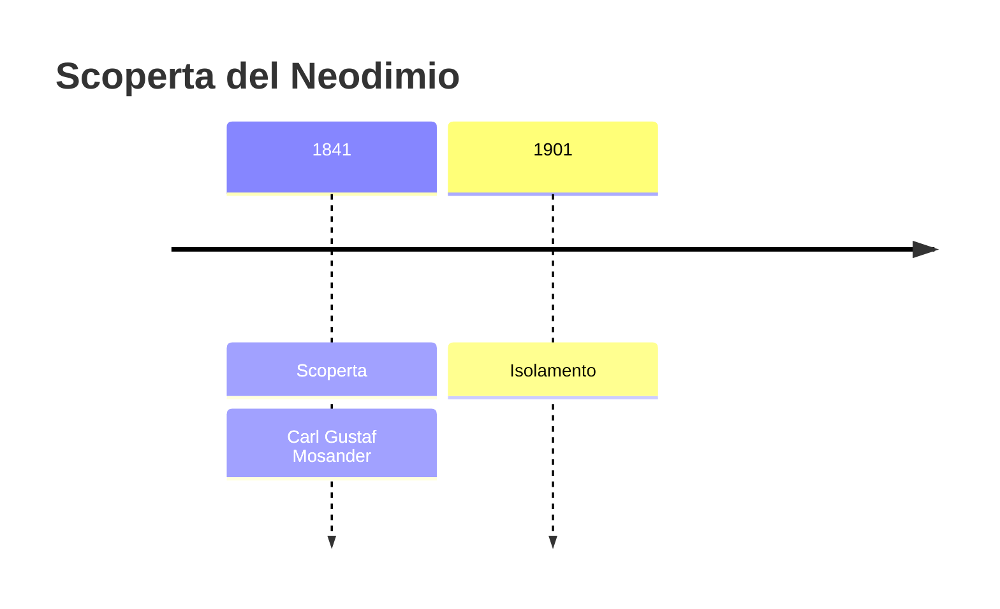
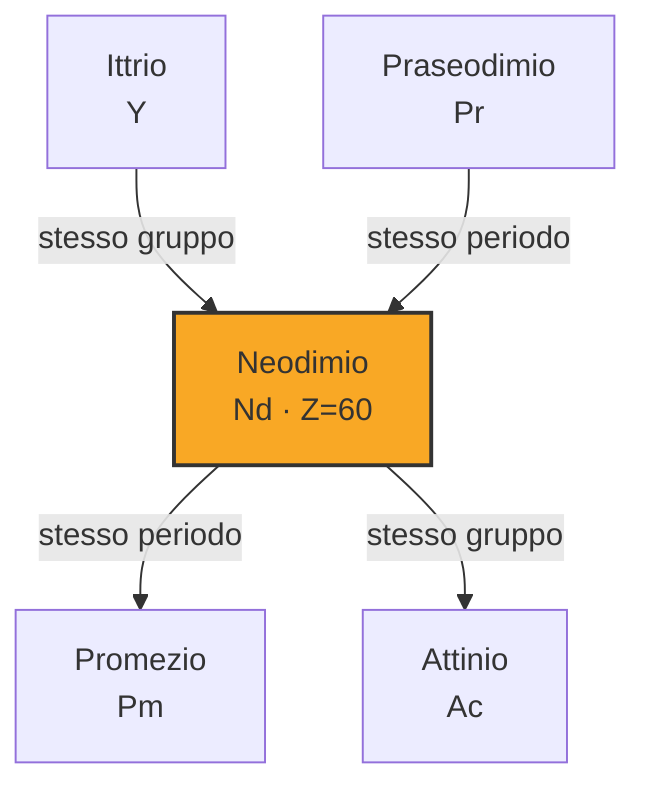

# Neodimio (Nd)

> [!abstract] 57° elemento scoperto — 1841
> 

## Cronologia della scoperta

## Storia della scoperta

## Posizione nella tavola periodica

## Caratteristiche

### Dati fisico-chimici

| Proprietà | Valore |
|---|---|
| Numero atomico | 60 |
| Massa atomica | 144,2423 u |
| Categoria | Lantanide |
| Gruppo | 3 |
| Periodo | 6 |
| Blocco | f |
| Configurazione elettronica | [Xe] 4f⁴ 6s² |
| Punto di fusione | 1023,9 °C |
| Punto di ebollizione | 3073,9 °C |
| Densità | 7,01 g/cm³ |
| Stati di ossidazione | — |

## Struttura atomica

![[atomo-Neodimio.svg]]

## Usi e presenza in natura

## Nella cronologia

← Precedente: [[Lantanio]] (1838)
→ Successivo: [[Terbio]] (1843)

Epoca: [[L'età dell'elettrolisi]] · Scopritore: [[Carl Gustaf Mosander]]

## Fonti

