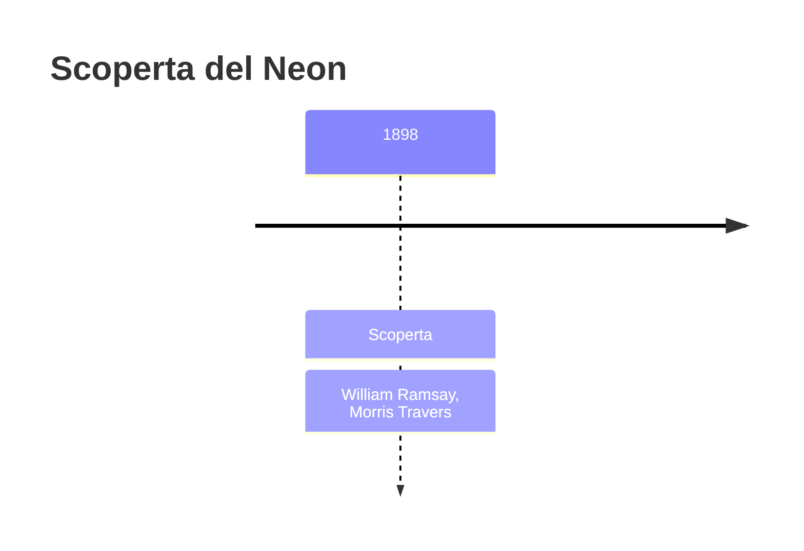
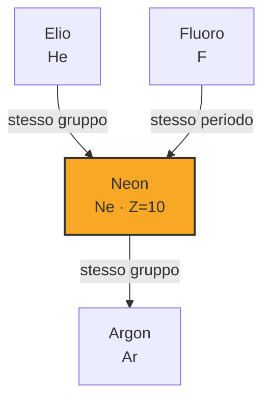

# Neon (Ne)

> [!abstract] 77° elemento scoperto — 1898
> 

## Cronologia della scoperta

## Storia della scoperta

## Posizione nella tavola periodica

## Caratteristiche

### Dati fisico-chimici

| Proprietà | Valore |
|---|---|
| Numero atomico | 10 |
| Massa atomica | 20,17976 u |
| Categoria | Gas nobile |
| Gruppo | 18 |
| Periodo | 2 |
| Blocco | p |
| Configurazione elettronica | [He] 2s² 2p⁶ |
| Punto di fusione | -248,6 °C |
| Punto di ebollizione | -246,0 °C |
| Densità | 0,9002 g/cm³ |
| Stati di ossidazione | — |

## Struttura atomica

![[atomo-Neon.svg]]

## Usi e presenza in natura

## Nella cronologia

← Precedente: [[Argon]] (1894)
→ Successivo: [[Cripton]] (1898)

Epoca: [[Spettroscopia e radioattività]] · Scopritore: [[William Ramsay]], [[Morris Travers]]

## Fonti

