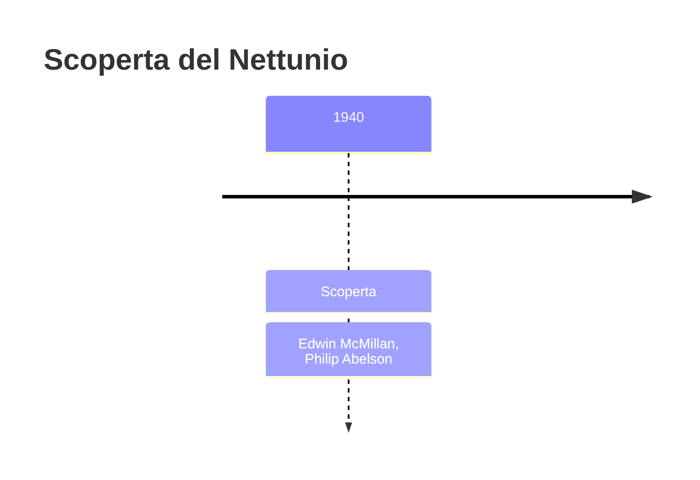
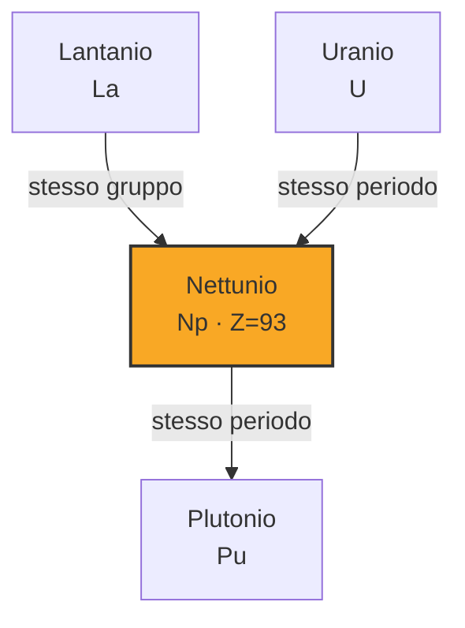

# Nettunio (Np)

> [!abstract] 92° elemento scoperto — 1940
> 

## Cronologia della scoperta

## Storia della scoperta

## Posizione nella tavola periodica

## Caratteristiche

### Dati fisico-chimici

| Proprietà | Valore |
|---|---|
| Numero atomico | 93 |
| Massa atomica | 237,0 u |
| Categoria | Attinide |
| Gruppo | 3 |
| Periodo | 7 |
| Blocco | f |
| Configurazione elettronica | [Rn] 5f⁴ 6d¹ 7s² |
| Punto di fusione | 638,9 °C |
| Punto di ebollizione | 4173,9 °C |
| Densità | 20,45 g/cm³ |
| Stati di ossidazione | — |

## Struttura atomica

![[atomo-Nettunio.svg]]

## Usi e presenza in natura

## Nella cronologia

← Precedente: [[Astato]] (1940)
→ Successivo: [[Plutonio]] (1940)

Epoca: [[Era nucleare]] · Scopritori: [[Edwin McMillan]], [[Philip Abelson]]

## Fonti

