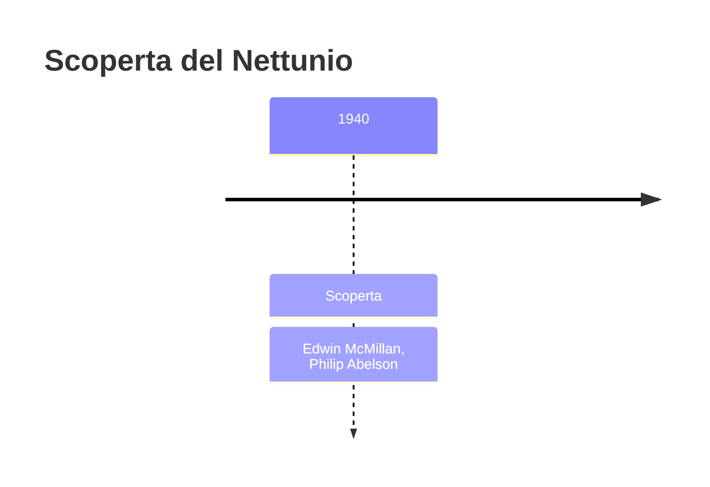
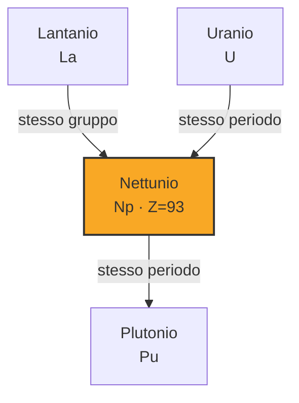
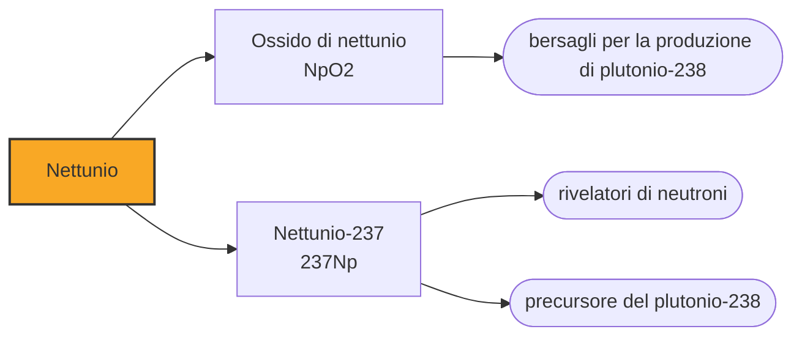

# Nettunio (Np)

> [!abstract] 92° elemento scoperto — 1940
> Fermi credeva di averlo fatto nel 1934, e prese il Nobel anche per quello. In realtà aveva spezzato l'uranio senza accorgersene: il primo elemento oltre l'uranio arrivò sei anni dopo, a Berkeley.

Il nettunio è il primo elemento oltre l'uranio, e il primo transuranico mai prodotto: da lui in poi la tavola periodica smette di essere l'inventario di ciò che la Terra contiene. Prende il nome dal pianeta che segue Urano, e apre una serie che arriverà fino alla casella 118.

## Cronologia della scoperta

> [!info] Nota sulla cronologia
> Primo elemento transuranico prodotto. Le attività osservate da Fermi nel 1934, interpretate all'epoca come elementi oltre l'uranio, erano in realtà frammenti di fissione. McMillan e Abelson dimostrarono nel 1940 che il nuovo decadimento a 2,3 giorni apparteneva alla casella 93.

## Storia della scoperta

Nel 1934 Enrico Fermi bombardò l'uranio con neutroni e osservò attività radioattive nuove, che interpretò come elementi più pesanti dell'uranio; li chiamò ausonio ed esperio, e il Nobel del 1938 cita anche quel risultato. La lettura era sbagliata: ciò che aveva prodotto erano frammenti di fissione, cioè nuclei spezzati in due, come Ida Noddack aveva suggerito inutilmente nello stesso anno. La fissione fu riconosciuta solo alla fine del 1938, da Hahn e Strassmann con l'interpretazione di Lise Meitner, e a quel punto la domanda su che cosa ci fosse davvero oltre l'uranio tornò aperta.

Nel 1940, a Berkeley, Edwin McMillan bombardò uranio con neutroni nel ciclotrone e osservò due decadimenti: uno era l'uranio-239, già noto, l'altro aveva un'emivita di 2,3 giorni e non corrispondeva a nulla. Trattando il campione con acido fluoridrico in presenza di un riducente, la sostanza precipitava insieme all'uranio invece che con le terre rare: non era un frammento di fissione, era qualcosa di nuovo.

Fu Philip Abelson, chimico, a completare la dimostrazione: il comportamento della sostanza somigliava a quello dell'uranio, non a quello di nessun elemento noto delle terre rare, e l'unica collocazione possibile era la casella 93. I due pubblicarono nello stesso 1940, ed era la prima volta che l'uomo aggiungeva una casella oltre il limite della tavola naturale.

Il nome venne dall'astronomia, per continuare una serie già cominciata: l'uranio era stato battezzato per Urano, e l'elemento successivo prese il nome di Nettuno, il pianeta che nel sistema solare viene dopo. L'elemento seguente, il 94, avrebbe preso quello di Plutone, e con lui la sequenza si sarebbe fermata.

La scoperta del nettunio e, pochi mesi dopo, del plutonio dimostrò che gli elementi oltre l'uranio non erano semplicemente metalli di transizione più pesanti, come la tavola periodica dell'epoca lasciava intendere collocandoli sotto renio, osmio e iridio. Erano una serie a sé, analoga a quella dei lantanidi: è la serie degli attinidi, che Glenn Seaborg avrebbe proposto pochi anni dopo, riscrivendo la forma stessa della tavola periodica e spostando quattordici elementi in una riga a parte.

## Posizione nella tavola periodica

## Caratteristiche

L'isotopo più importante è il nettunio-237, con un'emivita di 2,14 milioni di anni: abbastanza lunga da permettere di accumularlo e studiarlo, abbastanza breve perché in natura ne resti solo qualche traccia. Si forma in quantità nei reattori nucleari come sottoprodotto, e oggi ne esistono decine di tonnellate nel combustibile esausto del mondo.

È un metallo argenteo, denso e reattivo, con una chimica insolitamente ricca per un attinide: forma composti in cinque stati di ossidazione diversi, dal +3 al +7, e in soluzione il +5 è il più stabile. Ogni stato ha un colore proprio, e nella stessa soluzione possono coesistere più stati contemporaneamente, il che rende la sua chimica notoriamente scomoda.

Tracce di nettunio esistono nei minerali di uranio, prodotte quando un nucleo di uranio cattura un neutrone liberato dalla fissione spontanea di un altro. Sono quantità infinitesime, ma dimostrano che la distinzione fra elementi naturali e artificiali è meno netta di quanto sembri: alcuni transuranici la natura li produce, semplicemente non li conserva.

Il nettunio-237 è fissile, con una massa critica di una sessantina di chilogrammi: non è mai stato usato per costruire armi, ma la sua accumulazione nel combustibile esausto è uno dei motivi per cui il materiale nucleare civile viene contabilizzato e controllato con tanta attenzione.

### Dati fisico-chimici

| Proprietà | Valore |
|---|---|
| Numero atomico | 93 |
| Massa atomica | 237,0 u |
| Categoria | Attinide |
| Gruppo | 3 |
| Periodo | 7 |
| Blocco | f |
| Configurazione elettronica | [Rn] 5f⁴ 6d¹ 7s² |
| Punto di fusione | 638,9 °C |
| Punto di ebollizione | 4173,9 °C |
| Densità | 20,45 g/cm³ |
| Stati di ossidazione | +3, +4, +5, +6, +7 |

## Struttura atomica

![[atomo-Nettunio.svg]]

## Usi e presenza in natura

L'impiego principale è fare da materia prima per un altro elemento: irraggiando nettunio-237 con neutroni si ottiene plutonio-238, che è l'isotopo dei generatori termoelettrici delle sonde spaziali. Le missioni verso i pianeti esterni, dove il Sole è troppo lontano perché i pannelli solari bastino, si alimentano con il calore di quel decadimento e funzionano per decenni: il nettunio è l'anello che rende possibile produrlo, e la sua disponibilità è uno dei vincoli reali dei programmi di esplorazione.

L'altro impiego è la rivelazione: il nettunio-237 serve nei rivelatori di neutroni ad alta energia, dove la sua risposta alla fissione permette di misurare flussi che altri materiali non distinguono. Sono usi da laboratorio e da impianto, misurati in grammi.

## Curiosità

La serie astronomica dei nomi si è fermata a Plutone perché dopo il 94 gli elementi hanno cominciato a essere intitolati a persone e luoghi: americio, curio, berkelio, californio. Se la logica planetaria fosse continuata, oggi avremmo elementi con nomi di corpi celesti che nel frattempo hanno perso lo statuto di pianeta.

Philip Abelson, il chimico che completò la dimostrazione, avrebbe poi diretto per vent'anni la rivista Science ed è stato uno dei primi a sostenere pubblicamente che il progetto della bomba all'idrogeno andava discusso e non deciso in segreto. La sua firma sul primo transuranico è il suo lavoro meno noto.

## Nella cronologia

← Precedente: [[Astato]] (1940)
→ Successivo: [[Plutonio]] (1940)

Epoca: [[Era nucleare]] · Scopritori: [[Edwin McMillan]], [[Philip Abelson]]

## Fonti

- [Neptunium](https://en.wikipedia.org/wiki/Neptunium) — consultata il 09/09/2026
- [Neptunium — Royal Society of Chemistry](https://periodic-table.rsc.org/element/93/neptunium) — consultata il 09/09/2026
- [Transuranium element](https://en.wikipedia.org/wiki/Transuranium_element) — consultata il 09/09/2026

---

> [!warning] Avvertenza
> Questo progetto è stato realizzato con l'assistenza di sistemi di
> intelligenza artificiale. I contenuti sono verificati sulle fonti citate,
> ma **possono contenere errori e imprecisioni**: prima di riutilizzarli,
> controlla la fonte.
