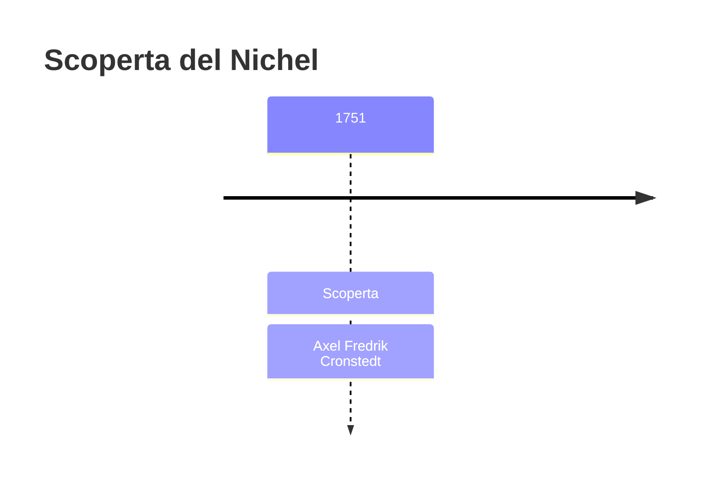
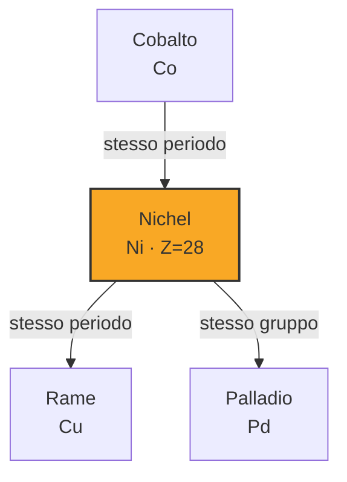

# Nichel (Ni)

> [!abstract] 21° elemento scoperto — 1751
> 

## Cronologia della scoperta

## Storia della scoperta

## Posizione nella tavola periodica

## Caratteristiche

### Dati fisico-chimici

| Proprietà | Valore |
|---|---|
| Numero atomico | 28 |
| Massa atomica | 58,69344 u |
| Categoria | Metallo di transizione |
| Gruppo | 10 |
| Periodo | 4 |
| Blocco | d |
| Configurazione elettronica | [Ar] 3d⁸ 4s² |
| Punto di fusione | 1454,9 °C |
| Punto di ebollizione | 2729,9 °C |
| Densità | 8,908 g/cm³ |
| Stati di ossidazione | — |

## Struttura atomica

![[atomo-Nichel.svg]]

## Usi e presenza in natura

## Nella cronologia

← Precedente: [[Alluminio]] (1746)
→ Successivo: [[Magnesio]] (1755)

Epoca: [[Chimica pneumatica]] · Scopritore: [[Axel Fredrik Cronstedt]]

## Fonti

