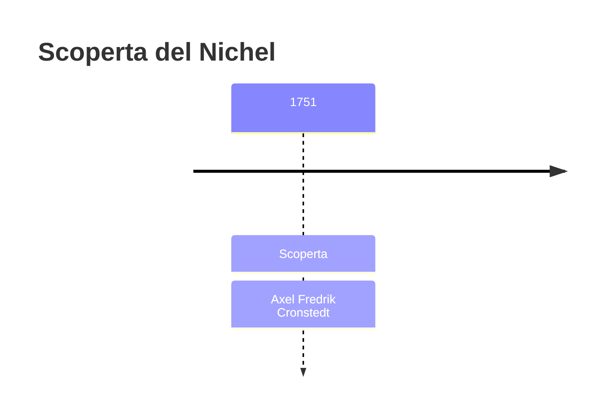
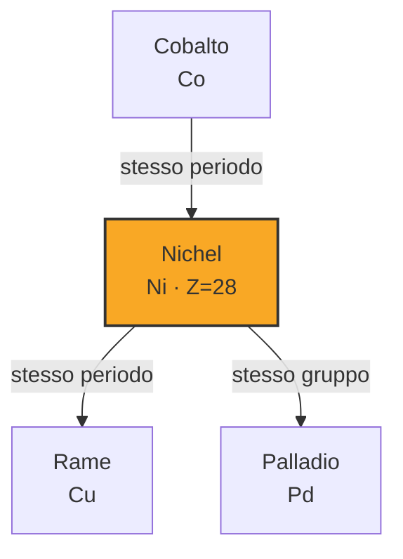
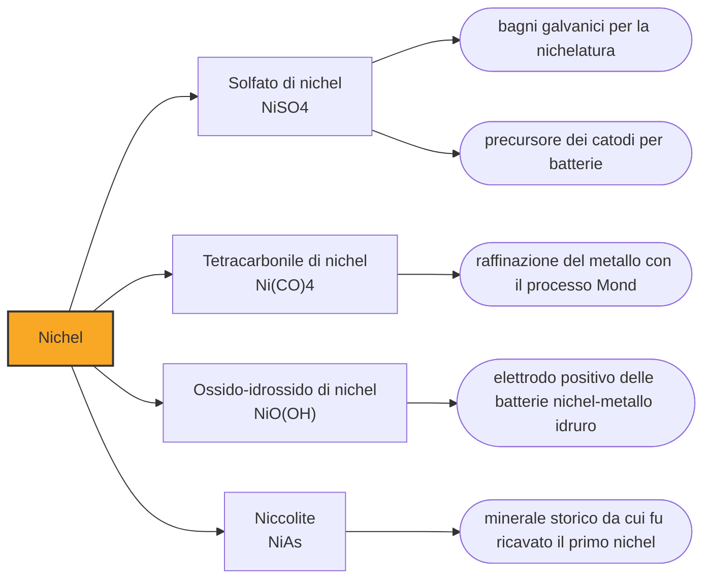

# Nichel (Ni)

> [!abstract] 21° elemento scoperto — 1751
> I minatori sassoni davano la colpa al diavolo. Il minerale sembrava rame, si lasciava lavorare come rame e alla fine non ne dava un grammo: qualcuno, sottoterra, li stava prendendo in giro.

Il nichel è un metallo bianco-argenteo dal riflesso appena dorato, duro, magnetico e straordinariamente restio ad arrugginire. È il metallo che tiene insieme il mondo moderno senza mai comparire in scena: due oggetti di acciaio inossidabile su tre lo contengono, e quasi nessuno che li usi saprebbe dire che c'è. La sua identificazione nasce da un equivoco durato secoli, e da un minerale che i minatori consideravano stregato.

## Cronologia della scoperta

## Storia della scoperta

Nelle miniere fra la Sassonia e la Boemia circolava da tempo un minerale irritante. Aveva il colore caldo e il luccichio del minerale di rame, prometteva un buon carico, e per quanto lo si arrostisse non restituiva rame: soltanto scorie e, spesso, fumi che facevano ammalare chi ci stava sopra. Oggi sappiamo che era niccolite, un arseniuro, e che i fumi erano ossido di arsenico. Allora era semplicemente un tradimento senza spiegazione.

Al minerale toccò il nome di Kupfernickel, che si traduce grosso modo come il rame di Nickel. Che quel Nickel indicasse una creatura dispettosa del sottosuolo è quanto di più solido offra la linguistica storica: i dizionari etimologici lo registrano come folletto o demone minore. Da lì in avanti, però, la catena si assottiglia. La derivazione dal nome proprio Nikolaus, usato in Germania orientale come termine d'insulto, è la ricostruzione più accreditata; il legame diretto con il santo, o con l'Old Nick che in inglese è uno dei nomi del diavolo, resta una congettura che nessuno ha dimostrato.

A occuparsene sul serio è Axel Fredrik Cronstedt, che nel 1751 lavora sul minerale proveniente dalla miniera di cobalto di Los, in Hälsingland. Cronstedt non è un cercatore di fortuna ma un funzionario del Collegio delle miniere svedese, e affronta il kupfernickel con il metodo: lo scompone, ne riduce il residuo e ottiene un metallo bianco che non è rame, non è cobalto e non è ferro. Lo chiama nichel, accorciando il nome dell'insulto che i minatori avevano rivolto al minerale.

La cosa più importante che Cronstedt lascia alla chimica non è però il nichel. È il cannello ferruminatorio, un semplice tubo con cui soffiare aria dentro la fiamma di una candela per concentrarne il calore su un frammento di minerale grosso come un chicco. Era un attrezzo da orefici; Cronstedt ne fa lo strumento analitico standard della mineralogia, capace di dire in pochi minuti che cosa contiene una pietra. Nel secolo successivo quel tubo di ottone porterà all'identificazione di una dozzina di elementi nuovi.

Nel 1758 Cronstedt pubblica un tentativo di mineralogia in cui propone una cosa che oggi sembra ovvia e allora era eretica: classificare i minerali per quel che contengono invece che per come appaiono. Fino a quel momento le pietre si ordinavano per colore, durezza e lucentezza, cioè per i caratteri che il kupfernickel aveva usato per ingannare tutti. Il nichel è insieme la vittima e la prova del vecchio sistema: un minerale che sembrava una cosa ed era un'altra.

## Posizione nella tavola periodica

## Caratteristiche

Il nichel appartiene al ristrettissimo club dei metalli che si magnetizzano da soli e restano magnetizzati. Sono quattro in tutta la tavola periodica intorno alla temperatura ambiente — ferro, cobalto, nichel e gadolinio — e il nichel è quello che cede per primo: sopra i 354 gradi perde ogni proprietà magnetica di colpo. Il gadolinio, all'altro estremo, smette di essere magnetico appena sopra i venti gradi, cioè in una giornata tiepida.

La virtù industriale del nichel è la pigrizia. Reagisce con l'ossigeno molto più lentamente del ferro e si copre di uno strato di ossido sottile e aderente che protegge il metallo sottostante invece di sfaldarsi. Aggiunto all'acciaio insieme al cromo, trasforma un materiale che marcisce in uno che dura, e in più ne cambia la struttura cristallina rendendolo tenace anche a temperature molto basse. È per questo che sta nelle turbine, nei serbatoi criogenici e nelle posate.

In soluzione il nichel è quasi sempre allo stato più due, e i suoi sali danno un verde smeraldo inconfondibile, anche se la letteratura gli riconosce un ventaglio di stati molto più ampio, fino a quelli negativi ottenuti solo in condizioni speciali. Il composto più notevole è il tetracarbonile, un liquido volatile e velenosissimo scoperto per caso alla fine dell'Ottocento: si forma a bassa temperatura e si riscompone a temperatura più alta, e questa reversibilità è diventata il metodo industriale per purificare il metallo.

### Dati fisico-chimici

| Proprietà | Valore |
|---|---|
| Numero atomico | 28 |
| Massa atomica | 58,69344 u |
| Categoria | Metallo di transizione |
| Gruppo | 10 |
| Periodo | 4 |
| Blocco | d |
| Configurazione elettronica | [Ar] 3d⁸ 4s² |
| Punto di fusione | 1454,9 °C |
| Punto di ebollizione | 2729,9 °C |
| Densità | 8,908 g/cm³ |
| Stati di ossidazione | -2, -1, 0, +1, +2, +3, +4 |

## Struttura atomica

![[atomo-Nichel.svg]]

## Usi e presenza in natura

La destinazione dominante del nichel è una sola: l'acciaio inossidabile e le leghe speciali, che negli Stati Uniti assorbono oltre l'ottantacinque per cento del metallo primario. Il resto si divide fra galvanica, superleghe per turbine e, quota in rapida crescita, catodi per batterie. Il baricentro produttivo si è spostato in modo brusco: nel 2024 l'Indonesia da sola ha estratto due milioni e duecentomila tonnellate su una produzione mineraria mondiale stimata in tre milioni e settecentomila, cioè quasi il sessanta per cento del totale.

Il nichel è anche il metallo delle monete, al punto che negli Stati Uniti dà il nome al pezzo da cinque centesimi. La ragione è pratica: resiste all'usura, non annerisce nelle tasche e ha una firma elettromagnetica che i distributori automatici riconoscono con facilità. Il prezzo di questa ubiquità è una delle allergie da contatto più diffuse al mondo, tanto che l'Unione Europea regola da anni quanto nichel possa rilasciare un oggetto destinato a toccare la pelle.

## Curiosità

Quasi tutto il nichel della Terra è irraggiungibile. Si trova nel nucleo, in lega con il ferro, e le riserve che estraiamo in superficie sono in buona parte arrivate dopo la formazione del pianeta, portate dagli asteroidi. Il ferro meteorico che le civiltà antiche lavoravano prima di saper fondere il ferro è riconoscibile proprio dal nichel che contiene: è la firma chimica che distingue un pugnale caduto dal cielo da uno uscito da una fornace.

Nella tavola periodica il nichel sta immediatamente accanto al cobalto, e i due portano incisa nel nome la stessa scena. Il cobalto deve il proprio ai Kobold, gli spiriti che si diceva sostituissero il metallo buono con una contraffazione avvelenata; il nichel al folletto che nascondeva il rame. Sono minerali simili, trovati negli stessi giacimenti, che hanno prodotto la stessa delusione e generato due leggende gemelle: due elementi vicini di casa anche nel folklore.

## Nella cronologia

← Precedente: [[Alluminio]] (1746)
→ Successivo: [[Magnesio]] (1755)

Epoca: [[Chimica pneumatica]] · Scopritore: [[Axel Fredrik Cronstedt]]

## Fonti

- [Nickel](https://en.wikipedia.org/wiki/Nickel) — consultata il 07/09/2026
- [Axel Fredrik Cronstedt](https://en.wikipedia.org/wiki/Axel_Fredrik_Cronstedt) — consultata il 07/09/2026
- [Multifarious devils, part 3. "Pumpernickel", "Nickel", and "Old Nick"](https://blog.oup.com/2013/06/pumpernickel-etymology-word-origin/) — consultata il 07/09/2026
- [USGS Mineral Commodity Summaries 2025: Nickel](https://pubs.usgs.gov/periodicals/mcs2025/mcs2025-nickel.pdf) — consultata il 07/09/2026
