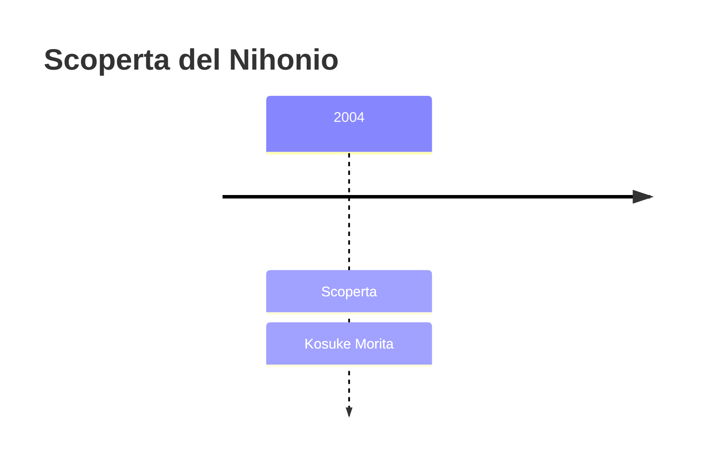
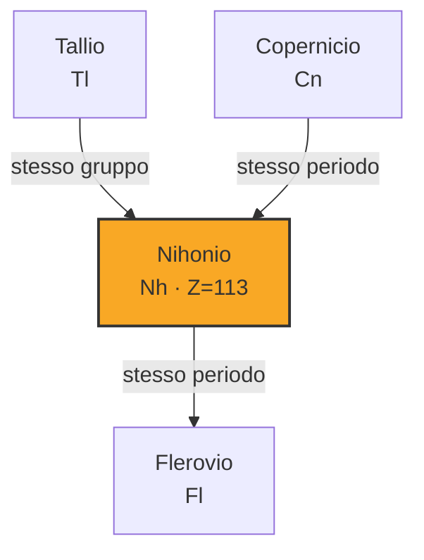

# Nihonio (Nh)

> [!abstract] 115° elemento scoperto — 2004
> 

## Cronologia della scoperta

## Storia della scoperta

## Posizione nella tavola periodica

## Caratteristiche

### Dati fisico-chimici

| Proprietà | Valore |
|---|---|
| Numero atomico | 113 |
| Massa atomica | 286,0 u |
| Categoria | Metallo di transizione |
| Gruppo | 13 |
| Periodo | 7 |
| Blocco | p |
| Configurazione elettronica | *[Rn] 5f¹⁴ 6d¹⁰ 7s² 7p¹ |
| Punto di fusione | 426,9 °C |
| Punto di ebollizione | 1156,9 °C |
| Densità | 16,0 g/cm³ |
| Stati di ossidazione | — |

## Struttura atomica

![[atomo-Nihonio.svg]]

## Usi e presenza in natura

## Nella cronologia

← Precedente: [[Moscovio]] (2003)
→ Successivo: [[Flerovio]] (2006)

Epoca: [[Era nucleare]] · Scopritore: [[Kosuke Morita]]

## Fonti

