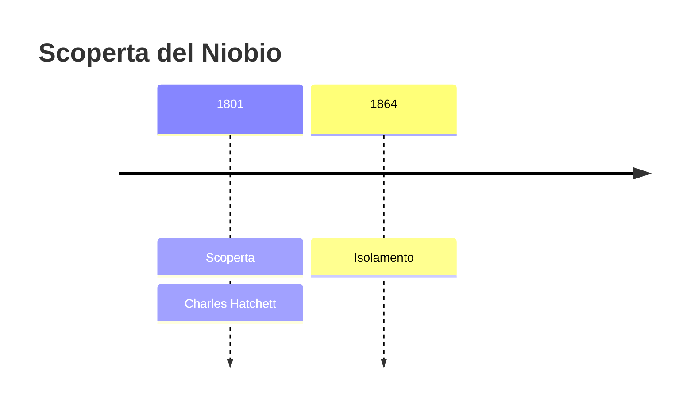
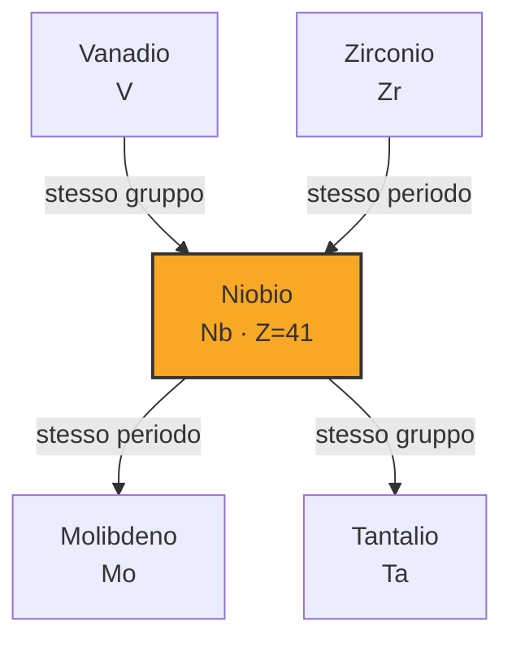
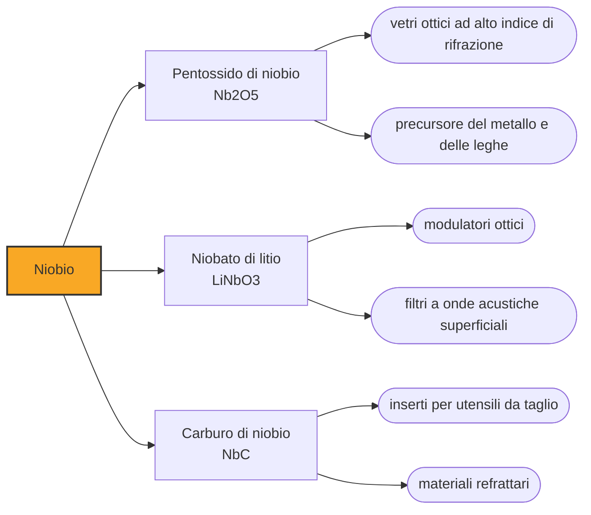

# Niobio (Nb)

> [!abstract] 41° elemento scoperto — 1801
> Un minerale spedito dal Connecticut a Londra rimase in un cassetto per quasi settant'anni. Quando qualcuno lo analizzò ne uscì un elemento che avrebbe passato il secolo e mezzo successivo a litigare sul proprio nome.

Il niobio è un metallo grigio chiaro, duttile quanto il ferro e leggero per essere un refrattario, che quasi nessuno vede mai: nove decimi di quello estratto se ne vanno in acciai a cui bastano poche centinaia di grammi per tonnellata, e gran parte del resto nei magneti superconduttori.

## Cronologia della scoperta

> [!info] Nota sulla cronologia
> Il columbium annunciato da Hatchett nel 1801 era con ogni probabilità una miscela di niobio e tantalio; dal 1809 al 1846 i due elementi furono ritenuti la stessa sostanza, sulla scorta del confronto fra gli ossidi fatto da William Hyde Wollaston. Isolato nel 1864 da Christian Wilhelm Blomstrand. Il nome niobium prevalse su columbium solo nel 1949.

## Storia della scoperta

Nel 1801 Charles Hatchett stava esaminando i minerali del British Museum quando si fermò su un campione etichettato come columbite, arrivato in Inghilterra dal Connecticut nel 1734 e da allora rimasto nelle collezioni. Lo fuse con carbonato di potassio, sciolse il prodotto in acqua e per precipitazione ne ricavò l'ossido di un metallo che nessuno conosceva. Chiamò l'elemento columbium, da Columbia, il nome poetico degli Stati Uniti.

Che cosa avesse davvero in mano è meno chiaro di quanto suoni. Hatchett non arrivò mai al metallo, si fermò all'ossido, e il suo columbium era con ogni probabilità una miscela dell'elemento nuovo con il tantalio, che sarebbe stato annunciato l'anno seguente: i due stanno negli stessi minerali e nessuna tecnica dell'epoca sapeva dividerli.

Nel 1809 William Hyde Wollaston mise a confronto i due ossidi, quello ricavato dalla columbite e quello ricavato dalla tantalite. Le densità che misurò erano diverse — 5,918 contro 7,935 grammi per centimetro cubo — ma concluse ugualmente che le due sostanze fossero la stessa cosa, e tenne il nome tantalio. Friedrich Wöhler confermò, e per quasi quarant'anni il columbium di Hatchett smise di esistere.

Nel 1846 il chimico tedesco Heinrich Rose riprese la tantalite e sostenne che conteneva due metalli distinti, che battezzò con i nomi dei figli di Tantalo: niobio, da Niobe, e pelopio, da Pelope. Il pelopio si rivelò poi una miscela dei due, e la stessa fine fecero altri elementi annunciati in quegli anni, l'ilmenio e il dianio: se ne discusse sulle riviste fino al 1871.

La questione chimica si chiuse nel decennio successivo. Nel 1864 Christian Wilhelm Blomstrand, all'università di Lund, ottenne il metallo scaldando il cloruro di niobio in atmosfera di idrogeno, e insieme ai lavori di Henri Sainte-Claire Deville, Louis Troost e Jean Charles Galissard de Marignac stabilì che gli elementi erano due e non di più, e che il niobio di Rose era il columbium di Hatchett.

Il nome invece resistette ancora un secolo. In America si scriveva columbium, in Europa niobium, e le due letterature andarono avanti in parallelo fino alla conferenza dell'Unione di chimica di Amsterdam del 1949, che scelse niobium; la IUPAC lo adottò l'anno dopo, in uno scambio che accettava tungsten al posto di wolfram per riguardo all'uso nordamericano e niobium per riguardo a quello europeo. Qualche metallurgista statunitense scrive columbium ancora oggi, e la parola compare nelle norme ASTM.

## Posizione nella tavola periodica

## Caratteristiche

Il niobio fonde a 2477 gradi, ma è meno denso degli altri metalli refrattari, con 8,57 grammi per centimetro cubo, e a temperatura ambiente si lavora con la stessa facilità del ferro. All'aria non si ossida quasi: lo strato che si forma è sottilissimo e con il tempo dà al metallo una sfumatura azzurrina.

È anche un superconduttore, e in questo detiene un primato: a pressione ambiente nessun altro elemento resta superconduttore fino a una temperatura così alta, 9,2 kelvin. È inoltre uno dei tre soli elementi superconduttori di tipo II, insieme al vanadio e al tecnezio, cioè capaci di reggere campi magnetici intensi senza perdere lo stato.

In natura accompagna sempre il tantalio: sta nel pirocloro delle carbonatiti e nella columbite-tantalite, il minerale che in Africa centrale si chiama coltan. La geografia della produzione è quasi monopolistica: secondo lo USGS nel 2025 il Brasile ha fornito circa il 93 per cento delle 112.000 tonnellate mondiali e il Canada il cinque, mentre gli Stati Uniti non estraggono niobio dal 1959.

### Dati fisico-chimici

| Proprietà | Valore |
|---|---|
| Numero atomico | 41 |
| Massa atomica | 92,906372 u |
| Categoria | Metallo di transizione |
| Gruppo | 5 |
| Periodo | 5 |
| Blocco | d |
| Configurazione elettronica | [Kr] 4d⁴ 5s¹ |
| Punto di fusione | 2476,9 °C |
| Punto di ebollizione | 4743,9 °C |
| Densità | 8,57 g/cm³ |
| Stati di ossidazione | -3, -1, 0, +1, +2, +3, +4, +5 |

## Struttura atomica

![[atomo-Niobio.svg]]

## Usi e presenza in natura

L'impiego che assorbe quasi tutto il niobio estratto è il ferroniobio negli acciai basso-legati ad alta resistenza: poche centinaia di grammi per tonnellata affinano il grano del metallo e ne alzano il carico di rottura, e da lì il niobio passa a oleodotti, carrozzerie e travi. Negli Stati Uniti, nel 2025, il 77 per cento del consumo è andato agli acciai e il 23 alle superleghe per turbine.

La quota restante vale però quanto la fama dell'elemento. I fili di niobio-titanio e di niobio-stagno sono il materiale dei magneti superconduttori della risonanza magnetica e degli acceleratori di particelle — il Large Hadron Collider ne monta centinaia di tonnellate — e le cavità a radiofrequenza degli acceleratori lineari si ricavano da niobio puro.

## Curiosità

Anodizzando il niobio si ottiene uno strato di ossido che diffrange la luce, e quindi colore senza pigmenti. L'Austria ne conia dal 2003 monete commemorative bimetalliche in argento e niobio, con il centro blu, verde, viola o giallo; per la stessa proprietà, unita al fatto che il metallo è inerte e non dà allergie, il niobio si usa in gioielleria e negli impianti medici.

Che il niobio sia superconduttore si sapeva da tempo, ma è del 1961 la scoperta che ne ha fatto un materiale industriale: al Bell Labs si vide che il niobio-stagno regge la superconduttività anche attraversato da correnti fortissime e immerso in campi magnetici intensi. Prima di allora nessun materiale lo faceva, e i magneti superconduttori potenti non erano costruibili.

## Nella cronologia

← Precedente: [[Vanadio]] (1801)
→ Successivo: [[Palladio]] (1802)

Epoca: [[L'età dell'elettrolisi]] · Scopritore: [[Charles Hatchett]]

## Fonti

- [Niobium](https://en.wikipedia.org/wiki/Niobium) — consultata il 08/09/2026
- [Niobium — Royal Society of Chemistry](https://periodic-table.rsc.org/element/41/niobium) — consultata il 08/09/2026
- [USGS Mineral Commodity Summaries 2026 — Niobium (Columbium)](https://pubs.usgs.gov/periodicals/mcs2026/mcs2026-niobium.pdf) — consultata il 08/09/2026
- [Christian Wilhelm Blomstrand](https://en.wikipedia.org/wiki/Christian_Wilhelm_Blomstrand) — consultata il 08/09/2026
