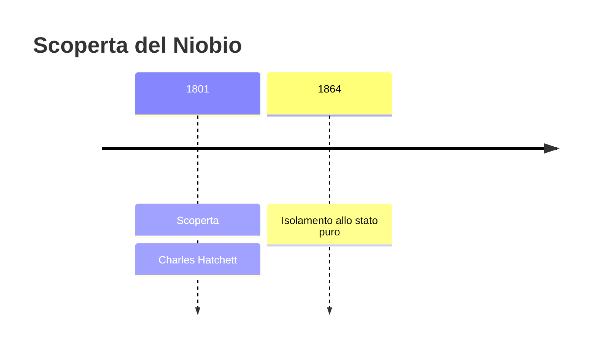
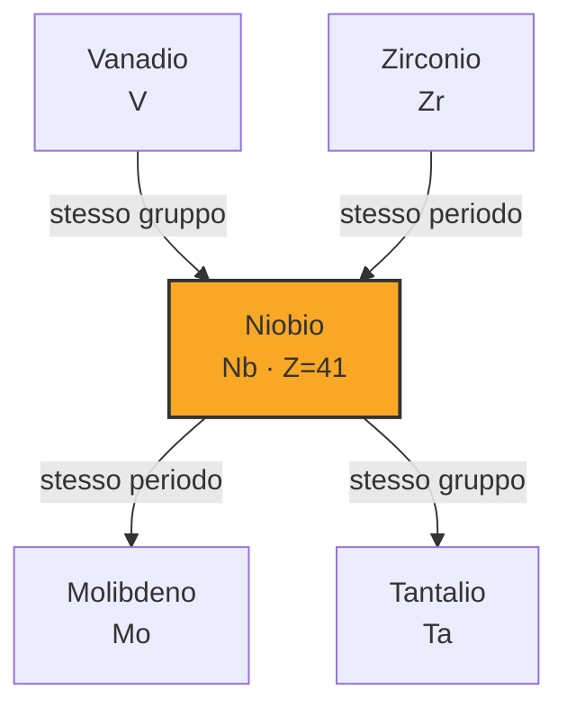

# Niobio (Nb)

> [!abstract] 41° elemento scoperto — 1801
> 

## Cronologia della scoperta

## Storia della scoperta

## Posizione nella tavola periodica

## Caratteristiche

### Dati fisico-chimici

| Proprietà | Valore |
|---|---|
| Numero atomico | 41 |
| Massa atomica | 92,906372 u |
| Categoria | Metallo di transizione |
| Gruppo | 5 |
| Periodo | 5 |
| Blocco | d |
| Configurazione elettronica | [Kr] 4d⁴ 5s¹ |
| Punto di fusione | 2476,9 °C |
| Punto di ebollizione | 4743,9 °C |
| Densità | 8,57 g/cm³ |
| Stati di ossidazione | — |

## Struttura atomica

![[atomo-Niobio.svg]]

## Usi e presenza in natura

## Nella cronologia

← Precedente: [[Vanadio]] (1801)
→ Successivo: [[Palladio]] (1802)

Epoca: [[L'età dell'elettrolisi]] · Scopritore: [[Charles Hatchett]]

## Fonti

