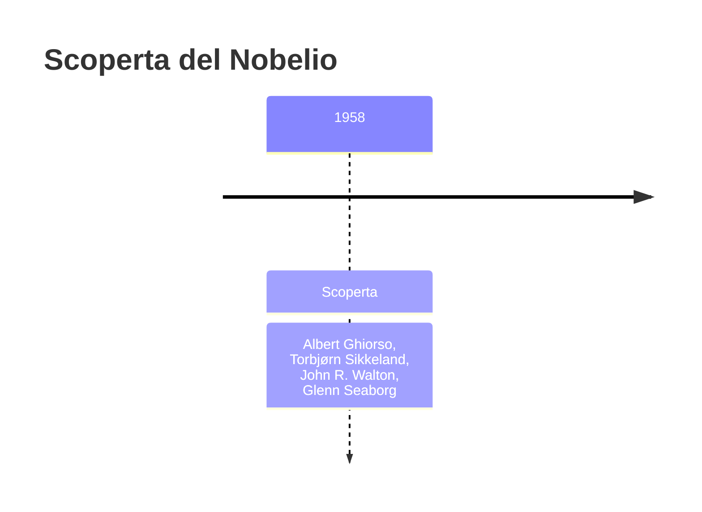
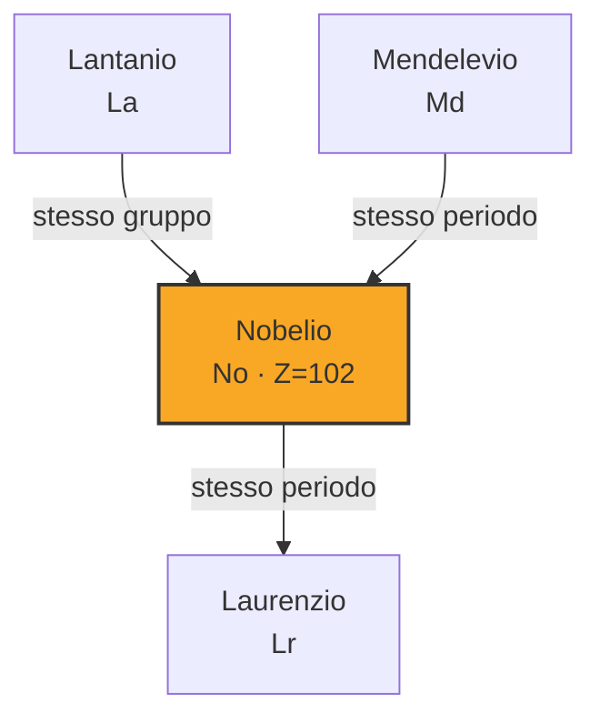
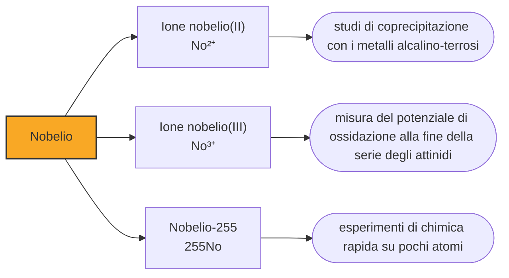

# Nobelio (No)

> [!abstract] 102° elemento scoperto — 1958
> Il nome glielo diede un gruppo il cui esperimento non è mai stato confermato. La scoperta, quarant'anni più tardi, è stata riconosciuta a un laboratorio che avrebbe voluto chiamarlo in un altro modo.

Il nobelio è l'elemento su cui la tavola periodica ha litigato più a lungo. Tre laboratori in tre paesi hanno annunciato di averlo fatto, in tre modi diversi e nell'arco di dieci anni; il nome è stato approvato prima che esistesse una prova, e la commissione che ha stabilito a chi spettasse la scoperta ha impiegato altri ventisei anni per pronunciarsi.

## Cronologia della scoperta

> [!info] Nota sulla cronologia
> Attribuzione contesa, e il dato adottato non è quello che oggi la IUPAC riconosce. La cronologia di riferimento assegna l'elemento alla squadra di Berkeley del 1958 — Ghiorso, Sikkeland, Walton e Seaborg, compressi nella fonte in «Ghiorso et al.» — mentre il Transfermium Working Group ha assegnato nel 1992 la priorità a Dubna. Cambiare il dato sposterebbe il nobelio dopo il laurenzio nell'ordine di lettura, e la divergenza è dichiarata qui invece di essere risolta in silenzio.

## Storia della scoperta

Il primo annuncio arrivò nel 1957 dall'Istituto Nobel di Fisica di Stoccolma, dove un gruppo che riuniva svedesi, britannici di Harwell e americani di Argonne aveva bombardato un bersaglio di curio con ioni di carbonio-13, cinquanta volte, mezz'ora alla volta. Nei rivelatori comparve una particella alfa da 8,5 megaelettronvolt che non corrispondeva a nulla di noto, e il gruppo propose per l'elemento 102 il nome del proprio istituto: nobelio. La IUPAC lo accettò subito.

L'anno dopo Berkeley provò a rifare l'esperimento con un acceleratore lineare per ioni pesanti appena entrato in funzione, e la riga da 8,5 megaelettronvolt non si presentò. Il gruppo di Albert Ghiorso, Torbjørn Sikkeland, John Walton e Glenn Seaborg rivendicò allora una scoperta propria: il nobelio-254, riconosciuto per via indiretta attraverso il fermio-250 in cui decade, con un'emivita di circa tre secondi. Anche questa assegnazione sarebbe stata rimessa in discussione, perché il nobelio-254 dura in realtà una cinquantina di secondi.

A Dubna, sul Volga, il gruppo di Georgij Flërov lavorava sullo stesso elemento dal 1958, con risultati che loro stessi giudicarono a lungo insufficienti: le attività osservate potevano venire da impurezze del bersaglio. La prova arrivò nel 1966, bombardando uranio-238 con ioni di neon-22 e seguendo per intero le catene di decadimento, con emivite misurate e coerenti fra loro. È il primo rapporto che nessuno ha potuto contestare.

Del risultato svedese si è capito più tardi che cosa fosse quasi certamente: non un elemento nuovo, ma un torio-225 prodotto come sottoprodotto, che decade in sequenza fino al polonio-213 emettendo alfa di energia simile a quella osservata. Gli isotopi del nobelio più leggeri del nobelio-259 durano al massimo pochi minuti, e nessuno di loro poteva produrre l'attività prolungata che era stata registrata a Stoccolma.

Nel 1992 il Transfermium Working Group, la commissione congiunta incaricata di sbrogliare le attribuzioni contese degli elementi pesanti, concluse che soltanto il lavoro di Dubna del 1966 aveva rilevato e assegnato correttamente decadimenti a nuclei con numero atomico 102. La priorità andò ai sovietici, che per l'elemento avevano proposto il nome joliotium, con il simbolo Jo, in onore di Irène Joliot-Curie, morta pochi anni prima.

Nel 1997, però, la IUPAC confermò nobelium. La motivazione non riguarda il merito: il nome era in uso da trent'anni in tutta la letteratura, nei manuali e nelle tavole appese nelle aule, e cambiarlo avrebbe creato più confusione di quanta ne avrebbe risolta. L'elemento 102 conserva così il nome scelto da un gruppo la cui osservazione non è mai stata confermata, mentre chi lo ha davvero prodotto per primo non ha avuto né il nome né il simbolo.

La vicenda lascia aperta una domanda che questo elemento pone più chiaramente di ogni altro: che cosa significhi scoprire, quando l'oggetto della scoperta esiste per pochi secondi e in pochi atomi. Le tavole e i repertori registrano date diverse a seconda che si segua il primo annuncio, la prima rivendicazione americana o il primo esperimento riproducibile, e nessuna delle tre scelte è arbitraria. La cronologia di questo vault segue il 1958 delle proprie fonti di riferimento, ma la sentenza del 1992 dice altro, e chi legge ha il diritto di saperlo.

> [!warning] Questione aperta
> Tre rivendicazioni per lo stesso elemento: Stoccolma nel 1957 (mai confermata, ma il nome è suo), Berkeley nel 1958 (assegnazione poi messa in dubbio) e Dubna, a cui il Transfermium Working Group ha riconosciuto la priorità nel 1992 sulla base del rapporto del 1966. Il nome è rimasto quello proposto da chi non ha scoperto l'elemento.

## Posizione nella tavola periodica

## Caratteristiche

Si conoscono una dozzina di isotopi del nobelio e nessuno arriva all'ora. Il più longevo è il nobelio-259, con cinquantotto minuti di emivita; quello che si usa per gli esperimenti di chimica è il nobelio-255, che ne dura tre e mezzo ma si produce in quantità molto maggiori. Sono tempi che obbligano a decidere in anticipo ogni singolo passaggio: la separazione, la misura e il conteggio devono stare dentro pochi minuti.

La sua chimica riserva l'unica vera sorpresa della fine della serie. Tutti gli attinidi hanno come stato più stabile il +3; il nobelio no: il suo stato normale in soluzione acquosa è il +2, e per portarlo al +3 serve un ossidante forte. Il motivo è la configurazione elettronica: perdendo due elettroni il nobelio arriva a un guscio 5f completo, quattordici elettroni, che è una condizione particolarmente stabile e che l'elemento non ha nessuna voglia di rompere.

La conseguenza pratica è che in soluzione il nobelio non assomiglia ai propri vicini di serie ma ai metalli alcalino-terrosi, e in particolare al bario: coprecipita con loro, li segue nelle separazioni, e per isolarlo si usano procedure pensate per il calcio e lo stronzio invece che per gli attinidi. Prima che lo si misurasse ci si aspettava il contrario, ed è una delle poche volte in cui una misura fatta su pochi atomi ha costretto a riscrivere una previsione invece di limitarsi a confermarla.

### Dati fisico-chimici

| Proprietà | Valore |
|---|---|
| Numero atomico | 102 |
| Massa atomica | 259,0 u |
| Categoria | Attinide |
| Gruppo | 3 |
| Periodo | 7 |
| Blocco | f |
| Configurazione elettronica | [Rn] 5f¹⁴ 7s² |
| Punto di fusione | 826,9 °C |
| Punto di ebollizione | dato non disponibile |
| Densità | dato non disponibile |
| Stati di ossidazione | +2, +3 |

## Struttura atomica

![[atomo-Nobelio.svg]]

## Usi e presenza in natura

Non esistono usi del nobelio al di fuori dei laboratori che lo producono, e non ne esisteranno: la quantità totale mai prodotta sulla Terra non basterebbe a riempire la punta di uno spillo, e comunque sarebbe scomparsa nel giro di un pomeriggio. Serve a fare esperimenti su se stesso, ed è tutto.

Ma quegli esperimenti servono a qualcosa. Il nobelio è il banco di prova su cui si verifica se i modelli teorici sappiano prevedere il comportamento chimico di un elemento che non si può maneggiare: qui la previsione era sbagliata e la misura l'ha corretta, il che è esattamente quello che si chiede a un esperimento. Gli stessi modelli servono a decidere quali reazioni tentare per gli elementi delle caselle successive, dove sbagliare significa sprecare mesi di tempo macchina.

## Curiosità

Alfred Nobel ha dato il nome a un premio, a un istituto e a un elemento chimico, e l'elemento è quello con la storia di attribuzione più contestata della tavola periodica. Non è del tutto fuori luogo: le controversie sulla priorità sono da sempre una specialità anche dei premi, e in questo caso la commissione ha assegnato il riconoscimento a un gruppo e il nome a un altro, cosa che nel regolamento di Stoccolma non sarebbe stata possibile.

Il simbolo del nobelio è No, che in inglese e in italiano si legge come una negazione: ed è la casella su cui si esercitano più volentieri i giochi di parole delle tavole periodiche illustrate. Il nome alternativo proposto da Dubna, joliotium con il simbolo Jo, era dedicato a Irène Joliot-Curie: non è mai stato usato per il 102, e quando la stessa radice tornò in una proposta della IUPAC del 1994 fu per l'elemento 105 e in onore del marito Frédéric, senza fortuna nemmeno lì. Dubna i suoi nomi li ha comunque avuti, ma più avanti nella riga: il dubnio e il flerovio.

## Nella cronologia

← Precedente: [[Mendelevio]] (1955)
→ Successivo: [[Laurenzio]] (1961)

Epoca: [[Era nucleare]] · Scopritori: [[Albert Ghiorso]], [[Torbjørn Sikkeland]], [[John R. Walton]], [[Glenn Seaborg]]

## Fonti

- [Nobelium](https://en.wikipedia.org/wiki/Nobelium) — consultata il 09/09/2026
- [Nobelium — Royal Society of Chemistry](https://periodic-table.rsc.org/element/102/nobelium) — consultata il 09/09/2026
- [Transfermium Wars](https://en.wikipedia.org/wiki/Transfermium_Wars) — consultata il 09/09/2026

---

> [!warning] Avvertenza
> Questo progetto è stato realizzato con l'assistenza di sistemi di
> intelligenza artificiale. I contenuti sono verificati sulle fonti citate,
> ma **possono contenere errori e imprecisioni**: prima di riutilizzarli,
> controlla la fonte.
