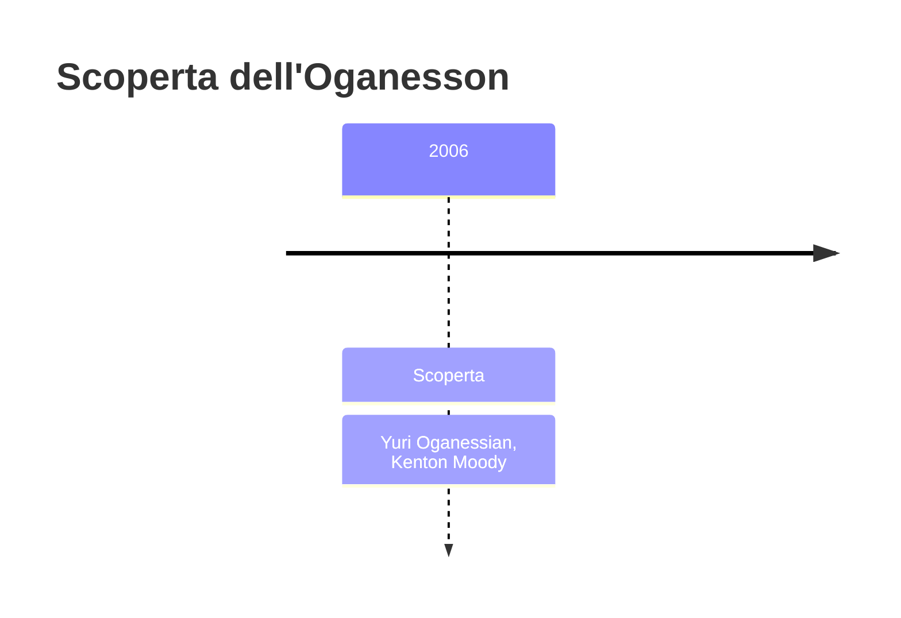
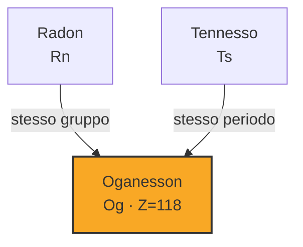

# Oganesson (Og)

> [!abstract] 117° elemento scoperto — 2006
> 

## Cronologia della scoperta

## Storia della scoperta

## Posizione nella tavola periodica

## Caratteristiche

### Dati fisico-chimici

| Proprietà | Valore |
|---|---|
| Numero atomico | 118 |
| Massa atomica | 294,0 u |
| Categoria | Gas nobile |
| Gruppo | 18 |
| Periodo | 7 |
| Blocco | p |
| Configurazione elettronica | [Rn] 5f¹⁴ 6d¹⁰ 7s² 7p⁶ |
| Punto di fusione | dato non disponibile |
| Punto di ebollizione | 76,9 °C |
| Densità | 4,95 g/cm³ |
| Stati di ossidazione | — |

## Struttura atomica

![[atomo-Oganesson.svg]]

## Usi e presenza in natura

## Nella cronologia

← Precedente: [[Flerovio]] (2006)
→ Successivo: [[Tennesso]] (2010)

Epoca: [[Era nucleare]] · Scopritori: [[Yuri Oganessian]], [[Kenton Moody]]

## Fonti

