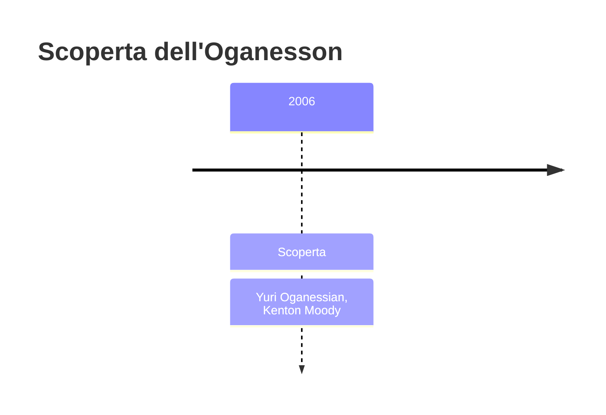
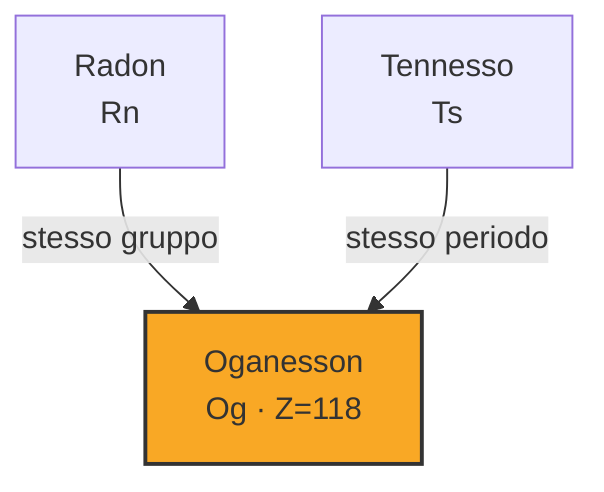
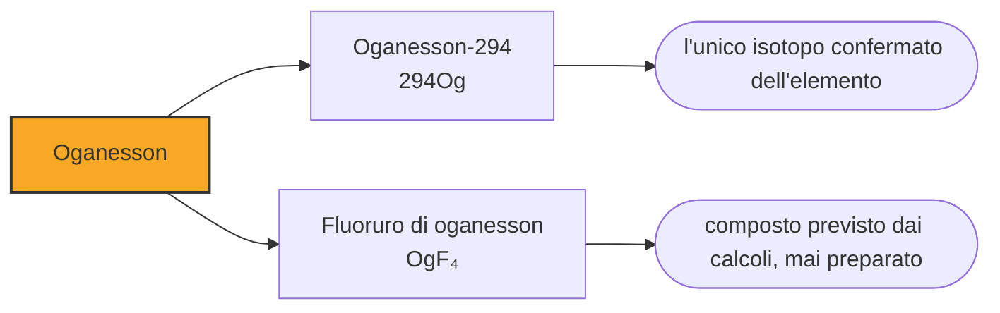

# Oganesson (Og)

> [!abstract] 117° elemento scoperto — 2006
> L'ultima casella della tavola periodica è stata annunciata nel 1999 da un laboratorio che se l'era inventata, e fabbricata davvero tre anni dopo da un altro. Sta nella colonna dei gas nobili e, con ogni probabilità, non è un gas.

L'oganesson chiude la tavola periodica: è l'elemento con il numero atomico più alto mai prodotto, l'ultima casella della settima riga e l'ultimo posto della colonna dei gas nobili. Di tutte e tre queste cose, solo la prima è sicura. La riga potrebbe continuare, e il gas nobile probabilmente non lo è.

## Cronologia della scoperta

## Storia della scoperta

Nel 1999 il laboratorio di Berkeley annunciò di aver prodotto gli elementi 118 e 116 bombardando piombo-208 con ioni di cripton-86. Era un risultato clamoroso: una reazione che nessuno riteneva praticabile, e due caselle in un colpo solo. Il gruppo aveva già scelto il nome, ghiorsium, in onore di Albert Ghiorso.

Nessun altro laboratorio riuscì a riprodurre il risultato, e non ci riuscì nemmeno Berkeley rifacendo il proprio esperimento. Nel 2001 arrivò la ritrattazione; nel giugno del 2002 il direttore del laboratorio annunciò che la rivendicazione si basava su dati fabbricati dal primo autore, Victor Ninov, lo stesso che aveva inventato un atomo di darmstadtio e uno di copernicio. Ninov fu licenziato.

Vale la pena notare che cosa ha funzionato. Non un'ispezione né un sospetto: la frode è caduta perché il risultato non si riproduceva, prima altrove e poi in casa. In un campo che lavora su una manciata di eventi e senza campioni da conservare, la riproducibilità è l'unico controllo possibile, ed è la ragione per cui le regole di attribuzione sono diventate così severe proprio in quegli anni.

L'oganesson vero è nato a Dubna: uno o due atomi nel 2002, altri due nel 2005, bombardando californio-249 con ioni di calcio-48. In tutto tre o quattro nuclei di oganesson-294, ciascuno vissuto meno di un millesimo di secondo. La IUPAC riconobbe la scoperta alla collaborazione russo-americana nel dicembre del 2015, insieme alle altre tre caselle rimaste.

Per il nome i russi avevano pensato a flyorium, per il fondatore del laboratorio, e a moskovium; entrambi sono poi finiti su altre caselle. La scelta cadde su oganesson, in onore di Jurij Oganesjan, che dirigeva il programma e che era ed è vivo: è il secondo elemento della storia intitolato a una persona vivente, dopo il seaborgio. La desinenza in -on segue la regola fissata dalla IUPAC nel 2016 per gli elementi del gruppo 18.

Oganesjan, armeno di nascita e sovietico di formazione, ha diretto per decenni il laboratorio di Dubna e ha firmato una parte cospicua dell'ultima riga della tavola. È stato il suo gruppo a proporre la fusione a bassa energia che i tedeschi hanno poi usato per sei caselle, ed è stato il suo gruppo a mettere a punto la strada del calcio-48 che ne ha riempite altre sei. Fra le due idee passano quarant'anni di lavoro sulla stessa domanda.

## Posizione nella tavola periodica

## Caratteristiche

La colonna in cui sta l'oganesson è quella degli elementi che non reagiscono con nulla, e proprio questa è la previsione che i calcoli smentiscono. L'oganesson dovrebbe essere sensibilmente più reattivo del radon, che già non è un modello di inerzia, e dovrebbe legare a sé un elettrone in più liberando energia: un comportamento che nessun altro gas nobile ha. Gli stati di ossidazione previsti arrivano fino al +6.

Il seguito è ancora più curioso. Le simulazioni gli assegnano un punto di fusione attorno ai cinquanta gradi e un'ebollizione attorno ai centosettanta: se i conti sono giusti, a temperatura ambiente l'oganesson sarebbe un solido. Un gas nobile solido e reattivo non è più un gas nobile, e la casella 118 diventa il punto in cui una delle famiglie più solide della tavola periodica smette di descrivere i propri membri.

La ragione è sempre la stessa, portata all'estremo. In un atomo con centodiciotto protoni gli elettroni si muovono tanto in fretta che l'accoppiamento fra il loro moto e il loro spin diventa determinante, e i livelli energetici si rimescolano al punto che il guscio esterno chiuso perde la propria stabilità. I calcoli suggeriscono che nell'oganesson gli elettroni non siano nemmeno più disposti in gusci netti, ma sfumati in una distribuzione quasi uniforme.

Di oganesson si conosce un solo isotopo confermato, l'oganesson-294, che dura sette decimi di millesimo di secondo. Nessun esperimento di chimica è pensabile con questi tempi, e tutto ciò che si è detto sopra resta una previsione: di questo elemento si sa molto per calcolo e quasi nulla per misura.

### Dati fisico-chimici

| Proprietà | Valore |
|---|---|
| Numero atomico | 118 |
| Massa atomica | 294,0 u |
| Categoria | Gas nobile |
| Gruppo | 18 |
| Periodo | 7 |
| Blocco | p |
| Configurazione elettronica | [Rn] 5f¹⁴ 6d¹⁰ 7s² 7p⁶ |
| Punto di fusione | dato non disponibile |
| Punto di ebollizione | 76,9 °C |
| Densità | 4,95 g/cm³ |
| Stati di ossidazione | -1, 0, +1, +2, +4, +6 |

## Struttura atomica

![[atomo-Oganesson.svg]]

## Usi e presenza in natura

L'oganesson non ha usi e non ne avrà: ne esistono in tutto tre o quattro atomi mai prodotti, ciascuno vissuto meno di un millesimo di secondo. Non c'è nemmeno un uso di ricerca, perché non si riesce a farci nulla.

Ma la casella 118 è il luogo in cui si verifica se la tavola periodica sia una legge o una buona approssimazione. Se l'ultimo gas nobile risultasse un solido reattivo, la colonna smetterebbe di essere una famiglia e diventerebbe una posizione. Sapere dove esattamente la periodicità si esaurisce serve a capire che cosa la periodicità sia, ed è una domanda che riguarda tutta la tavola, non solo il suo angolo in basso a destra.

## Curiosità

Gli elementi intitolati a persone viventi sono due, e i loro protagonisti sono stati per decenni su fronti opposti: Glenn Seaborg a Berkeley e Jurij Oganesjan a Dubna, cioè i due laboratori che si erano contesi ogni casella dal 1958 al 1997. Le loro caselle distano dodici posizioni e appartengono alla stessa riga.

Albert Ghiorso ha partecipato alla scoperta di dodici elementi, più di chiunque altro, e non ha una casella con il proprio nome. Ci è andato vicino nel 2001, quando il gruppo di Berkeley voleva chiamare ghiorsium l'elemento 118: quel nome è sparito insieme alla rivendicazione da cui dipendeva.

## Nella cronologia

← Precedente: [[Flerovio]] (2006)
→ Successivo: [[Tennesso]] (2010)

Epoca: [[Era nucleare]] · Scopritori: [[Yuri Oganessian]], [[Kenton Moody]]

## Fonti

- [Oganesson](https://en.wikipedia.org/wiki/Oganesson) — consultata il 10/09/2026
- [Oganesson — Royal Society of Chemistry](https://periodic-table.rsc.org/element/118/oganesson) — consultata il 10/09/2026
- [Noble gas](https://en.wikipedia.org/wiki/Noble_gas) — consultata il 10/09/2026
