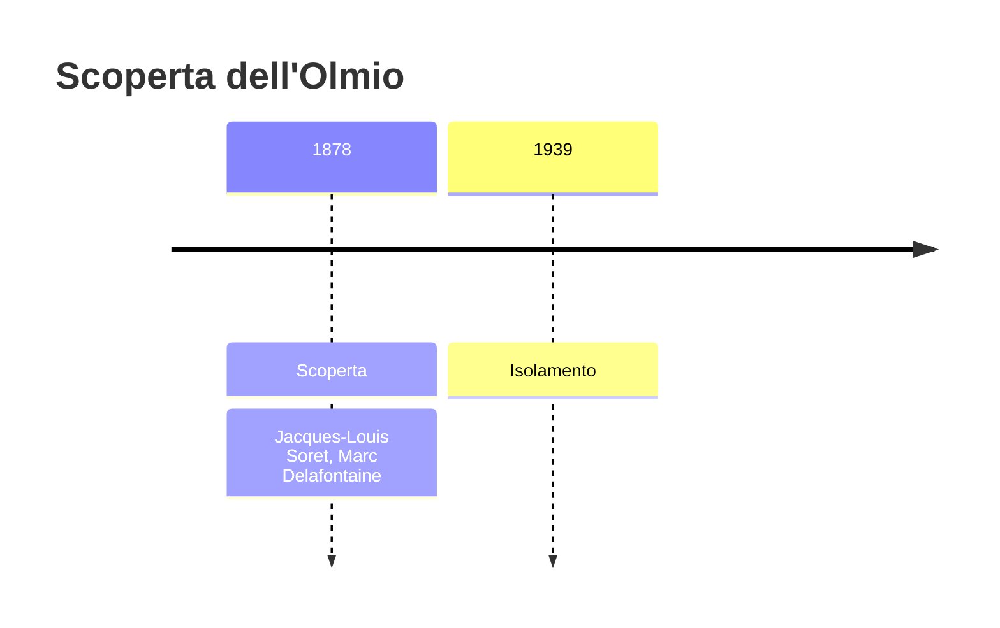
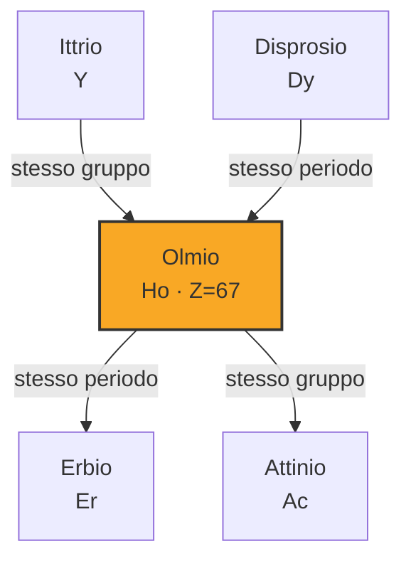

# Olmio (Ho)

> [!abstract] 67° elemento scoperto — 1878
> 

## Cronologia della scoperta

## Storia della scoperta

## Posizione nella tavola periodica

## Caratteristiche

### Dati fisico-chimici

| Proprietà | Valore |
|---|---|
| Numero atomico | 67 |
| Massa atomica | 164,930332 u |
| Categoria | Lantanide |
| Gruppo | 3 |
| Periodo | 6 |
| Blocco | f |
| Configurazione elettronica | [Xe] 4f¹¹ 6s² |
| Punto di fusione | 1460,9 °C |
| Punto di ebollizione | 2599,9 °C |
| Densità | 8,79 g/cm³ |
| Stati di ossidazione | — |

## Struttura atomica

![[atomo-Olmio.svg]]

## Usi e presenza in natura

## Nella cronologia

← Precedente: [[Gallio]] (1875)
→ Successivo: [[Itterbio]] (1878)

Epoca: [[Spettroscopia e radioattività]] · Scopritori: [[Jacques-Louis Soret]], [[Marc Delafontaine]]

## Fonti

