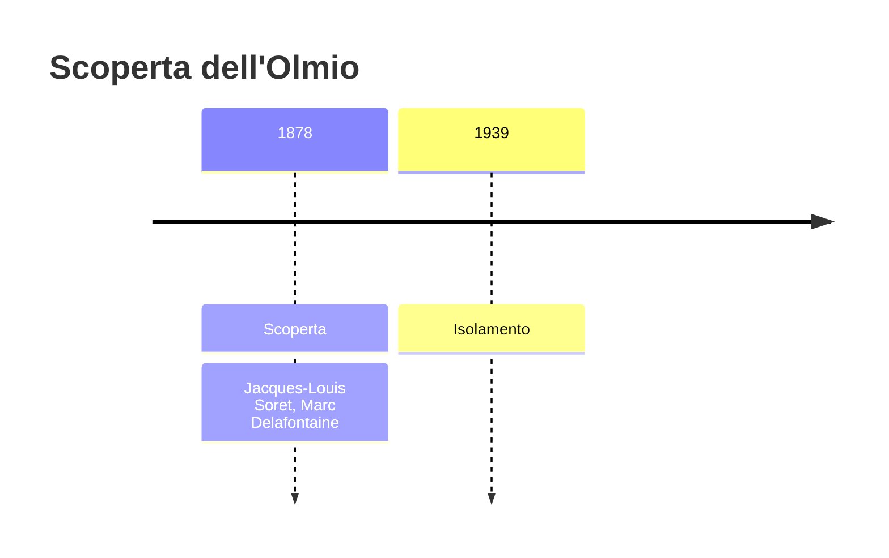
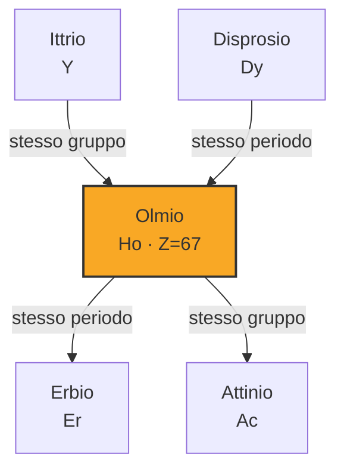
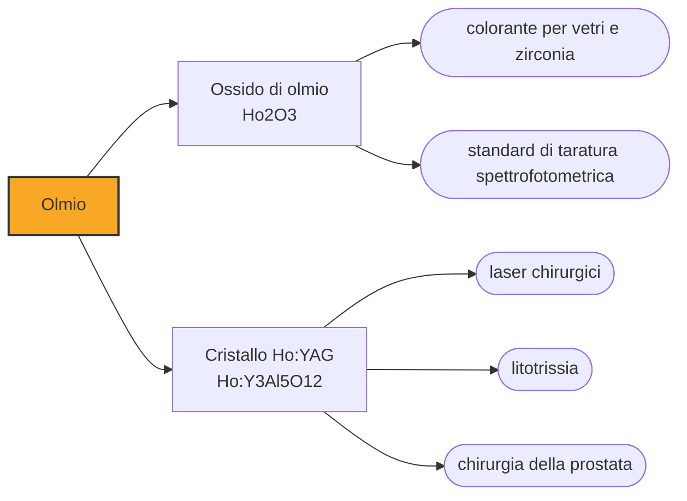

# Olmio (Ho)

> [!abstract] 67° elemento scoperto — 1878
> A Ginevra lo chiamarono «elemento X» perché non sapevano che cosa fosse. A Uppsala, nello stesso anno, qualcun altro lo tirava fuori dalla stessa terra e gli dava il nome della propria città.

L'olmio è il campione magnetico della tavola periodica: nessun altro elemento naturale ha un momento magnetico atomico più alto. È una proprietà che non serve a fare calamite — a temperatura ambiente il magnetismo non regge — ma a concentrare i campi magnetici degli elettromagneti più potenti che si sappiano costruire.

## Cronologia della scoperta

## Storia della scoperta

Nel 1878, a Ginevra, Jacques-Louis Soret e Marc Delafontaine studiavano allo spettroscopio i residui delle terre rare e trovarono righe di assorbimento che non corrispondevano a nessun elemento conosciuto. Non riuscendo a isolare la sostanza che le produceva, la chiamarono provvisoriamente «elemento X»: era il modo onesto di annunciare che c'era qualcosa senza sapere che cosa.

Nello stesso periodo, a Uppsala, Per Teodor Cleve stava smontando l'erbia con il metodo che gli aveva già dato il tulio: rimuoveva sistematicamente i contaminanti noti e guardava che cosa restava. Quello che restava erano due sostanze nuove, e una era la stessa che i ginevrini avevano visto. Cleve ne ottenne l'ossido impuro e la chiamò holmia, da Holmia, il nome latino di Stoccolma.

Le tavole assegnano la scoperta ai ginevrini, che videro per primi, e il nome allo svedese, che per primo isolò qualcosa di tangibile: è la stessa divisione che si era vista per il tallio fra Crookes e Lamy, e che la spettroscopia rendeva inevitabile. Vedere una riga e tenere in mano una polvere erano ormai due traguardi diversi, e non sempre li raggiungeva la stessa persona.

L'ossido puro arrivò solo nel 1911, con le migliaia di cristallizzazioni frazionate che questa famiglia richiedeva, e il metallo nel 1939, per mano di Heinrich Bommer. Sessant'anni fra l'annuncio e il primo pezzo di elemento: uno degli scarti più lunghi della tavola periodica, e tutto dovuto alla difficoltà di separare fra loro sostanze quasi identiche.

## Posizione nella tavola periodica

## Caratteristiche

Il guscio f dell'olmio ospita elettroni spaiati disposti in modo da sommare i loro momenti magnetici invece di annullarli, e il risultato è il momento magnetico atomico più alto fra tutti gli elementi naturali: 10,6 magnetoni di Bohr. È una proprietà dell'atomo singolo, non del materiale, ed è per questo che non se ne ricavano magneti permanenti.

Come materiale l'olmio è ferromagnetico solo a temperature molto basse, e a temperatura ambiente si comporta da paramagnete: subisce i campi magnetici invece di produrne. È esattamente questo, però, a renderlo utile come concentratore: inserito fra le espansioni polari di un elettromagnete, ne raccoglie e ne intensifica il campo.

Per il resto è un lantanide ordinario: metallo argenteo, relativamente tenero e malleabile, che all'aria secca resiste bene e in aria umida si ossida lentamente; nei composti sta stabilmente nello stato +3 e i suoi sali sono gialli o rosati. Le sue righe di assorbimento sono così nette e così poco sensibili all'ambiente chimico da essere usate per tarare gli spettrofotometri.

Nella crosta terrestre è a 1,3 parti per milione, poco più del terbio, e come tutti i lantanidi pesanti si ricava dalla monazite, dallo xenotime e dalle argille ad adsorbimento ionico della Cina meridionale. Non ha minerali propri e non ne ha mai avuti.

### Dati fisico-chimici

| Proprietà | Valore |
|---|---|
| Numero atomico | 67 |
| Massa atomica | 164,930332 u |
| Categoria | Lantanide |
| Gruppo | 3 |
| Periodo | 6 |
| Blocco | f |
| Configurazione elettronica | [Xe] 4f¹¹ 6s² |
| Punto di fusione | 1460,9 °C |
| Punto di ebollizione | 2599,9 °C |
| Densità | 8,79 g/cm³ |
| Stati di ossidazione | +3 |

## Struttura atomica

![[atomo-Olmio.svg]]

## Usi e presenza in natura

Il cristallo di ittrio-alluminio granato drogato con olmio emette a circa 2,1 micrometri, una lunghezza d'onda che l'acqua assorbe molto bene: il colpo si esaurisce in pochi decimi di millimetro di tessuto, e questo ne fa un bisturi ottico che taglia e coagula senza danneggiare quello che sta appena sotto. È il laser con cui si frantumano i calcoli renali e si opera l'ipertrofia prostatica, due interventi che con questa tecnica si fanno per via endoscopica, e negli ultimi decenni ha sostituito la chirurgia tradizionale in buona parte dell'urologia.

Nei laboratori, i puntali in olmio degli elettromagneti servono a raggiungere i campi statici più intensi disponibili; nei reattori nucleari l'olmio fa da veleno bruciabile, cioè da assorbitore di neutroni che si consuma man mano che il combustibile invecchia, compensando da solo la perdita di reattività.

L'ossido colora i vetri di giallo-arancio e la zirconia cubica di rosa, ed è uno dei pochi impieghi in cui l'olmio si vede: il resto del suo lavoro avviene dentro cristalli laser, magneti e noccioli di reattore, dove non lo guarda nessuno.

## Curiosità

Le righe di assorbimento dell'olmio sono così strette e così stabili che un filtro di vetro all'olmio è lo standard con cui si verifica la scala delle lunghezze d'onda degli spettrofotometri di mezzo mondo: si mette il filtro nel cammino ottico, si guarda dove cadono i picchi e si corregge lo strumento. Un elemento trovato grazie a righe che nessuno riconosceva è diventato il metro con cui si controllano le righe di tutti gli altri.

Fra il 1878 e il 1879 Cleve, dalla sola erbia, tirò fuori due elementi e li battezzò l'uno con il nome latino di Stoccolma e l'altro con quello mitico dell'estremo nord: olmio e tulio. È il momento in cui la nomenclatura chimica diventa una carta geografica della Scandinavia.

## Nella cronologia

← Precedente: [[Gallio]] (1875)
→ Successivo: [[Itterbio]] (1878)

Epoca: [[Spettroscopia e radioattività]] · Scopritori: [[Jacques-Louis Soret]], [[Marc Delafontaine]]

## Fonti

- [Holmium](https://en.wikipedia.org/wiki/Holmium) — consultata il 09/09/2026
- [Holmium — Royal Society of Chemistry](https://periodic-table.rsc.org/element/67/holmium) — consultata il 09/09/2026
- [Per Teodor Cleve](https://en.wikipedia.org/wiki/Per_Teodor_Cleve) — consultata il 09/09/2026
