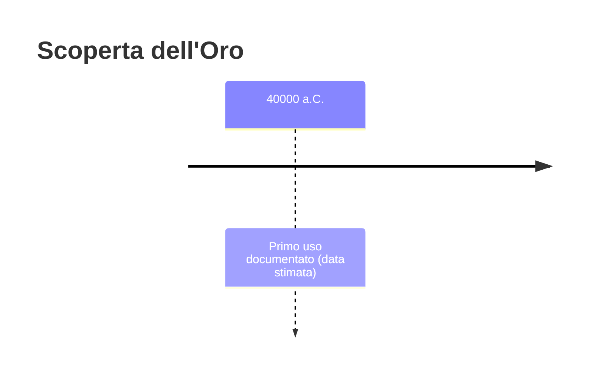
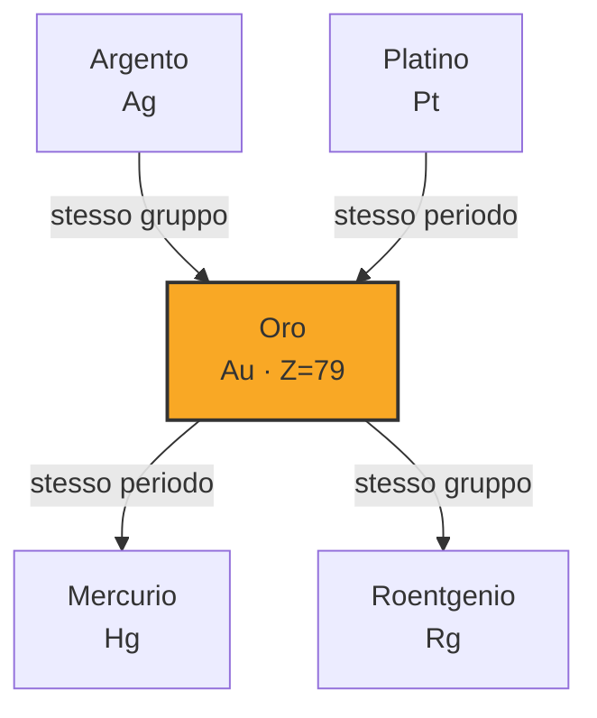
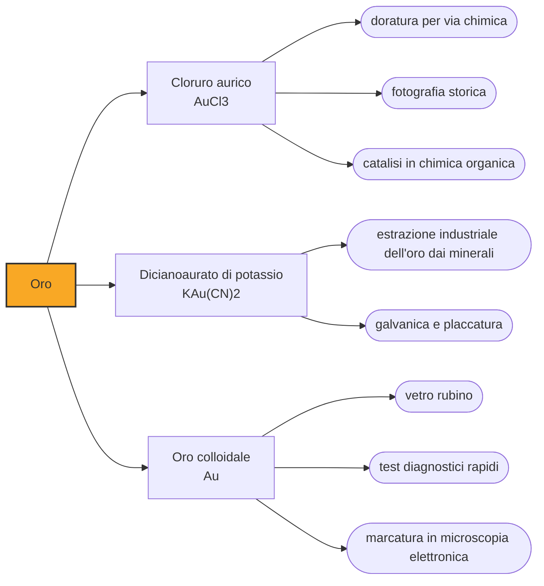

# Oro (Au)

> [!abstract] 1° elemento scoperto — 40000 a.C.
> L'oro non è stato scoperto: è stato notato. È il metallo che si trova già pronto, lucente e inalterato, e per questo entra nella storia umana prima di qualunque tecnica capace di lavorarlo.

Fra tutti gli elementi, l'oro ha la storia più lunga e la scoperta più impossibile da datare: non richiede fuoco, non richiede minerali da riconoscere, non richiede nulla se non un occhio che si accorga di una pagliuzza gialla nella ghiaia di un fiume. Per questo la sua data convenzionale è la più antica dell'intera tavola periodica.

## Cronologia della scoperta

## Storia della scoperta

L'oro appartiene alla piccolissima famiglia dei metalli che in natura si presentano allo stato nativo, cioè già metallici e non combinati con altri elementi. Non arrugginisce, non annerisce, non si sfalda: un granello depositato in un fiume centomila anni fa è ancora oro oggi, identico. È questa indifferenza chimica, più ancora della rarità, a spiegare perché sia il primo metallo entrato nelle mani dell'uomo, in un'epoca in cui la sola tecnologia disponibile era raccogliere e battere.

*Per tradizione:* La data convenzionale di quarantamila anni fa nasce dalla segnalazione di piccole quantità di oro naturale in grotte spagnole frequentate nel Paleolitico superiore. È una testimonianza d'uso, non un ritrovamento databile con precisione, e conviene leggerla per quello che è: l'indizio che il metallo veniva raccolto e conservato molto prima che qualcuno sapesse farci qualcosa.

La prima oreficeria vera e propria, invece, è documentata benissimo e arriva molto dopo. Nella necropoli calcolitica di Varna, sulla costa bulgara del Mar Nero, scavata a partire dal 1972, sono stati recuperati oltre tremila oggetti d'oro per circa sei chili complessivi, datati fra il 4600 e il 4200 a.C.: è l'oro lavorato più antico che si conosca. In una sola sepoltura, la tomba 43, c'era un chilo e mezzo di metallo, segno che il valore sociale dell'oro nasce insieme alla capacità di lavorarlo.

Nel IV millennio a.C. l'Egitto e la Mesopotamia trattano l'oro su scala ormai statale, e le miniere della Nubia diventano una delle basi materiali del potere faraonico. Il passaggio decisivo per l'economia arriva però intorno al 610 a.C. in Lidia, nell'odierna Turchia: lì compaiono le prime monete coniate del mondo, battute in elettro, la lega naturale di oro e argento. Da quel momento l'oro smette di essere soltanto ornamento e diventa la misura del valore di ogni altra cosa.

> [!warning] Questione aperta
> La data di -40000 è convenzionale e va presa per quello che è. Deriva dalla segnalazione di piccole quantità di oro nativo in grotte spagnole frequentate nel Paleolitico superiore, un dato che circola largamente nella letteratura divulgativa ma che non poggia su un singolo ritrovamento datato con precisione e ampiamente discusso, come accade invece per il rame o per il ferro meteoritico. Ciò che è solidamente documentato è molto più tardo: la più antica oreficeria del mondo è quella della necropoli calcolitica di Varna, in Bulgaria, datata fra il 4600 e il 4200 a.C., con oltre tremila oggetti d'oro per circa sei chili complessivi. Fra la raccolta di pagliuzze e l'oreficeria di Varna corrono decine di millenni: la prima è un gesto, la seconda una tecnica.

## Posizione nella tavola periodica

## Caratteristiche

L'oro è il più malleabile e il più duttile dei metalli, con un margine che non è piccolo: un solo grammo può essere battuto in una foglia di un metro quadrato, sottile al punto da lasciar passare la luce con una tonalità verdastra. È la proprietà che ha reso possibile la doratura molto prima dell'industria, perché consente di rivestire superfici enormi con quantità minime di metallo.

Con 19,3 grammi per centimetro cubo l'oro è quasi due volte e mezzo più denso del ferro: un lingotto che sta in una mano pesa molto più di quanto l'occhio si aspetti, ed è per questo che il peso è da sempre il primo controllo di autenticità. Il suo colore giallo, raro fra i metalli, non è un dettaglio estetico ma la conseguenza degli effetti relativistici sugli elettroni di un atomo così pesante, che spostano l'assorbimento della luce verso il blu e lasciano riflesso il resto dello spettro.

Chimicamente l'oro è quasi indifferente al mondo: non reagisce con l'ossigeno, resiste ai singoli acidi forti e non si ossida all'aria a nessuna temperatura ordinaria. Cede solo a poche condizioni particolari, prima fra tutte l'acqua regia, la miscela di acido nitrico e cloridrico che gli alchimisti chiamarono così proprio perché scioglie il re dei metalli. Nei suoi composti compare soprattutto negli stati di ossidazione +1 e +3.

### Dati fisico-chimici

| Proprietà | Valore |
|---|---|
| Numero atomico | 79 |
| Massa atomica | 196,9665695 u |
| Categoria | Metallo di transizione |
| Gruppo | 11 |
| Periodo | 6 |
| Blocco | d |
| Configurazione elettronica | [Xe] 4f¹⁴ 5d¹⁰ 6s¹ |
| Punto di fusione | 1064,2 °C |
| Punto di ebollizione | 2969,9 °C |
| Densità | 19,3 g/cm³ |
| Stati di ossidazione | -1, +1, +2, +3, +5 |

## Struttura atomica

![[atomo-Oro.svg]]

## Usi e presenza in natura

Oggi la domanda mondiale si divide in tre parti molto diverse fra loro: circa metà va in gioielleria, una quota di poco inferiore in investimento e riserve delle banche centrali, e appena un decimo negli usi industriali. È una ripartizione che dice qualcosa sull'elemento: dell'oro si continua a usare soprattutto il significato, non la funzione.

La quota industriale, per quanto piccola, è insostituibile. Poiché non si ossida, un contatto elettrico dorato conduce allo stesso modo dopo vent'anni: per questo l'oro riveste connettori, piedini di circuiti integrati e contatti in ogni apparecchio elettronico. Serve anche come schermo per la radiazione infrarossa nelle visiere dei caschi spaziali e nei rivestimenti dei satelliti, e in odontoiatria per le leghe delle protesi.

L'oro che si estrae oggi non si raccoglie più a mano: i minerali che lo contengono ne portano pochi grammi per tonnellata, e per recuperarlo si scioglie il metallo in soluzioni di cianuro per poi riprecipitarlo. È un processo efficiente e ambientalmente delicato, e spiega perché la miniera d'oro moderna assomigli più a un impianto chimico che a un giacimento.

## Curiosità

Negli oceani c'è oro disciolto, ma in concentrazioni dell'ordine di poche decine di parti per quadrilione: estrarlo costerebbe incomparabilmente più di quanto valga, e i progetti che nel Novecento promisero di ricavarlo dall'acqua di mare sono finiti tutti in nulla, quando non in truffa.

L'oro terrestre non si è formato sulla Terra. Nuclei così pesanti nascono negli eventi più violenti dell'universo, e la fusione di due stelle di neutroni osservata nel 2017 ne ha dato una conferma diretta attraverso la luce emessa dai detriti. Ogni fede nuziale è materia arrivata qui dopo un cataclisma stellare, inglobata nella nube da cui si è formato il sistema solare.

## Nella cronologia

← *Primo elemento della cronologia*
→ Successivo: [[Carbonio]] (26000 a.C.)

Epoca: [[Antichità]]

## Fonti

- [Gold](https://en.wikipedia.org/wiki/Gold) — consultata il 07/09/2026
- [Varna Necropolis](https://en.wikipedia.org/wiki/Varna_Necropolis) — consultata il 07/09/2026
- [Varna Chalcolithic Necropolis - oldest gold treasure in the world](https://visit.varna.bg/en/varna_oldest_gold_treasure_in_the_world.html) — consultata il 07/09/2026
