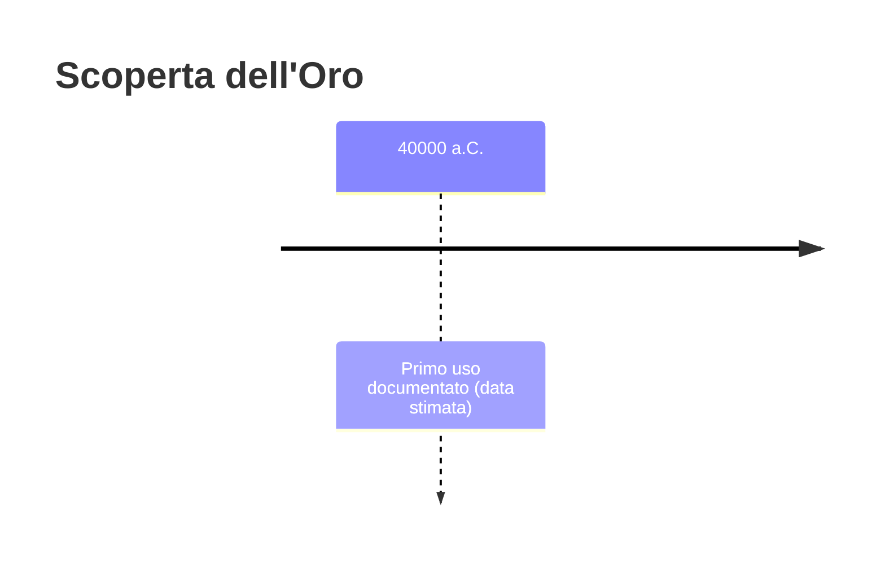
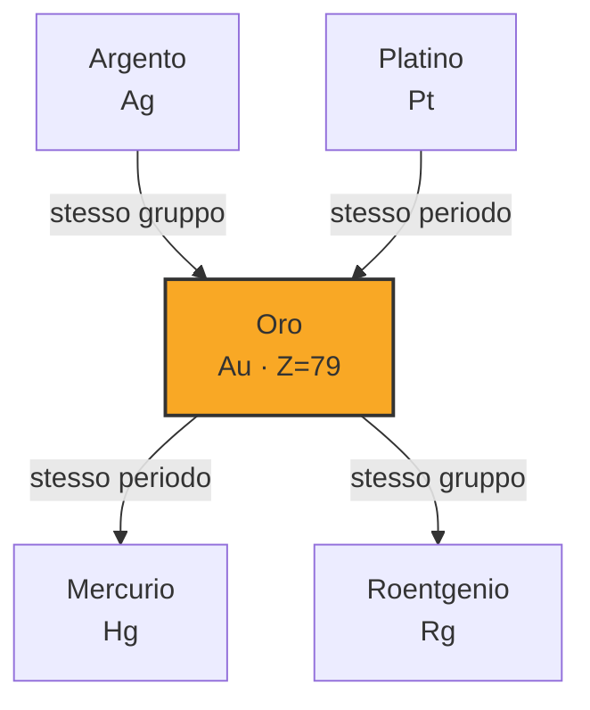

# Oro (Au)

> [!abstract] 1° elemento scoperto — 40000 a.C.
> 

## Cronologia della scoperta

## Storia della scoperta

## Posizione nella tavola periodica

## Caratteristiche

### Dati fisico-chimici

| Proprietà | Valore |
|---|---|
| Numero atomico | 79 |
| Massa atomica | 196,9665695 u |
| Categoria | Metallo di transizione |
| Gruppo | 11 |
| Periodo | 6 |
| Blocco | d |
| Configurazione elettronica | [Xe] 4f¹⁴ 5d¹⁰ 6s¹ |
| Punto di fusione | 1064,2 °C |
| Punto di ebollizione | 2969,9 °C |
| Densità | 19,3 g/cm³ |
| Stati di ossidazione | — |

## Struttura atomica

![[atomo-Oro.svg]]

## Usi e presenza in natura

## Nella cronologia

← *Primo elemento della cronologia*
→ Successivo: [[Carbonio]] (26000 a.C.)

Epoca: [[Antichità]]

## Fonti

