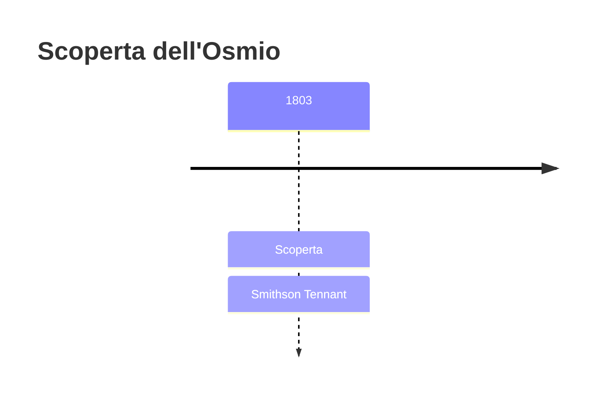
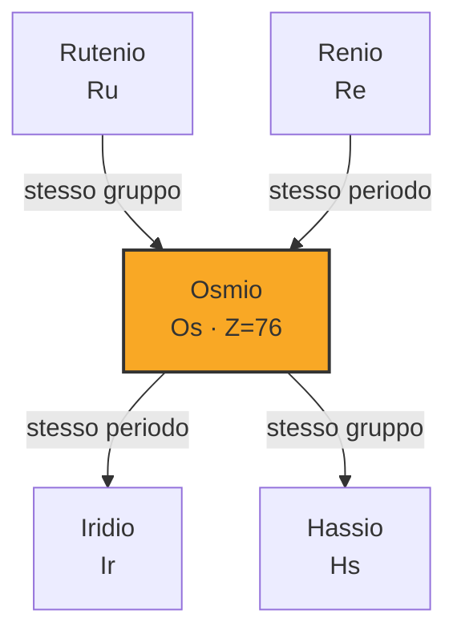

# Osmio (Os)

> [!abstract] 45° elemento scoperto — 1803
> 

## Cronologia della scoperta

## Storia della scoperta

## Posizione nella tavola periodica

## Caratteristiche

### Dati fisico-chimici

| Proprietà | Valore |
|---|---|
| Numero atomico | 76 |
| Massa atomica | 190,233 u |
| Categoria | Metallo di transizione |
| Gruppo | 8 |
| Periodo | 6 |
| Blocco | d |
| Configurazione elettronica | [Xe] 4f¹⁴ 5d⁶ 6s² |
| Punto di fusione | 3032,9 °C |
| Punto di ebollizione | 5011,9 °C |
| Densità | 22,59 g/cm³ |
| Stati di ossidazione | — |

## Struttura atomica

![[atomo-Osmio.svg]]

## Usi e presenza in natura

## Nella cronologia

← Precedente: [[Cerio]] (1803)
→ Successivo: [[Iridio]] (1803)

Epoca: [[L'età dell'elettrolisi]] · Scopritore: [[Smithson Tennant]]

## Fonti

