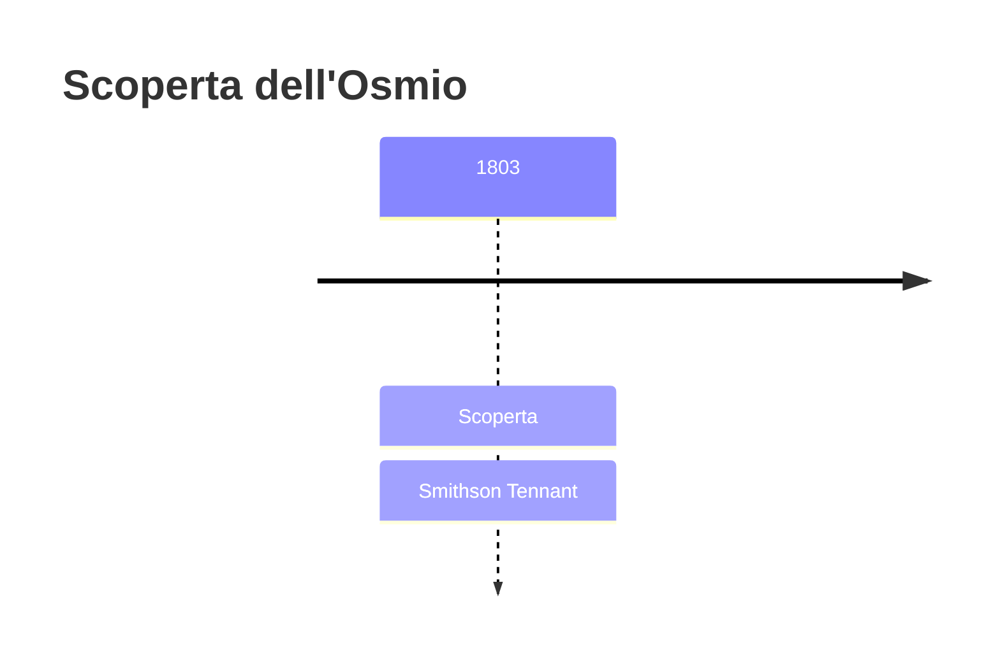
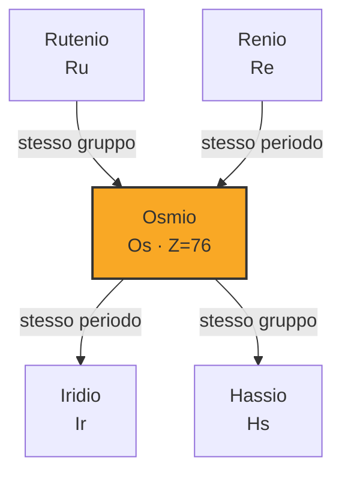
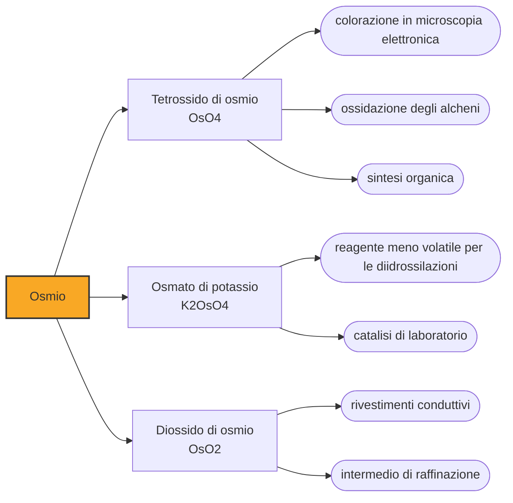

# Osmio (Os)

> [!abstract] 45° elemento scoperto — 1803
> Tennant riconobbe il suo elemento dall'odore: dalla polvere nera che l'acqua regia non scioglieva, trattata prima con alcali e poi con acidi, saliva un vapore pungente, a mezza strada fra il cloro e l'aglio.

L'osmio è il più denso degli elementi stabili, quasi il doppio del piombo, ed è fra i più refrattari al calore. È anche uno dei più rari della crosta terrestre e uno di quelli che si usano meno: quasi tutto ciò che se ne produce finisce in laboratorio, non in oggetti.

## Cronologia della scoperta

> [!info] Nota sulla cronologia
> Tennant separò osmio e iridio dal residuo insolubile della platina greggia nel 1803; la lettera che ne annuncia entrambi alla Royal Society porta la data del 21 giugno 1804.

## Storia della scoperta

Sciogliendo la platina greggia in acqua regia restava sempre sul fondo una polvere scura che non voleva saperne di andare in soluzione. Joseph Louis Proust la considerava grafite, e per decenni fu trattata come uno scarto. Nel 1800 il chimico inglese Smithson Tennant si era messo in società con William Hyde Wollaston per raffinare il platino, e nella divisione dei compiti si era preso la parte che sembrava senza speranza: proprio quel residuo insolubile.

Nel 1803 sulla stessa polvere si lavorava anche a Parigi. Victor Collet-Descotils, Antoine-François de Fourcroy e Louis Nicolas Vauquelin conclusero che conteneva un metallo mai descritto; Vauquelin ne isolò un ossido volatile e lo battezzò ptène, «alato», per come il vapore se ne andava. Nessuno dei tre però ne aveva raccolto abbastanza per caratterizzare quello che aveva trovato.

Tennant, che di quel residuo ne aveva molto di più, lo trattò alternando alcali e acidi, e dopo l'acidificazione riuscì a distillare un ossido volatile dall'odore inconfondibile, simile al cloro e vagamente all'aglio. Il nome venne da lì: osmio, dal greco osme, odore. Quel vapore è il tetrossido di osmio, tossico a concentrazioni bassissime e aggressivo verso gli occhi e le vie respiratorie: il tratto che ha dato il nome all'elemento è anche il suo pericolo principale.

La lettera che annunciava alla Royal Society i due elementi trovati nella polvere nera, l'osmio e l'iridio, porta la data del 21 giugno 1804. A separare Tennant dai francesi, arrivati sulla stessa polvere alle stesse conclusioni, non era stato un metodo migliore ma la quantità di materiale: Tennant ne aveva abbastanza per caratterizzare ciò che trovava, e loro no.

Tennant era arrivato alla chimica passando per la medicina e la botanica, e prima del platino aveva contribuito a dimostrare che il diamante e il carbone sono la stessa sostanza. Nel 1813 ottenne la cattedra di chimica a Cambridge, ma fece in tempo a tenere un solo corso di lezioni: nel febbraio del 1815, presso Boulogne-sur-Mer, il ponte su cui stava passando a cavallo crollò e lo uccise.

## Posizione nella tavola periodica

## Caratteristiche

Che l'osmio sia l'elemento stabile più denso è vero, ma di poco e non da sempre. I valori oggi accettati, ricavati dai parametri del reticolo cristallino misurati ai raggi X, sono 22,587 grammi per centimetro cubo per l'osmio e 22,562 per l'iridio a 20 °C: la differenza cade nella terza cifra. Finché si pesarono campioni reali, sempre un po' porosi o impuri, il primato passò più volte dall'uno all'altro, e solo negli anni Novanta le misure divennero abbastanza precise da assegnarlo con sicurezza.

Fonde a 3033 °C: fra i metalli solo il tungsteno e il renio arrivano più in alto. È durissimo e insieme fragile, di un bianco azzurrino, e a temperatura ambiente resiste agli acidi. In polvere fine, però, reagisce lentamente con l'ossigeno dell'aria formando il tetrossido, ed è la ragione per cui l'odore si sente anche accanto al metallo puro.

La sua chimica copre un arco insolitamente ampio, da -2 a +8, e il +8, che pochissimi elementi raggiungono, è quello del tetrossido. Si tratta di un solido giallo pallido, solubile in acqua, che sublima già a temperatura ambiente: è il motivo per cui l'osmio si maneggia sotto cappa e in fiale sigillate.

### Dati fisico-chimici

| Proprietà | Valore |
|---|---|
| Numero atomico | 76 |
| Massa atomica | 190,233 u |
| Categoria | Metallo di transizione |
| Gruppo | 8 |
| Periodo | 6 |
| Blocco | d |
| Configurazione elettronica | [Xe] 4f¹⁴ 5d⁶ 6s² |
| Punto di fusione | 3032,9 °C |
| Punto di ebollizione | 5011,9 °C |
| Densità | 22,59 g/cm³ |
| Stati di ossidazione | -2, -1, 0, +1, +2, +3, +4, +5, +6, +7, +8 |

## Struttura atomica

![[atomo-Osmio.svg]]

## Usi e presenza in natura

L'osmio metallico da solo serve a poco: è troppo duro e troppo difficile da lavorare. In lega con l'iridio e con gli altri metalli del gruppo forma però le punte dei pennini delle stilografiche, i perni degli strumenti di precisione e contatti elettrici destinati a durare; per un decennio, fra il 1945 e il 1955, fu anche la punta degli aghi dei giradischi, prima che zaffiro e diamante la mandassero fuori mercato perché si consumava troppo in fretta. La vera carriera dell'osmio è quella del suo tetrossido, che in microscopia elettronica fissa e colora i lipidi delle membrane cellulari, e che in chimica organica trasforma gli alcheni in dioli: la reazione per cui Barry Sharpless ha ricevuto una parte del Nobel del 2001.

Il mercato dell'osmio è minuscolo, e quanto sia minuscolo nessuno lo sa con precisione: la Royal Society of Chemistry stima la produzione mondiale intorno ai cento chilogrammi l'anno, altre fonti la danno fra qualche centinaio e qualche migliaio. Le statistiche dello USGS registrano per gli Stati Uniti importazioni dell'ordine del singolo chilogrammo annuo: nessun altro metallo del gruppo del platino si muove in quantità così esigue. Quasi tutto ciò che si ottiene arriva dai fanghi della raffinazione del nichel e del rame.

## Curiosità

Per qualche anno l'osmio illuminò le case: la lampada a filamento di osmio di Carl Auer von Welsbach, sviluppata nel 1898, arrivò sul mercato nel 1902 e fu presto soppiantata dal tungsteno, molto meno raro e altrettanto capace di reggere l'incandescenza. Ne resta traccia in un nome che si legge ancora sulle confezioni, Osram, contrazione di OSmio e wolfRAM.

Osmio e uranio furono i primi catalizzatori a rendere economicamente sensata la sintesi dell'ammoniaca da azoto e idrogeno. Il gruppo che alla BASF lavorava con Carl Bosch comprò per questo quasi tutta la scorta mondiale di osmio, prima che il ferro, incomparabilmente più abbondante, lo sostituisse.

## Nella cronologia

← Precedente: [[Cerio]] (1803)
→ Successivo: [[Iridio]] (1803)

Epoca: [[L'età dell'elettrolisi]] · Scopritore: [[Smithson Tennant]]

## Fonti

- [Two men, two centuries, four metals](https://www.chemistryworld.com/features/two-men-two-centuries-four-metals/3004876.article) — consultata il 07/09/2026
- [Osmium](https://en.wikipedia.org/wiki/Osmium) — consultata il 07/09/2026
- [Osmium — Royal Society of Chemistry](https://periodic-table.rsc.org/element/76/osmium) — consultata il 07/09/2026
- [Smithson Tennant](https://en.wikipedia.org/wiki/Smithson_Tennant) — consultata il 08/09/2026
- [USGS Mineral Commodity Summaries 2025 — Platinum-Group Metals](https://pubs.usgs.gov/periodicals/mcs2025/mcs2025-platinum-group.pdf) — consultata il 07/09/2026
