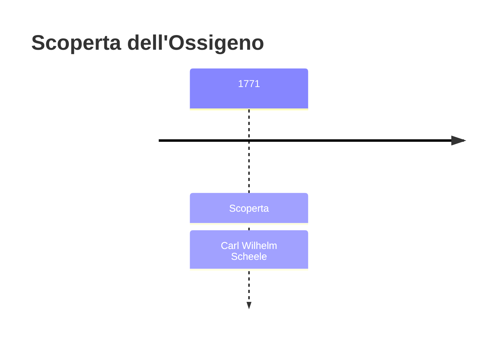
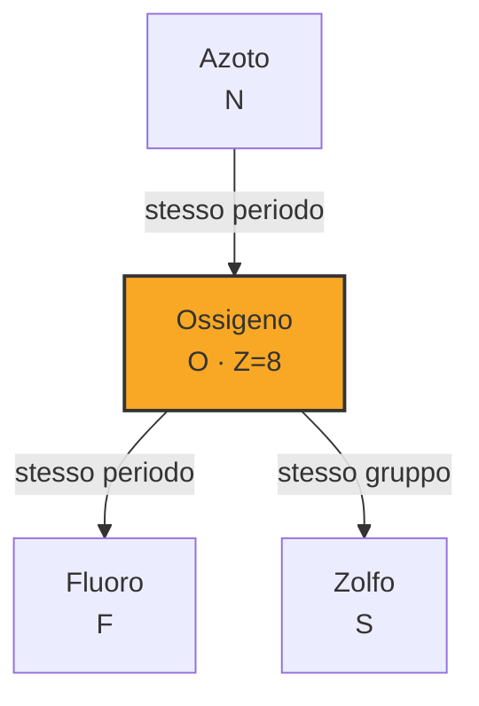

# Ossigeno (O)

> [!abstract] 24° elemento scoperto — 1771
> 

## Cronologia della scoperta

## Storia della scoperta

## Posizione nella tavola periodica

## Caratteristiche

### Dati fisico-chimici

| Proprietà | Valore |
|---|---|
| Numero atomico | 8 |
| Massa atomica | 15,999 u |
| Categoria | Non metallo |
| Gruppo | 16 |
| Periodo | 2 |
| Blocco | p |
| Configurazione elettronica | [He] 2s² 2p⁴ |
| Punto di fusione | -218,8 °C |
| Punto di ebollizione | -183,0 °C |
| Densità | 1,429 g/cm³ |
| Stati di ossidazione | — |

## Struttura atomica

![[atomo-Ossigeno.svg]]

## Usi e presenza in natura

## Nella cronologia

← Precedente: [[Manganese]] (1770)
→ Successivo: [[Fluoro]] (1771)

Epoca: [[Chimica pneumatica]] · Scopritore: [[Carl Wilhelm Scheele]]

## Fonti

