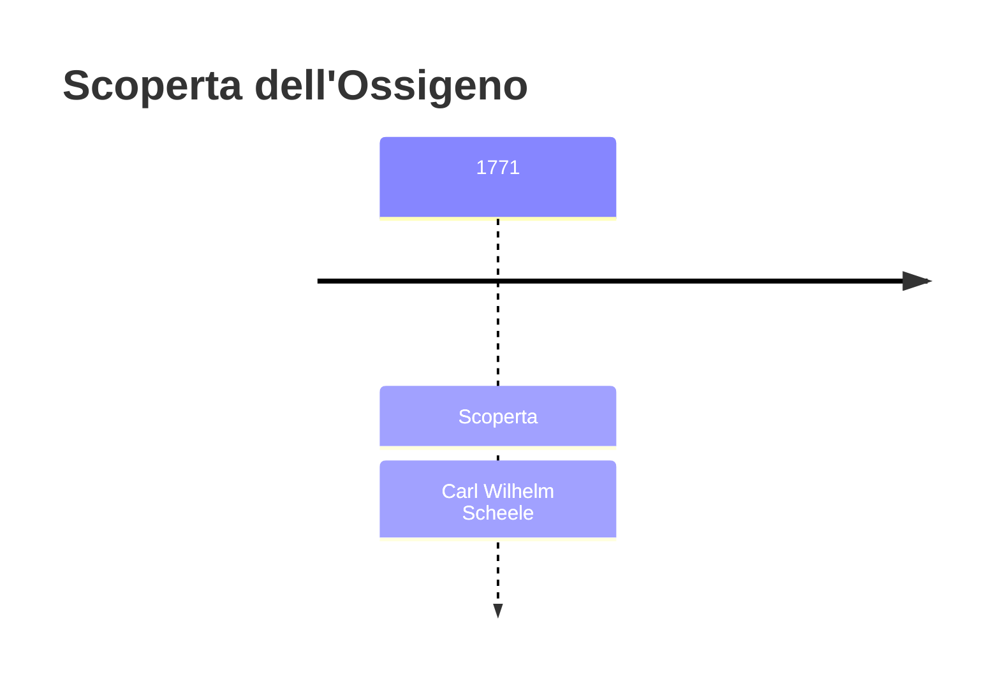
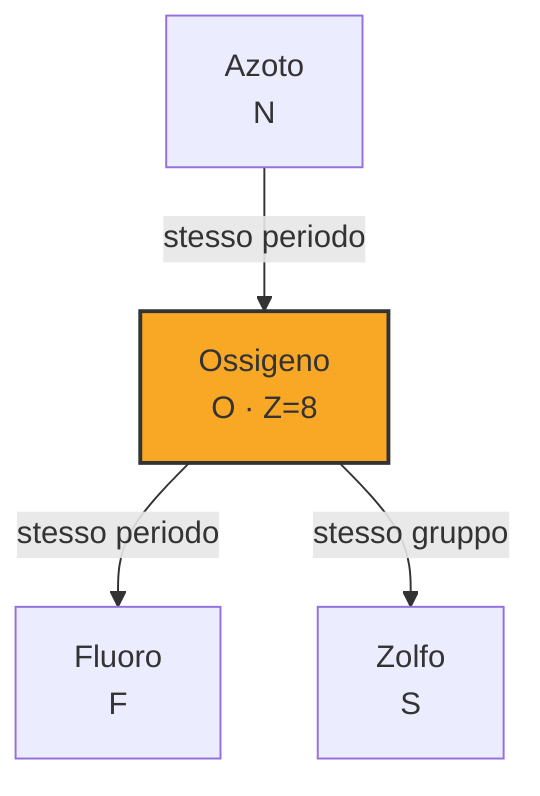
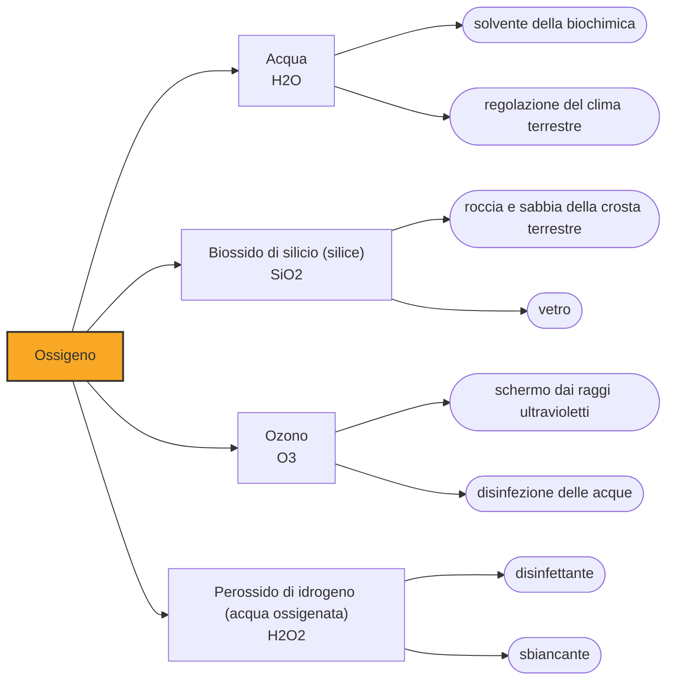

# Ossigeno (O)

> [!abstract] 24° elemento scoperto — 1771
> Per duemila anni l'aria fu un elemento, uno e indivisibile. In tre anni si scoprì che era una miscela, e che la parte che tiene in vita è meno di un quinto.

L'ossigeno è l'elemento più abbondante della crosta terrestre, quasi la metà della sua massa, e l'ottantanove per cento del peso degli oceani; nell'aria che respiriamo è appena un quinto del volume. È la sostanza che rende possibile il fuoco e la respirazione, cioè le due cose che gli esseri umani hanno osservato più a lungo senza capirle, e la sua identificazione ha riscritto la chimica da capo.

## Cronologia della scoperta

> [!info] Nota sulla cronologia
> Scheele ottiene la sua "aria di fuoco" intorno al 1771 e la registra su un quaderno di laboratorio che si conserva, ma pubblica soltanto nel 1777. Joseph Priestley arriva allo stesso gas per via indipendente il 1° agosto 1774 ed è il primo a stamparne la preparazione, alla fine del 1775. Antoine-Laurent Lavoisier ne capisce la natura, lo battezza e ne fa il perno della chimica moderna.

## Storia della scoperta

Fino alla metà del Settecento l'aria era un elemento nel senso di Aristotele: una delle quattro sostanze semplici di cui tutto è fatto, non scomponibile in nulla di più elementare. Le arie diverse che i chimici incontravano — quella che spegneva le candele, quella che esplodeva, quella che soffocava i topi — erano considerate aria comune sporcata da qualche impurità, non sostanze distinte. La chimica pneumatica nasce nel momento in cui qualcuno prende sul serio l'ipotesi contraria.

A ostacolare la comprensione c'era una teoria che spiegava troppo bene. Il flogisto era il principio dell'infiammabilità: si supponeva che ogni sostanza combustibile ne fosse impregnata e che bruciare significasse liberarlo. La teoria rendeva conto di quasi tutto ciò che si vedeva, e per questo resse un secolo; aveva un solo difetto, che nessuno pesava. I metalli arrostiti, che secondo la teoria avevano perso qualcosa, risultavano più pesanti di prima.

Il primo a tenere in mano il gas è un farmacista di provincia. Carl Wilhelm Scheele, apprendista di bottega senza laurea né cattedra, lavora nelle ore che gli avanzano dal banco e intorno al 1771 ottiene, scaldando ossido di mercurio e nitrati, un'aria in cui la fiamma divampa. La chiama aria di fuoco, ne studia le proprietà con una cura che ancora si legge nei suoi quaderni, e poi fa quello che farà sempre: rimanda la pubblicazione.

Il 1° agosto 1774 un pastore inglese ottiene lo stesso gas senza saperne nulla. Joseph Priestley concentra con una lente la luce del sole sull'ossido rosso di mercurio e raccoglie un'aria in cui la candela brucia con una fiamma smisurata e un topo sopravvive molto più a lungo del previsto. La prova più eloquente se la fa addosso: respira il gas puro e riferisce che il petto gli è parso stranamente leggero. Lo chiama aria deflogisticata, e stampa il risultato alla fine del 1775.

A Parigi Antoine-Laurent Lavoisier fa una cosa che a Scheele e a Priestley non era venuta in mente: pesa. Misura la massa di tutto ciò che entra e di tutto ciò che esce da una combustione, recipiente compreso, e trova che il peso guadagnato dal metallo arrostito è esattamente quello perduto dall'aria del recipiente. Non si perde nulla: si combina. Il flogisto diventa superfluo, e con esso crolla l'impianto teorico su cui la chimica si reggeva.

Il nome che l'elemento porta è un errore fossilizzato. Nel 1779 Lavoisier lo battezza oxygène, dal greco per generatore di acidi, convinto che ogni acido dovesse contenerlo: un'ipotesi ragionevole e sbagliata, smontata di lì a poco dall'acido cloridrico, che di ossigeno non ne ha. Il nome era già entrato in tutte le lingue d'Europa, e nessuno lo ha più tolto. L'italiano ossigeno è la traduzione fedele di una tesi che nessun chimico sostiene più.

> [!warning] Questione aperta
> Chi ha scoperto l'ossigeno è la domanda di paternità più discussa della storia della chimica, e la risposta cambia a seconda di che cosa si intenda per scoprire. Il primo a preparare il gas e a studiarne le proprietà è Scheele, intorno al 1771: lo chiama aria di fuoco e ne annota tutto, poi lascia passare anni prima di dare il manoscritto alle stampe. Il primo a pubblicare è Priestley, che arriva allo stesso gas nell'agosto del 1774 senza sapere nulla del lavoro svedese e lo stampa l'anno dopo, restando convinto fino alla morte che il flogisto esistesse. Nell'ottobre di quello stesso anno Priestley cena a Parigi da Lavoisier e gli racconta l'esperimento; nel giro di pochi giorni arriva a Lavoisier anche una lettera di Scheele che descrive una preparazione analoga. Lavoisier non scopre il gas per primo e non lo pubblica per primo: capisce che cos'è. Pesando tutto ciò che entra e tutto ciò che esce dalle sue reazioni dimostra che la combustione non è perdita di flogisto ma combinazione con questo gas, e nel 1779 gli dà il nome che porta ancora. Chi assegna la scoperta a Scheele premia la priorità cronologica, chi la assegna a Priestley la priorità di stampa, chi la assegna a Lavoisier la comprensione: tutte e tre le scelte sono difendibili, ed è per questo che la questione non si chiude.

## Posizione nella tavola periodica

## Caratteristiche

L'ossigeno che respiriamo è una molecola di due atomi, e ha una stranezza che ci salva la vita. Nel suo stato normale ha due elettroni spaiati, una configurazione che lo rende magnetico — l'ossigeno liquido, azzurro pallido, resta appeso fra i poli di una calamita — e che soprattutto lo obbliga a reagire lentamente con la materia organica. Senza quella pigrizia quantistica, in un'atmosfera al ventuno per cento di ossigeno ogni cosa combustibile prenderebbe fuoco da sola.

Data una spinta iniziale, però, è uno degli ossidanti più aggressivi che esistano: reagisce con quasi tutti gli altri elementi e nei suoi composti compare quasi sempre allo stato meno due, anche se nei perossidi e in pochi composti esotici con il fluoro assume altri valori. La ruggine, la respirazione cellulare, l'incendio di un bosco e l'irrancidire di un olio sono la stessa reazione condotta a velocità diverse.

Esiste in una seconda forma, fatta di tre atomi invece di due, e questa doppia identità è anche una doppia reputazione. L'ozono nella stratosfera assorbe la radiazione ultravioletta più energetica e senza quello schermo la vita sulla terraferma non sarebbe possibile; lo stesso ozono al livello del suolo è un inquinante che aggredisce i polmoni e le foglie. Non è una molecola buona in alto e cattiva in basso: fa esattamente la stessa cosa, cioè reagire con quello che trova.

### Dati fisico-chimici

| Proprietà | Valore |
|---|---|
| Numero atomico | 8 |
| Massa atomica | 15,999 u |
| Categoria | Non metallo |
| Gruppo | 16 |
| Periodo | 2 |
| Blocco | p |
| Configurazione elettronica | [He] 2s² 2p⁴ |
| Punto di fusione | -218,8 °C |
| Punto di ebollizione | -183,0 °C |
| Densità | 1,429 g/cm³ |
| Stati di ossidazione | -2, -1, +1, +2 |

## Struttura atomica

![[atomo-Ossigeno.svg]]

## Usi e presenza in natura

L'industria che consuma più ossigeno è la siderurgia: soffiato nella ghisa fusa, brucia via il carbonio in eccesso e la trasforma in acciaio, e questo assorbe la quota maggiore della produzione mondiale. Il resto si divide fra la sintesi chimica, il taglio e la saldatura a fiamma ossidrica, il trattamento delle acque reflue e la propulsione dei razzi, dove l'ossigeno liquido fa da comburente perché nello spazio non c'è aria da cui prenderlo.

In medicina l'ossigeno è il farmaco più somministrato al mondo, dalle bombole dei reparti ai concentratori domestici che lo separano dall'aria filtrandola su setacci molecolari. La pandemia di COVID-19 ha reso visibile a tutti quanto quella catena di fornitura sia fragile: in diversi paesi le bombole sono venute a mancare prima dei posti letto, e la disponibilità di ossigeno è diventata un indicatore sanitario.

## Curiosità

L'ossigeno libero nell'atmosfera non c'è sempre stato: è un rifiuto. Per almeno un miliardo e mezzo di anni la Terra ne fu priva, finché i cianobatteri non inventarono la fotosintesi e cominciarono a scaricarne quantità enormi. Per gli organismi di allora era un veleno corrosivo, e la Grande Ossidazione fu con ogni probabilità la più vasta estinzione della storia del pianeta. L'aria che ci tiene in vita è l'inquinamento di qualcun altro.

L'uomo che ha dato il nome all'ossigeno fu ghigliottinato nel maggio 1794. Non per la sua chimica, ma perché era stato azionista della Ferma generale, la società privata che riscuoteva le imposte indirette per la corona: durante il Terrore quel ruolo bastò a farlo condannare. Aveva cinquant'anni. Il matematico Lagrange commentò che era bastato un istante per far cadere quella testa e che cent'anni forse non sarebbero bastati a produrne una simile.

## Nella cronologia

← Precedente: [[Manganese]] (1770)
→ Successivo: [[Fluoro]] (1771)

Epoca: [[Chimica pneumatica]] · Scopritore: [[Carl Wilhelm Scheele]]

## Fonti

- [Oxygen](https://en.wikipedia.org/wiki/Oxygen) — consultata il 07/09/2026
- [Alan J. Rocke, The Birth of Oxygen: Untangling the Web (Oxygen Symposium, 2003)](https://web.stanford.edu/group/swain/ncw/2003/oxygen.pdf) — consultata il 07/09/2026
- [Carl Wilhelm Scheele](https://en.wikipedia.org/wiki/Carl_Wilhelm_Scheele) — consultata il 07/09/2026
- [Carl Wilhelm Scheele — the Uppsala chemist who discovered oxygen and chlorine](https://www.uu.se/en/about-uu/history/prominent-people/carl-scheele) — consultata il 07/09/2026
- [Antoine Lavoisier](https://en.wikipedia.org/wiki/Antoine_Lavoisier) — consultata il 07/09/2026
