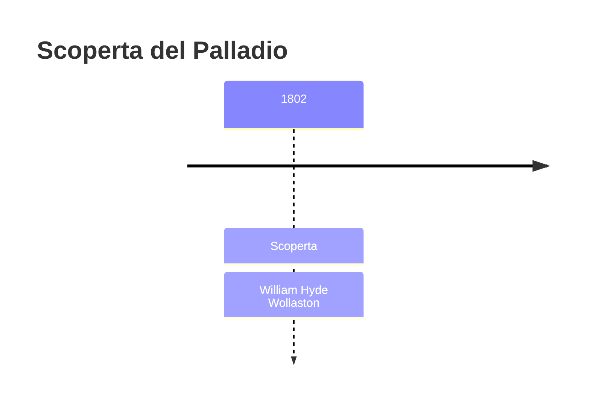
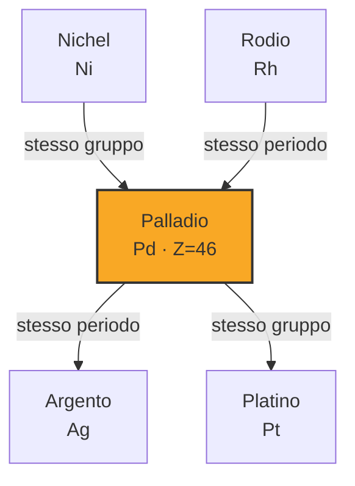
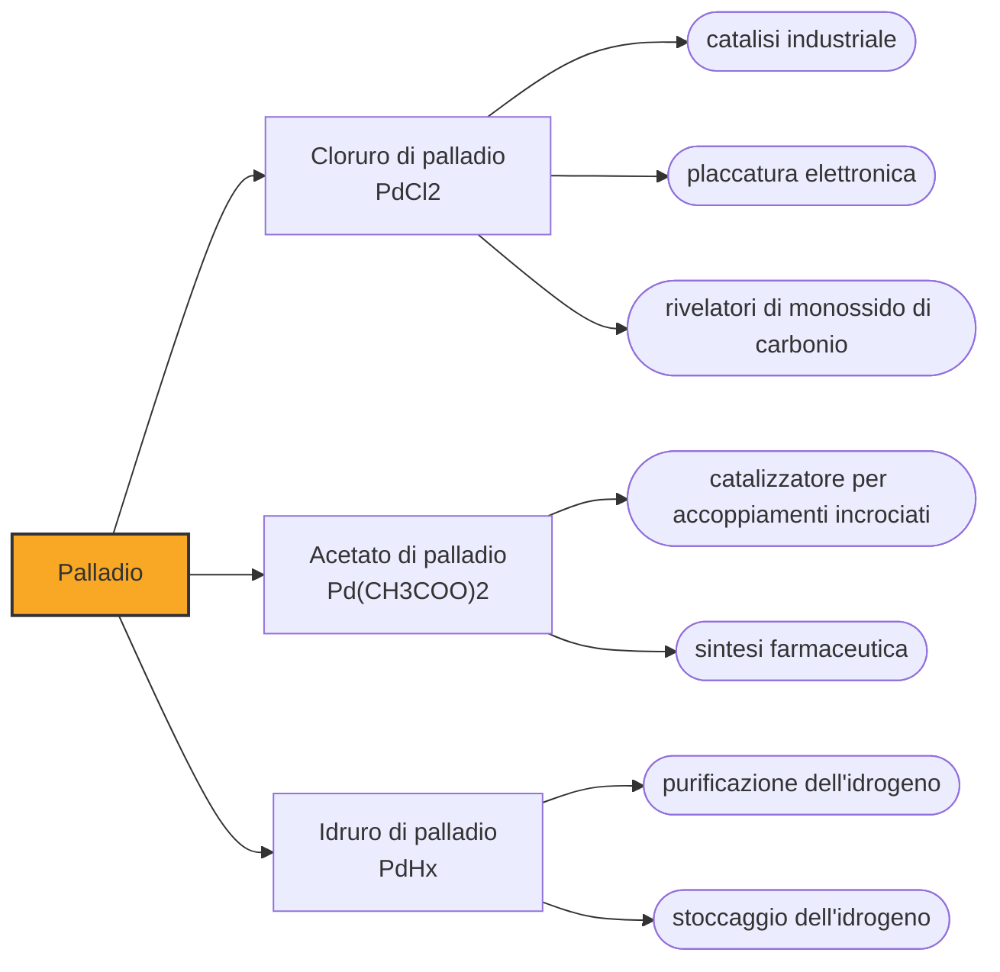

# Palladio (Pd)

> [!abstract] 42° elemento scoperto — 1802
> Nel 1803 un metallo mai visto comparve in vendita nella vetrina di una bottega di Soho, con un volantino che ne elencava le proprietà e non diceva chi lo avesse scoperto. Ci vollero due anni perché l'autore uscisse allo scoperto.

Il palladio è l'unico elemento della tavola periodica il cui orbitale s più esterno resta vuoto nello stato fondamentale, una configurazione che non si ripete in nessuno degli altri centodiciassette. È anche il più leggero e il più fusibile dei sei metalli del gruppo del platino, e uno dei catalizzatori su cui si regge la chimica industriale di oggi.

## Cronologia della scoperta

> [!info] Nota sulla cronologia
> Wollaston annotò il metallo nel taccuino di laboratorio nel luglio 1802 e ne mise in vendita campioni anonimi nell'aprile 1803: rivelò di esserne lo scopritore solo con la memoria del 1805.

## Storia della scoperta

Il 24 dicembre 1800 due chimici inglesi conosciutisi a Cambridge, William Hyde Wollaston e Smithson Tennant, comprarono per 795 sterline una partita di platina greggia sudamericana e si misero in società per raffinarla e rivenderla. Il denaro era quasi tutto di Tennant, che aveva ereditato un patrimonio; l'abilità sperimentale era di Wollaston, che dalla metallurgia del platino sperava di arricchirsi. Si divisero anche il lavoro seguendo la materia: a Wollaston la parte che l'acqua regia scioglieva, a Tennant la polvere nera che restava sul fondo.

Nel luglio del 1802 Wollaston annotò sul taccuino di laboratorio di aver trovato nella soluzione un metallo nobile che nessuno aveva descritto; in agosto gli diede il nome di palladio, dall'asteroide Pallade che Heinrich Olbers aveva individuato nel marzo di quello stesso anno. Il procedimento era suo: sciolta la platina in acqua regia e fatto precipitare il platino come cloroplatinato d'ammonio, dal liquido residuo il cianuro di mercurio faceva cadere il cianuro di palladio, che scaldato lasciava il metallo.

Invece di pubblicare, Wollaston fece stampare un volantino anonimo intitolato «Palladium, or New Silver» e nell'aprile del 1803 lo espose, con i campioni in vendita, nella vetrina della bottega di Mrs Forster in Gerrard Street, a Soho. Chi voleva poteva comprarne un pezzo per cinque scellini, mezza ghinea o una ghinea. Un elemento nuovo messo in commercio da un venditore senza nome non somigliava a niente che la chimica riconoscesse come annuncio scientifico.

Il chimico irlandese Richard Chenevix, che a Londra godeva di ottima reputazione, sospettò una frode e comprò l'intera scorta. Dopo due settimane di lavoro concluse che il materiale aveva sì tutte le proprietà annunciate, ma che non era affatto un elemento: era una lega di platino e mercurio. Pubblicò l'analisi nelle Philosophical Transactions, e nello stesso 1803 la Royal Society gli assegnò la medaglia Copley.

La replica arrivò per la stessa via anonima: nel dicembre del 1803 una lettera offriva venti sterline a chi fosse riuscito a fabbricare in pubblico venti grani di palladio partendo da platino e mercurio. Nessuno raccolse la sfida. Nel 1805 Wollaston pubblicò a proprio nome la memoria sulla scoperta del palladio, rivelando di essere anche l'autore del volantino, dei campioni in vendita e del premio. Con Chenevix rimase in buoni rapporti; Chenevix lasciò la chimica e si diede al teatro.

## Posizione nella tavola periodica

## Caratteristiche

Palladio, platino, rodio, rutenio, iridio e osmio formano il gruppo del platino: sei metalli che condividono chimica, giacimenti e procedimenti di raffinazione. Il palladio è quello che fonde più in basso, a 1555 °C, ed è anche il meno denso, con dodici grammi per centimetro cubo contro i 22,6 dell'osmio. È inoltre quello che si estrae in quantità maggiori.

La proprietà che lo distingue da tutti è l'affinità per l'idrogeno: a temperatura ambiente il palladio metallico ne assorbe oltre novecento volte il proprio volume, ospitandolo negli interstizi del reticolo cristallino sotto forma di idruro, e lo rilascia quando viene scaldato. Su questo si basano le membrane che purificano l'idrogeno lasciandolo passare e trattenendo tutto il resto.

Nei composti il palladio si presenta quasi sempre nello stato di ossidazione +2, ma la gamma nota va dallo zero dei complessi metallorganici fino a +5, passando per +1, +3 e +4. È proprio questa disponibilità a cambiare valenza senza fatica, legando e rilasciando molecole a ripetizione, a farne uno dei catalizzatori più versatili della chimica moderna.

### Dati fisico-chimici

| Proprietà | Valore |
|---|---|
| Numero atomico | 46 |
| Massa atomica | 106,421 u |
| Categoria | Metallo di transizione |
| Gruppo | 10 |
| Periodo | 5 |
| Blocco | d |
| Configurazione elettronica | [Kr] 4d¹⁰ |
| Punto di fusione | 1554,9 °C |
| Punto di ebollizione | 2962,9 °C |
| Densità | 12,023 g/cm³ |
| Stati di ossidazione | 0, +1, +2, +3, +4, +5 |

## Struttura atomica

![[atomo-Palladio.svg]]

## Usi e presenza in natura

Più della metà del palladio estratto finisce nei convertitori catalitici delle automobili, dove insieme a platino e rodio ossida il monossido di carbonio e gli idrocarburi incombusti trasformandoli in anidride carbonica e acqua. Secondo lo USGS nel 2024 le miniere del mondo ne hanno prodotto circa 190 tonnellate: 75 in Russia, che è il primo produttore, 72 in Sudafrica, 15 in Canada e altrettante in Zimbabwe. Nello stesso anno il recupero dalle marmitte esauste ne ha restituite 45 tonnellate nei soli Stati Uniti.

Il resto si divide fra l'elettronica, dove il palladio sta negli elettrodi dei condensatori ceramici multistrato di computer e telefoni, l'odontoiatria, la gioielleria dell'oro bianco e la chimica di sintesi: le reazioni di accoppiamento incrociato catalizzate dal palladio, premiate con il Nobel per la chimica del 2010, sono oggi il modo abituale di costruire legami fra atomi di carbonio nei farmaci e nei materiali.

## Curiosità

Alla fine degli anni Novanta le forniture russe di palladio arrivarono sul mercato con ritardi e interruzioni, il prezzo salì a livelli mai visti e la Ford, temendo di dover fermare le linee di montaggio, accumulò scorte del metallo. Quando nel 2001 il prezzo crollò, la perdita sfiorò il miliardo di dollari.

A rendere ricco Wollaston non fu però il palladio, ma il platino: mise a punto il primo procedimento capace di lavorarne il minerale in quantità industriali, ne tenne segreti i dettagli per una ventina d'anni restando l'unico fornitore in Inghilterra, e li dettò soltanto in punto di morte, nel 1828.

## Nella cronologia

← Precedente: [[Niobio]] (1801)
→ Successivo: [[Tantalio]] (1802)

Epoca: [[L'età dell'elettrolisi]] · Scopritore: [[William Hyde Wollaston]]

## Fonti

- [Two men, two centuries, four metals](https://www.chemistryworld.com/features/two-men-two-centuries-four-metals/3004876.article) — consultata il 07/09/2026
- [Palladium](https://en.wikipedia.org/wiki/Palladium) — consultata il 07/09/2026
- [Palladium — Royal Society of Chemistry](https://periodic-table.rsc.org/element/46/palladium) — consultata il 07/09/2026
- [USGS Mineral Commodity Summaries 2025 — Platinum-Group Metals](https://pubs.usgs.gov/periodicals/mcs2025/mcs2025-platinum-group.pdf) — consultata il 07/09/2026

---

> [!warning] Avvertenza
> Questo progetto è stato realizzato con l'assistenza di sistemi di
> intelligenza artificiale. I contenuti sono verificati sulle fonti citate,
> ma **possono contenere errori e imprecisioni**: prima di riutilizzarli,
> controlla la fonte.
