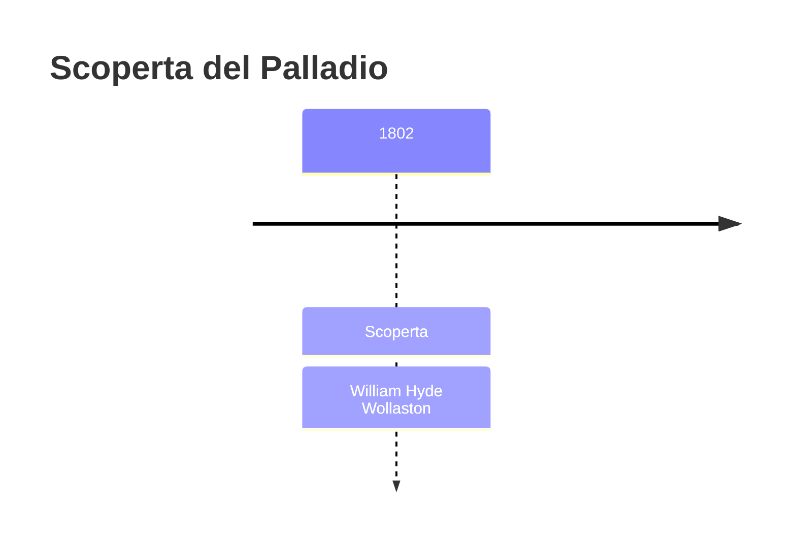
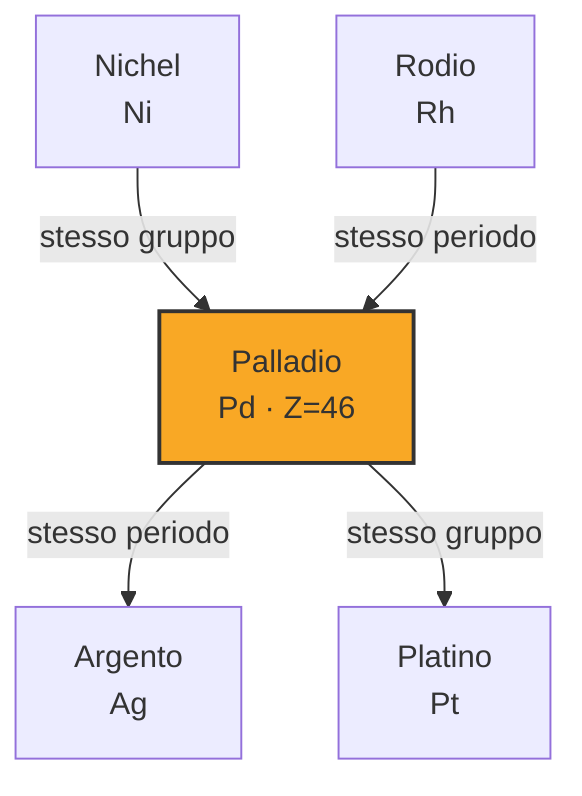

# Palladio (Pd)

> [!abstract] 42° elemento scoperto — 1802
> 

## Cronologia della scoperta

## Storia della scoperta

## Posizione nella tavola periodica

## Caratteristiche

### Dati fisico-chimici

| Proprietà | Valore |
|---|---|
| Numero atomico | 46 |
| Massa atomica | 106,421 u |
| Categoria | Metallo di transizione |
| Gruppo | 10 |
| Periodo | 5 |
| Blocco | d |
| Configurazione elettronica | [Kr] 4d¹⁰ |
| Punto di fusione | 1554,9 °C |
| Punto di ebollizione | 2962,9 °C |
| Densità | 12,023 g/cm³ |
| Stati di ossidazione | — |

## Struttura atomica

![[atomo-Palladio.svg]]

## Usi e presenza in natura

## Nella cronologia

← Precedente: [[Niobio]] (1801)
→ Successivo: [[Tantalio]] (1802)

Epoca: [[L'età dell'elettrolisi]] · Scopritore: [[William Hyde Wollaston]]

## Fonti

