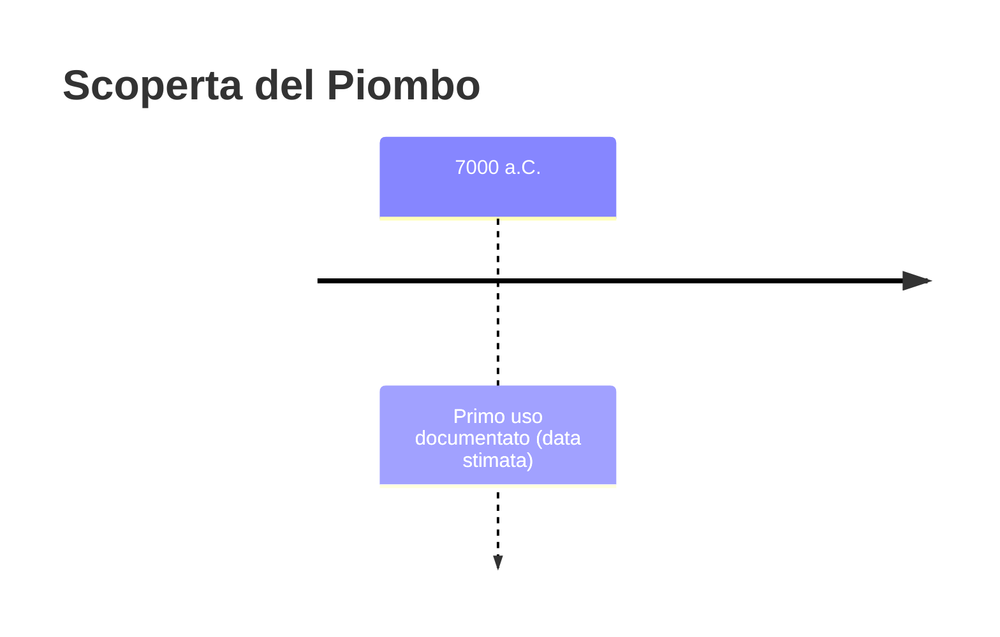
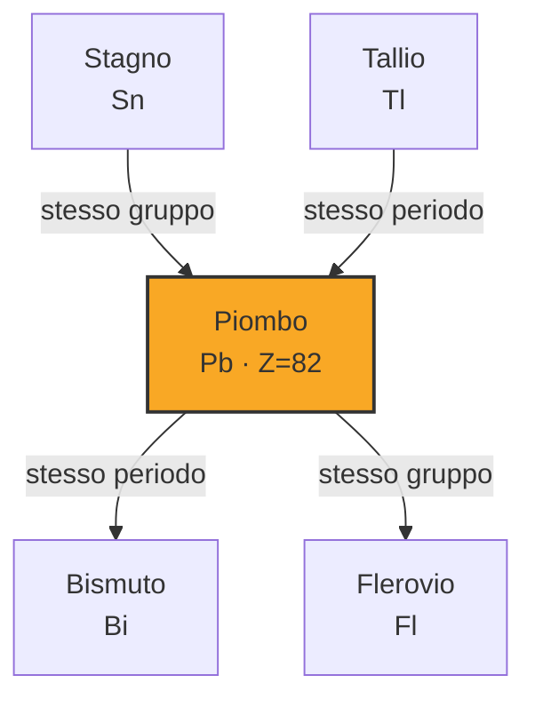
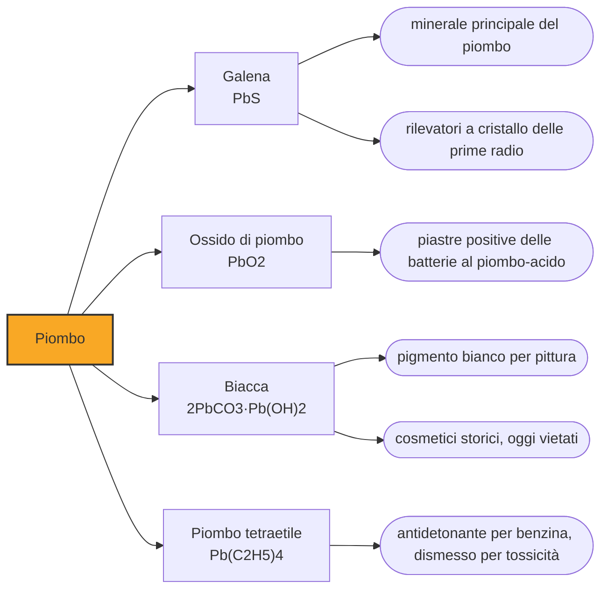

# Piombo (Pb)

> [!abstract] 4° elemento scoperto — 7000 a.C.
> Il piombo è il metallo che l'umanità ha amato per tutte le ragioni sbagliate: facile da fondere, facile da lavorare, dolce al gusto. Ci sono voluti novemila anni per capire che avvelena.

Il piombo non ha uno scopritore, e la data convenzionale del VII millennio a.C. indica il momento in cui compare la capacità di estrarlo dal minerale. È uno dei primissimi metalli fusi dall'uomo, e non per caso: si ricava con poco calore da un minerale vistoso, e una volta ottenuto si taglia quasi con l'unghia.

## Cronologia della scoperta

> [!info] Nota sulla cronologia
> La data convenzionale indica le prime tracce di fusione del piombo dalla galena, non un atto di scoperta: il piombo non ha scopritore.

## Storia della scoperta

Il minerale di partenza è la galena, solfuro di piombo, che si riconosce a colpo d'occhio per i suoi cristalli cubici grigi e brillanti. Per liberarne il metallo basta scaldarla in aria: molto meno del calore necessario al rame, e infinitamente meno di quello che chiederà il ferro. È per questo una delle prime operazioni metallurgiche riuscite, e le prime tracce risalgono al VII millennio a.C.

Sui primissimi reperti conviene essere precisi, perché la letteratura divulgativa li ripete in modo impreciso. Le perline dal sito neolitico di Çatalhöyük, in Anatolia, sono state a lungo citate come il più antico piombo fuso del mondo; analisi successive hanno però indicato che si tratta di minerale sagomato, galena e cerussite, non di metallo prodotto per fusione. Un oggetto in piombo metallico quasi puro proviene invece dalla grotta di Ashalim, in Israele, e risale alla fine del V millennio a.C.

Il destino del piombo è legato a quello dell'argento più di quanto sembri. I due metalli si trovano quasi sempre insieme nello stesso minerale, e la tecnica che li separa, la coppellazione, produce argento e lascia piombo come sottoprodotto abbondante. Ogni volta che una civiltà antica ha voluto argento per monetare, ha ottenuto piombo in quantità molto maggiori, e ha dovuto inventarsi come impiegarlo.

Roma porta la produzione di piombo a livelli che il mondo antico non aveva mai visto e che non si rivedranno per oltre un millennio. Il metallo diventa il materiale generico dell'ingegneria idraulica: tubature, cisterne, giunti, sigilli. La parola che ancora usiamo per il mestiere lo ricorda, perché plumbum è il piombo e da lì viene l'inglese plumber.

Che il piombo facesse male era già noto agli antichi. Autori greci e romani descrivono i sintomi dell'intossicazione nei minatori e in chi lavorava il metallo, e Vitruvio raccomanda esplicitamente le tubature di terracotta al posto di quelle di piombo per ragioni di salubrità. Il riconoscimento sistematico del problema arriva però solo nel tardo Ottocento, con la medicina del lavoro.

> [!warning] Questione aperta
> Sui primi oggetti di piombo la letteratura divulgativa ripete un dato ormai superato. Le perline dal livello IX di Çatalhöyük, in Anatolia, sono state pubblicate come piombo fuso del VII millennio a.C. e da lì citate ovunque, ma le analisi successive indicano che si tratta di minerale sagomato, galena e cerussite, e non di metallo ottenuto per fusione. Il più antico oggetto sicuramente in piombo metallico quasi puro è quello della grotta di Ashalim, in Israele, datato alla fine del V millennio a.C. e ricondotto per composizione a minerali del Tauro anatolico. Resta comunque solido che la fusione del piombo su piccola scala inizi nel VII millennio a.C., ed è a quella fase che si riferisce la data usata qui.

## Posizione nella tavola periodica

## Caratteristiche

Il piombo è tenero al punto da lasciarsi scalfire con l'unghia, con una durezza Mohs di appena 1,5, e fonde a 327 gradi, una temperatura che un normale fuoco di legna raggiunge senza difficoltà. La sua densità di 11,34 grammi per centimetro cubo lo rende più pesante del ferro e del rame: è il metallo comune che dà quella sensazione di peso sproporzionato rispetto al volume, e che per questo compare in zavorre, piombini da pesca e contrappesi.

In aria il piombo si copre rapidamente di uno strato di ossido opaco che protegge il metallo sottostante dall'ulteriore corrosione, e resiste bene all'acido solforico: è la ragione della sua fortuna nelle batterie. Nei composti compare quasi sempre nello stato di ossidazione +2 e molto più raramente +4, per un fenomeno chiamato effetto della coppia inerte.

La tossicità del piombo non dipende dalla dose isolata ma dall'accumulo: il metallo si deposita nelle ossa e nei tessuti molli e ci resta per anni, interferendo con i sistemi enzimatici e con lo sviluppo del sistema nervoso. Non esiste una soglia sotto la quale sia sicuro, ed è particolarmente dannoso nei bambini, in cui deficit cognitivi permanenti compaiono a concentrazioni molto basse.

### Dati fisico-chimici

| Proprietà | Valore |
|---|---|
| Numero atomico | 82 |
| Massa atomica | 207,21 u |
| Categoria | Metallo post-transizione |
| Gruppo | 14 |
| Periodo | 6 |
| Blocco | p |
| Configurazione elettronica | [Xe] 4f¹⁴ 5d¹⁰ 6s² 6p² |
| Punto di fusione | 327,5 °C |
| Punto di ebollizione | 1748,9 °C |
| Densità | 11,34 g/cm³ |
| Stati di ossidazione | -4, +2, +4 |

## Struttura atomica

![[atomo-Piombo.svg]]

## Usi e presenza in natura

L'uso di gran lunga dominante oggi è la batteria al piombo-acido, inventata nel 1859 e ancora insostituita per l'avviamento dei motori a combustione e per gli accumuli stazionari: è pesante ed economica, esattamente ciò che serve quando il peso non è un problema. La produzione mondiale continua a crescere per questa ragione, e più della metà del piombo immesso sul mercato proviene oggi dal riciclo delle batterie esauste.

La densità del piombo lo rende efficace nello schermare le radiazioni ionizzanti, perché la probabilità che un raggio gamma venga assorbito cresce con la densità del materiale che attraversa. Da qui i grembiuli usati in radiologia, le pareti delle sale radiodiagnostiche e i contenitori per il materiale radioattivo.

Molti impieghi storici sono invece stati smantellati per legge. Il piombo tetraetile, aggiunto alla benzina dal 1923 come antidetonante, ha disperso il metallo nell'aria di tutto il pianeta per oltre mezzo secolo prima di essere eliminato a partire dagli anni Settanta; le vernici al piombo e le saldature per tubature di acqua potabile hanno seguito la stessa strada.

## Curiosità

Il piombo è stato per secoli un cosmetico. La biacca, o cerussa, un carbonato basico di piombo di un bianco coprente e luminoso, si stendeva sul viso per ottenere il pallore di moda: la variante veneziana era la più costosa e la più ambita nell'Europa fra Cinquecento e Settecento. Provocava caduta dei capelli e dei denti, danni alla pelle e declino cognitivo, e più il danno avanzava più serviva biacca per coprirlo.

I Romani addolcivano il vino e la frutta conservata con il sapa, uno sciroppo ottenuto facendo bollire a lungo il mosto. Le ricette arrivate fino a noi, da Catone a Columella a Plinio, prescrivono di cuocerlo in recipienti di piombo, e le riproduzioni di laboratorio mostrano che così il metallo passa nello sciroppo in quantità consistenti: l'acido dell'uva lo attacca e forma acetato, che per giunta è dolce.

Da qui nasce la tesi, in circolazione dall'Ottocento, che l'avvelenamento da piombo abbia causato il declino dell'Impero romano. Gli studi recenti la ridimensionano parecchio: il vasellame di piombo compare di rado negli scavi domestici, e le analisi degli scheletri non mostrano l'intossicazione diffusa e trasversale alle classi sociali che la tesi richiederebbe. Che i Romani si avvelenassero un po' è fuori discussione; che sia stato quello a far cadere l'impero è tutt'altra affermazione.

## Nella cronologia

← Precedente: [[Rame]] (9000 a.C.)
→ Successivo: [[Ferro]] (5000 a.C.)

Epoca: [[Antichità]]

## Fonti

- [Lead](https://en.wikipedia.org/wiki/Lead) — consultata il 07/09/2026
- [The Earliest Lead Object in the Levant (PLOS ONE)](https://journals.plos.org/plosone/article?id=10.1371%2Fjournal.pone.0142948) — consultata il 07/09/2026
- [Roman lead poisoning theory](https://en.wikipedia.org/wiki/Roman_lead_poisoning_theory) — consultata il 07/09/2026
- [Venetian ceruse](https://en.wikipedia.org/wiki/Venetian_ceruse) — consultata il 07/09/2026

---

> [!warning] Avvertenza
> Questo progetto è stato realizzato con l'assistenza di sistemi di
> intelligenza artificiale. I contenuti sono verificati sulle fonti citate,
> ma **possono contenere errori e imprecisioni**: prima di riutilizzarli,
> controlla la fonte.
