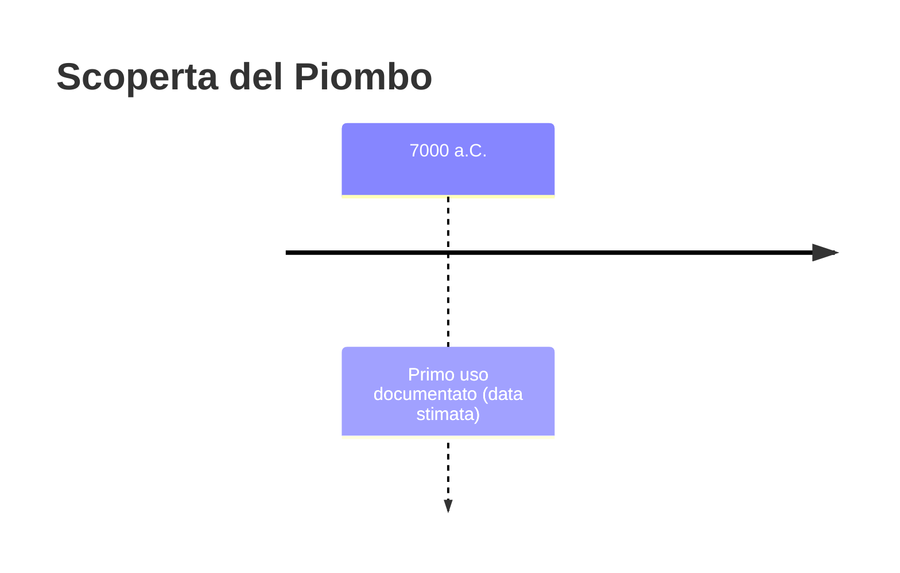
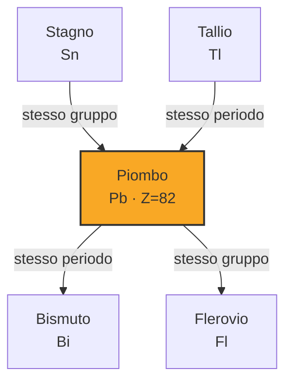

# Piombo (Pb)

> [!abstract] 4° elemento scoperto — 7000 a.C.
> 

## Cronologia della scoperta

## Storia della scoperta

## Posizione nella tavola periodica

## Caratteristiche

### Dati fisico-chimici

| Proprietà | Valore |
|---|---|
| Numero atomico | 82 |
| Massa atomica | 207,21 u |
| Categoria | Metallo post-transizione |
| Gruppo | 14 |
| Periodo | 6 |
| Blocco | p |
| Configurazione elettronica | [Xe] 4f¹⁴ 5d¹⁰ 6s² 6p² |
| Punto di fusione | 327,5 °C |
| Punto di ebollizione | 1748,9 °C |
| Densità | 11,34 g/cm³ |
| Stati di ossidazione | — |

## Struttura atomica

![[atomo-Piombo.svg]]

## Usi e presenza in natura

## Nella cronologia

← Precedente: [[Rame]] (9000 a.C.)
→ Successivo: [[Ferro]] (5000 a.C.)

Epoca: [[Antichità]]

## Fonti

