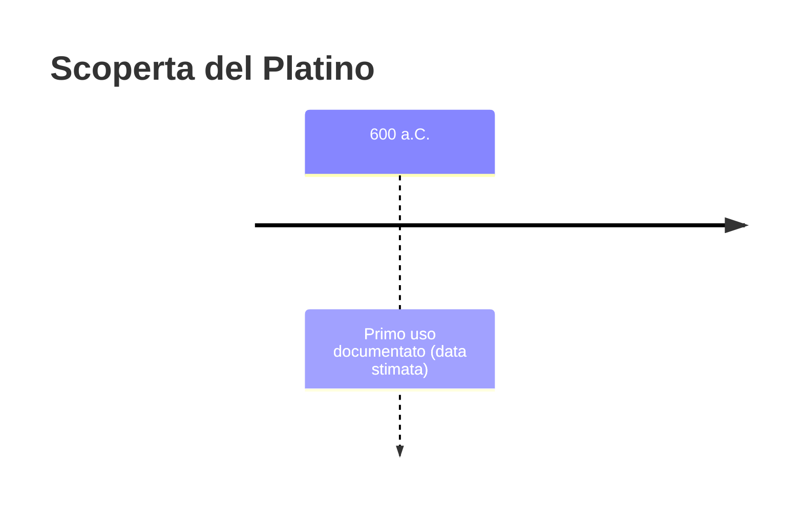
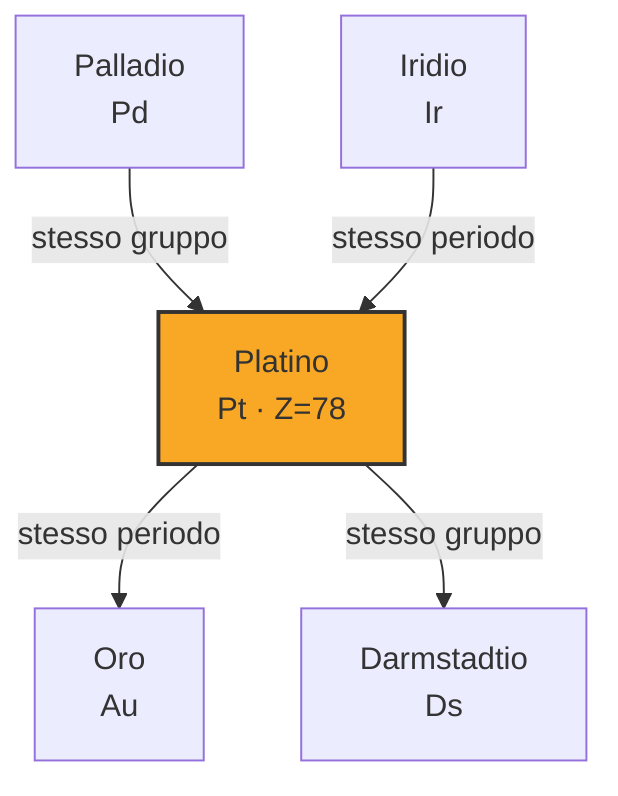

# Platino (Pt)

> [!abstract] 12° elemento scoperto — 600 a.C.
> 

## Cronologia della scoperta

## Storia della scoperta

## Posizione nella tavola periodica

## Caratteristiche

### Dati fisico-chimici

| Proprietà | Valore |
|---|---|
| Numero atomico | 78 |
| Massa atomica | 195,0849 u |
| Categoria | Metallo di transizione |
| Gruppo | 10 |
| Periodo | 6 |
| Blocco | d |
| Configurazione elettronica | [Xe] 4f¹⁴ 5d⁹ 6s¹ |
| Punto di fusione | 1768,3 °C |
| Punto di ebollizione | 3824,9 °C |
| Densità | 21,45 g/cm³ |
| Stati di ossidazione | — |

## Struttura atomica

![[atomo-Platino.svg]]

## Usi e presenza in natura

## Nella cronologia

← Precedente: [[Zinco]] (1000 a.C.)
→ Successivo: [[Arsenico]] (300)

Epoca: [[Antichità]]

## Fonti

