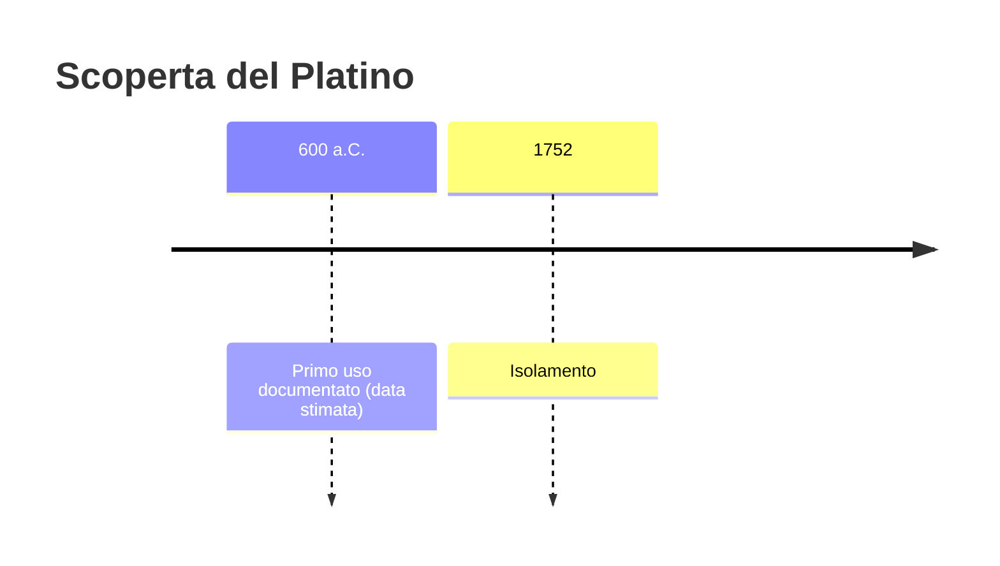
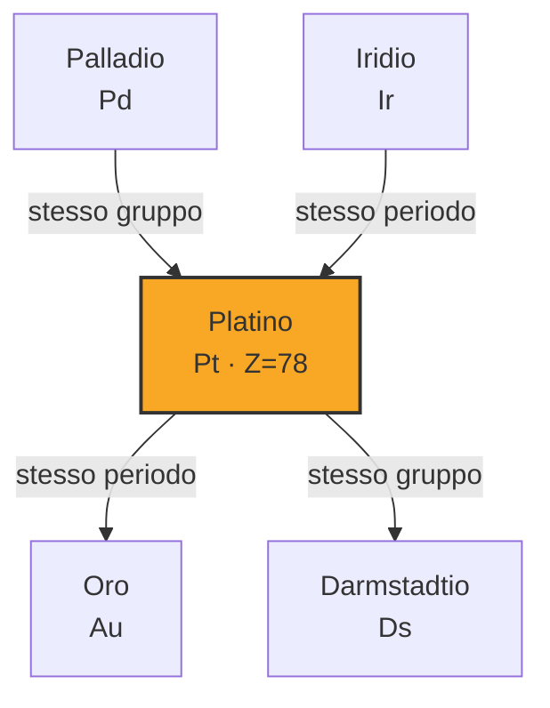
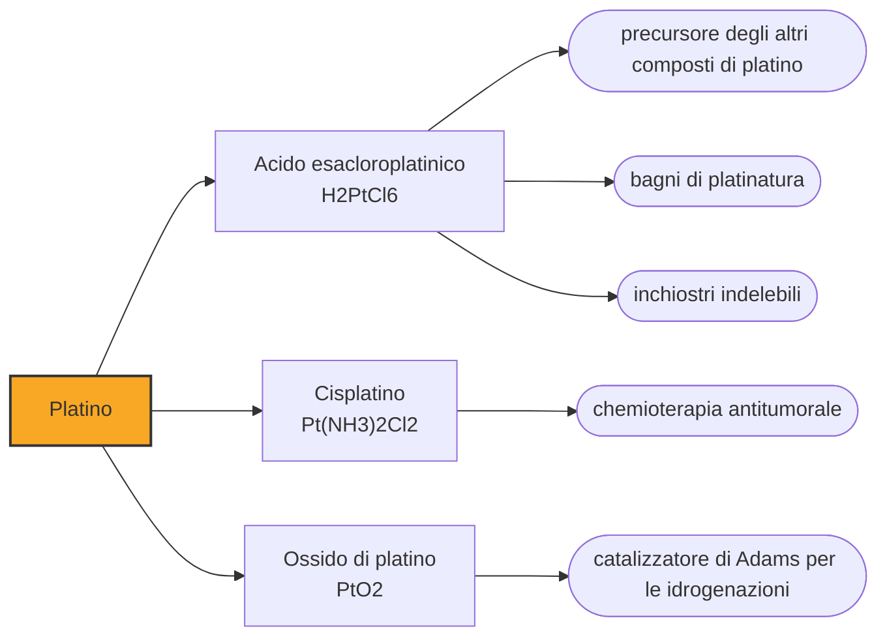

# Platino (Pt)

> [!abstract] 12° elemento scoperto — 600 a.C.
> Millesettecentosessantotto gradi: nessuna fornace antica ci arriva neanche lontanamente. Eppure sulla costa pacifica del Sud America c'è chi lavorava il platino secoli prima di Cristo, aggirando il problema invece di risolverlo.

Il platino è un metallo bianco, pesantissimo e praticamente inattaccabile: non arrugginisce, non annerisce, non si scioglie negli acidi comuni. Le stesse doti che oggi lo rendono prezioso lo hanno reso per secoli inutilizzabile, perché un metallo che non si fonde e non reagisce è un metallo con cui non si può fare niente.

## Cronologia della scoperta

> [!info] Nota sulla cronologia
> La data convenzionale si riferisce alla cultura La Tolita della costa pacifica sudamericana, che lavorava il platino per sinterizzazione. In Europa il metallo entra nella letteratura scientifica con la descrizione di Henrik Teofilus Scheffer nel 1752, dopo i campioni raccolti da Charles Wood nel 1741.

## Storia della scoperta

Nella regione di Esmeraldas, sulla costa pacifica dell'attuale Ecuador, gli orafi della cultura La Tolita risolsero il problema del punto di fusione ignorandolo. Setacciavano dai fiumi i granuli di platino nativo, li mescolavano a polvere d'oro e scaldavano l'impasto: l'oro, che fonde molto più in basso, rammolliva e faceva da legante fra i granuli di platino, che restavano solidi. Il pezzo veniva poi martellato e ricotto a ripetizione finché la massa non diventava omogenea e lavorabile.

La tecnica ha un nome moderno, sinterizzazione, e consiste nel far coalescere una polvere metallica senza mai portarla a fusione. Le analisi al microscopio elettronico condotte sugli oggetti di quella regione indicano che non superarono mai i millecento gradi e che con ogni probabilità non ci fu mai fase liquida di platino. Il risultato sono maschere e ornamenti in cui il bianco del platino e il giallo dell'oro convivono in una placcatura di venticinque millesimi di millimetro: una tecnologia che l'Europa raggiungerà con circa quattordici secoli di ritardo.

Gli europei che arrivano in quelle regioni non ereditano nulla di quel sapere. La prima menzione a stampa è del 1557, quando l'umanista Giulio Cesare Scaligero descrive fra Darién e il Messico un metallo sconosciuto che nessun fuoco e nessun artificio spagnolo è ancora riuscito a liquefare. Nelle sabbie aurifere del Chocó, in Colombia, il metallo si presenta mescolato all'oro che si sta cercando, e non essendo fusibile è soltanto una scocciatura: gli spagnoli lo chiamano platina, cioè argentino, diminutivo spregiativo di plata.

Quando i minatori del Chocó scoprono che la platina serve benissimo ad allungare l'oro senza che si veda, il fastidio diventa un problema di stato. La corona spagnola ne vieta l'esportazione e impone che tutto l'oro del Chocó destinato alla zecca venga ispezionato e ripulito del platino, affidato a funzionari incaricati: quando se n'era accumulato abbastanza, lo si portava al fiume Bogotá o al Cauca e lo si buttava dentro. Nel luglio del 1731 una di queste operazioni scaricò nel Bogotá i sacchi trasportati da un mulo.

Il platino entra nella scienza europea a tappe. Nel 1735 il marinaio e scienziato Antonio de Ulloa osserva di persona l'estrazione in Colombia e Perù, e ne pubblica la descrizione nel 1748, definendolo né separabile né calcinabile. Nel 1741 il metallurgista inglese Charles Wood ne procura campioni colombiani a William Brownrigg, che li presenta alla Royal Society nel 1750 sottolineando che di quel minerale non esiste menzione in alcun trattato noto. Nel 1752 lo svedese Henrik Teofilus Scheffer ne pubblica la descrizione compiuta, lo chiama oro bianco e riesce a fonderlo aiutandosi con l'arsenico.

> [!warning] Questione aperta
> Datare la lavorazione precolombiana del platino è più difficile di quanto le fonti divulgative lascino intendere. La cultura La Tolita, sulla costa fra l'attuale Ecuador e la Colombia meridionale, è collocata all'incirca fra il 600 a.C. e il 200 d.C., e la data adottata qui prende l'estremo antico di quell'intervallo. Il margine di incertezza è però ampio, perché la maggior parte degli oggetti di platino della regione non proviene da scavi controllati ma dal mercato antiquario, e senza contesto stratigrafico la datazione resta indiretta. Va aggiunto che quei metallurgisti non lavoravano platino puro, bensì granuli alluvionali di metalli del gruppo del platino, con palladio, rodio e iridio mescolati.

## Posizione nella tavola periodica

## Caratteristiche

Il platino massiccio non si ossida in aria a nessuna temperatura, resiste agli acidi presi singolarmente e cede soltanto all'acqua regia, la miscela di acido nitrico e cloridrico. Fonde a millesettecentosessantotto gradi ed è fra le sostanze più dense che esistano, ventuno volte e mezzo l'acqua: un litro di platino pesa più di venti chili.

L'inerzia chimica del platino convive con una proprietà che sembra contraddirla: è uno dei catalizzatori più potenti conosciuti. La sua superficie adsorbe le molecole dei gas, le tiene ferme nella posizione giusta e ne indebolisce i legami, permettendo reazioni che altrimenti richiederebbero temperature molto più alte, senza che il metallo si consumi. Quanto alla sua chimica, gli stati di ossidazione noti coprono un intervallo insolitamente largo, dal meno tre al più sei, ma quelli che contano davvero sono due: più due, tipico dei composti piani quadrati, e più quattro.

### Dati fisico-chimici

| Proprietà | Valore |
|---|---|
| Numero atomico | 78 |
| Massa atomica | 195,0849 u |
| Categoria | Metallo di transizione |
| Gruppo | 10 |
| Periodo | 6 |
| Blocco | d |
| Configurazione elettronica | [Xe] 4f¹⁴ 5d⁹ 6s¹ |
| Punto di fusione | 1768,3 °C |
| Punto di ebollizione | 3824,9 °C |
| Densità | 21,45 g/cm³ |
| Stati di ossidazione | -3, -2, -1, 0, +1, +2, +3, +4, +5, +6 |

## Struttura atomica

![[atomo-Platino.svg]]

## Usi e presenza in natura

Oggi la destinazione principale del platino è la marmitta catalitica delle automobili, che da sola vale poco meno di due quinti della domanda mondiale: sulla superficie del metallo gli idrocarburi incombusti e il monossido di carbonio degli scarichi finiscono di bruciare in anidride carbonica e acqua. Circa un quarto va invece in gioielleria, e il resto si divide fra raffinazione del petrolio, industria chimica, vetro ed elettronica. Sono quote di mercato volatili, che oscillano di parecchi punti da un anno all'altro.

C'è poi un impiego che nasce da una scoperta inattesa: il cisplatino, un composto di platino piano quadrato, è stato il capostipite di un'intera famiglia di chemioterapici antitumorali, seguito da carboplatino e oxaliplatino. Il meccanismo è di una violenza elegante, perché il farmaco crea legami trasversali fra i due filamenti del DNA e impedisce alla cellula di duplicarsi.

## Curiosità

Per centoquarant'anni la definizione stessa del chilogrammo è stata un oggetto di platino: un cilindro di lega platino-iridio fabbricato nel 1879 e custodito a Sèvres, la cui massa era il chilogrammo per definizione. Anche il metro campione, fino al 1960, era una barra della stessa lega. Il platino fu scelto proprio perché non cambia: solo un metallo che non si ossida e non si consuma può fare da riferimento per un secolo. Nel 2019 il cilindro è stato pensionato in favore di una definizione basata su una costante fisica.

Il metallo che gli spagnoli buttavano nei fiumi perché intralciava la raccolta dell'oro è oggi fra i più costosi al mondo, e la produzione annua globale sta in poche centinaia di tonnellate, contro le migliaia dell'oro. La svolta non è arrivata da una scoperta ma da una temperatura: appena si è imparato a fonderlo davvero, tutto ciò che lo rendeva inutile è diventato ciò che lo rende prezioso.

## Nella cronologia

← Precedente: [[Zinco]] (1000 a.C.)
→ Successivo: [[Arsenico]] (300 d.C.)

Epoca: [[Antichità]]

## Fonti

- [Platinum](https://en.wikipedia.org/wiki/Platinum) — consultata il 07/09/2026
- [The La Tolita-Tumaco Culture: Master Metalsmiths in Gold and Platinum (D. A. Scott)](https://www.academia.edu/6698631/THE_LA_TOLITA_TUMACO_CULTURE_MASTER_METALSMITHS_IN_GOLD_AND_PLATINUM) — consultata il 07/09/2026
- [K. Lane, Gone Platinum: Contraband and Chemistry in Eighteenth-Century Colombia (Colonial Latin American Review 20:1, 2011, pp. 61-79)](https://doi.org/10.1080/10609164.2011.552549) — consultata il 07/09/2026
