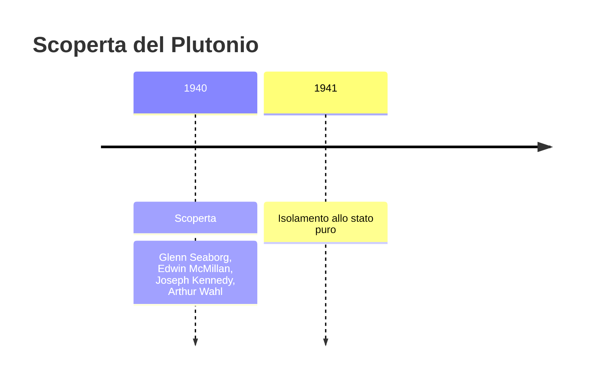
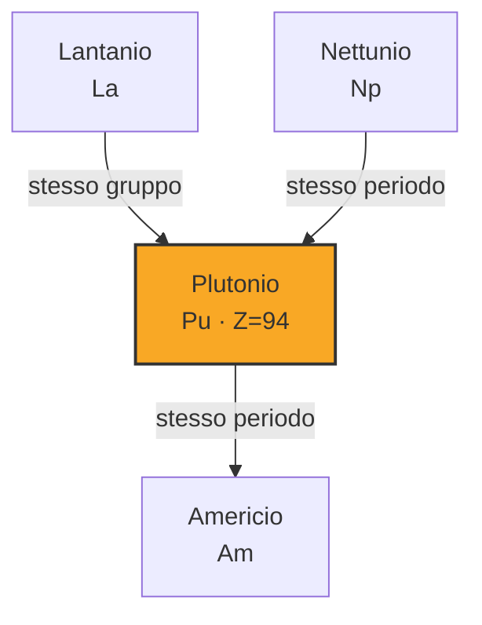
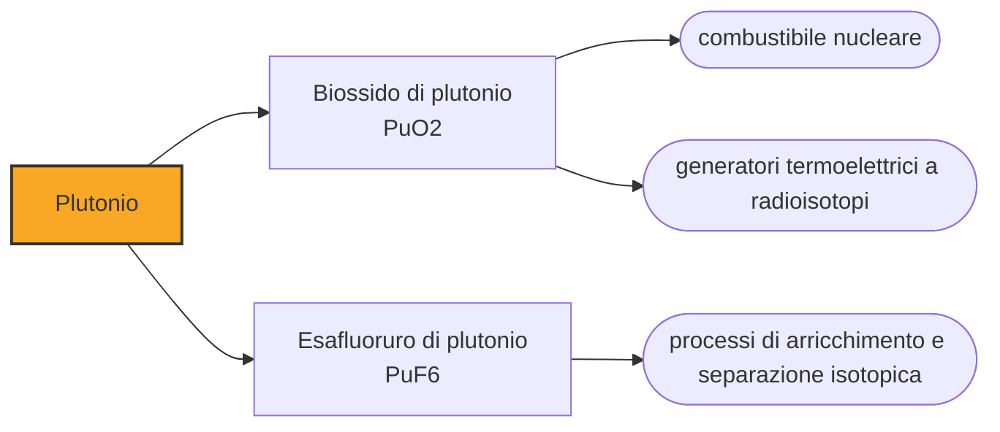

# Plutonio (Pu)

> [!abstract] 93° elemento scoperto — 1940
> Per quasi cinque anni il novantaquattresimo elemento della tavola periodica fu un segreto militare, non una voce di enciclopedia.

Il plutonio non si trova in natura se non in tracce infinitesimali: è un elemento fabbricato dall'uomo in laboratorio, e la sua storia comincia non con una scoperta ma con un bombardamento di particelle dentro un acceleratore.

## Cronologia della scoperta

## Storia della scoperta

Alla fine del 1940, all'Università della California a Berkeley, un gruppo di fisici e chimici guidato da Edwin McMillan aveva da poco identificato l'elemento 93, il nettunio, ottenuto bombardando uranio con neutroni. Era il primo elemento transuranico mai prodotto, oltre l'uranio che allora chiudeva la tavola periodica conosciuta: un risultato che apriva la strada, quasi per logica, alla ricerca dell'elemento successivo.

McMillan lasciò Berkeley per lavorare a un progetto radar bellico, e il testimone passò al chimico Glenn Seaborg, che proseguì la ricerca insieme al fisico Joseph Kennedy e al chimico Arthur Wahl. Fu questo terzetto, con il contributo dello stesso McMillan negli studi iniziali, a portare a termine l'identificazione del nuovo elemento: una scoperta di squadra, senza un singolo nome a cui attribuirla per intero.

Il 14 dicembre 1940 il gruppo bombardò uranio-238 con nuclei di deuterio accelerati dal ciclotrone da sessanta pollici del laboratorio di Berkeley. Il bersaglio, colpito dalle particelle, si trasformò prima in nettunio-238 e poi, per decadimento beta, in un nuovo elemento: il plutonio, nell'isotopo di massa 238. Fu il primo atomo di plutonio mai prodotto, in quantità troppo piccole per essere visto a occhio nudo.

Il 23 e 24 febbraio 1941, nella stanza 307 del Gilman Hall di Berkeley, oggi monumento storico nazionale, Seaborg, Kennedy e Wahl identificarono chimicamente un secondo isotopo, il plutonio-239, prodotto con un procedimento simile. Questa data è quella più spesso indicata come il momento ufficiale della scoperta del plutonio, perché fu allora che le sue proprietà chimiche vennero isolate e confermate con certezza.

Il 28 marzo 1941 Seaborg, Kennedy e il fisico Emilio Segrè dimostrarono che il plutonio-239 era fissile con neutroni lenti, proprio come l'uranio-235: una scoperta di enorme portata pratica, perché indicava una seconda via, oltre l'arricchimento dell'uranio, per costruire un'arma nucleare.

Consapevoli dell'importanza militare della scoperta, il gruppo di Berkeley scelse di non pubblicarla: temevano che un avversario, in piena guerra mondiale, potesse sfruttare l'informazione per sviluppare un'arma nucleare. Il plutonio rimase un segreto militare per anni, e la sua esistenza fu resa pubblica solo dopo la fine della guerra, nel 1945.

*Per tradizione:* Il nome scelto proseguì la sequenza dei pianeti: dopo l'uranio, chiamato come Urano, e il nettunio, come Nettuno, il nuovo elemento prese il nome da Plutone, allora considerato l'ultimo pianeta del sistema solare. Seaborg scelse le lettere Pu come simbolo, invece del più prevedibile Pl, in parte per uno scherzo goliardico legato all'espressione inglese "P.U.", usata per indicare qualcosa di maleodorante.

> [!warning] Questione aperta
> La data "di scoperta" varia a seconda della fonte perché il processo fu incrementale e in parte segreto: alcuni testi indicano il 14 dicembre 1940 (produzione del plutonio-238 al ciclotrone), altri il 23-24 febbraio 1941 (identificazione chimica del plutonio-239, la data più spesso citata come ufficiale), altri ancora il 28 marzo 1941 (dimostrazione della fissionabilità). Il gruppo scelse inoltre di non pubblicare la scoperta per ragioni di sicurezza legate al progetto dell'arma nucleare, a differenza di ogni altro elemento in questo vault.

## Posizione nella tavola periodica

## Caratteristiche

Il plutonio è un metallo pesante, di colore argenteo che si opacizza rapidamente all'aria formando uno strato di ossido, ed è dotato di una chimica fra le più complesse conosciute: può assumere fino a sei stati di ossidazione diversi, e in certe condizioni diversi stati possono coesistere contemporaneamente nella stessa soluzione.

Fra i metalli, il plutonio ha uno dei comportamenti più bizzarri sotto variazioni di temperatura: esiste in almeno sei forme cristalline diverse a pressione ordinaria, che passando dall'una all'altra cambiano volume anche in modo brusco, un problema serio per chi deve lavorarlo con precisione in componenti meccaniche. Per questo la densità dell'elemento non ha un valore unico da citare: dipende dalla forma cristallina considerata.

Tutti gli isotopi del plutonio sono radioattivi, e alcuni emettono calore in modo continuo e significativo per effetto del loro stesso decadimento: un campione di plutonio-238 è percettibilmente caldo al tatto, una proprietà che si è rivelata utile più che pericolosa in alcune applicazioni.

### Dati fisico-chimici

| Proprietà | Valore |
|---|---|
| Numero atomico | 94 |
| Massa atomica | 244,0 u |
| Categoria | Attinide |
| Gruppo | 3 |
| Periodo | 7 |
| Blocco | f |
| Configurazione elettronica | [Rn] 5f⁶ 7s² |
| Punto di fusione | 639,4 °C |
| Punto di ebollizione | 3231,9 °C |
| Densità | 19,816 g/cm³ |
| Stati di ossidazione | +2, +3, +4, +5, +6, +7 |

## Struttura atomica

![[atomo-Plutonio.svg]]

## Usi e presenza in natura

Il plutonio-239 è il materiale fissile alla base sia delle armi nucleari sia, in combinazione con l'uranio, del combustibile di alcuni reattori di potenza: un chilogrammo che vada incontro a fissione completa libera un'energia equivalente a circa ventunomila tonnellate di tritolo.

Il calore costante generato dal decadimento del plutonio-238, non adatto alle armi ma ideale come fonte di energia stabile, alimenta i generatori termoelettrici a radioisotopi che hanno fornito elettricità alle sonde spaziali dirette verso i confini del sistema solare, dove i pannelli solari non ricevono più luce sufficiente.

In natura il plutonio esiste solo in quantità infinitesimali, come sottoprodotto del decadimento naturale dell'uranio in alcuni minerali: praticamente tutto il plutonio oggi esistente è stato prodotto artificialmente in reattori nucleari, non estratto da una miniera.

## Curiosità

*Per tradizione:* Secondo alcuni resoconti dello stesso Seaborg, il simbolo Pu fu scelto proprio per il suono buffo che richiama l'espressione inglese di disgusto "P.U.", una scelta scherzosa che il gruppo di Berkeley non si aspettava venisse davvero accettata dalla comunità scientifica.

Glenn Seaborg ricevette il premio Nobel per la chimica nel 1951 per la scoperta degli elementi transuranici, plutonio incluso, e resta tuttora l'unica persona ad aver visto il proprio nome assegnato a un elemento chimico, il seaborgio, mentre era ancora in vita.

## Nella cronologia

← Precedente: [[Nettunio]] (1940)
→ Successivo: [[Americio]] (1944)

Epoca: [[Era nucleare]] · Scopritore: [[Glenn Seaborg]], [[Edwin McMillan]], [[Joseph Kennedy]], [[Arthur Wahl]]

## Fonti

- [Atomic number 94 — Plutonium Timeline](https://www.lanl.gov/media/publications/national-security-science/1221-plutonium-timeline) — consultata il 05/09/2026
- [From the Archives: Glenn T. Seaborg and the Discovery of Plutonium](https://elements.lbl.gov/news/from-the-archives-glenn-t-seaborg-and-the-discovery-of-plutonium/) — consultata il 05/09/2026
- [Plutonium](https://en.wikipedia.org/wiki/Plutonium) — consultata il 05/09/2026
