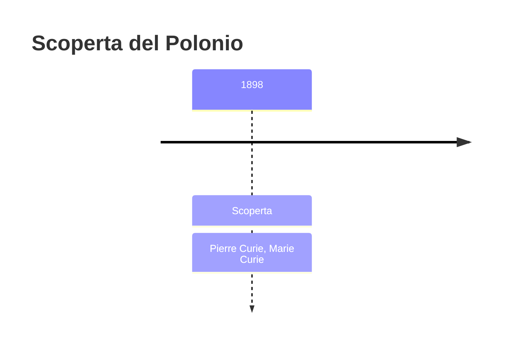
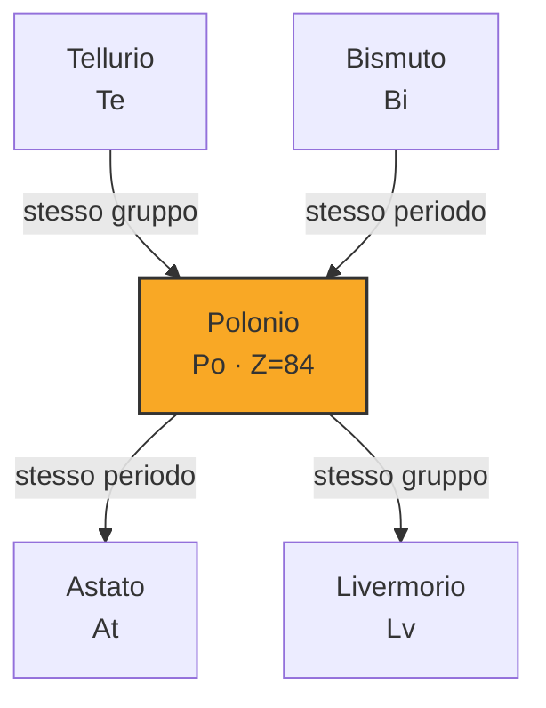
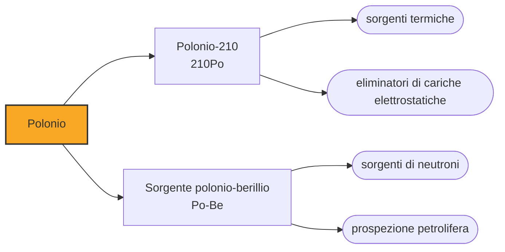

# Polonio (Po)

> [!abstract] 80° elemento scoperto — 1898
> Il minerale, tolti l'uranio e il torio, restava più radioattivo di quanto quei due spiegassero. Dentro quella differenza c'era un elemento nuovo, ed è il primo trovato contando la radiazione invece che guardando la materia.

Il polonio è uno degli elementi più radioattivi e più tossici che si conoscano: un milligrammo di polonio-210 emette tante particelle alfa quanto cinque grammi di radio, e un grammo si scalda da solo oltre i cinquecento gradi. Non ha usi quotidiani, e la sua fama gli viene da un avvelenamento.

## Cronologia della scoperta

## Storia della scoperta

Nel 1898 Marie e Pierre Curie stavano misurando la radioattività dei minerali di uranio con l'elettrometro messo a punto da Pierre e dal fratello. Trovarono un'anomalia: la pechblenda, tolti l'uranio e il torio, restava più attiva di quanto quei due elementi giustificassero. La differenza era di un fattore quattro, troppo grande per essere un errore di misura.

Ne trassero una conclusione che nessuno aveva mai tratto: nel minerale doveva esserci qualcosa di sconosciuto e molto più attivo dell'uranio. Cominciarono allora a separare chimicamente la pechblenda seguendo non il colore, il peso o le reazioni, ma la radioattività: dividevano, misuravano le due frazioni e tenevano quella che scottava di più. Era un metodo analitico nuovo, e il polonio è il primo elemento trovato così.

L'annuncio è del luglio 1898, e il nome lo scelse Marie: polonio, dalla Polonia, il suo paese, che allora non esisteva come stato ed era diviso fra Russia, Prussia e Austria. Era una scelta deliberatamente politica — l'unica del genere nella storia della tavola periodica — e serviva a far comparire il nome di una nazione senza indipendenza dentro la letteratura scientifica di tutto il mondo.

Cinque mesi dopo, con lo stesso metodo, i Curie annunciarono il radio, e fu il radio a prendersi la fama: era più attivo, luminescente, e se ne poteva ottenere abbastanza da farci qualcosa. Il polonio restò l'elemento difficile, presente nella pechblenda in proporzioni cento volte minori e con un'emivita di pochi mesi, che ne rende impossibile l'accumulo.

## Posizione nella tavola periodica

## Caratteristiche

Il polonio-210, l'isotopo più comune, ha un'emivita di 138 giorni ed emette quasi esclusivamente particelle alfa. Un grammo genera circa centoquaranta watt di potenza termica e si porta da solo a temperature di centinaia di gradi: è radioattivo cinquemila volte più del radio, a parità di massa.

Le particelle alfa sono nuclei di elio: pesanti, cariche, e fermate da un foglio di carta o dallo strato morto della pelle. Un emettitore alfa è quindi innocuo finché resta fuori dal corpo, e devastante appena entra, perché deposita tutta la propria energia in pochi micrometri di tessuto vivo. È il motivo per cui la tossicità del polonio si misura in microgrammi.

In natura il polonio esiste solo come prodotto intermedio del decadimento dell'uranio, in quantità infinitesime: la pechblenda ne contiene circa cento microgrammi per tonnellata, ed è la ragione per cui i Curie, che di pechblenda ne lavorarono tonnellate, non riuscirono mai a isolarne una quantità pesabile. Quello che si usa oggi non si estrae ma si fabbrica, irraggiando il bismuto-209 con neutroni in un reattore: una produzione concentrata in pochissimi impianti al mondo, e per questo tracciabile.

### Dati fisico-chimici

| Proprietà | Valore |
|---|---|
| Numero atomico | 84 |
| Massa atomica | 209,0 u |
| Categoria | Metallo post-transizione |
| Gruppo | 16 |
| Periodo | 6 |
| Blocco | p |
| Configurazione elettronica | [Xe] 4f¹⁴ 5d¹⁰ 6s² 6p⁴ |
| Punto di fusione | 253,9 °C |
| Punto di ebollizione | 961,9 °C |
| Densità | 9,196 g/cm³ |
| Stati di ossidazione | -2, +2, +4, +6 |

## Struttura atomica

![[atomo-Polonio.svg]]

## Usi e presenza in natura

Il calore che genera lo ha reso una sorgente termica per lo spazio: i rover sovietici Lunochod 1 e 2, nel 1970 e nel 1973, usavano sorgenti al polonio-210 per tenere caldi i propri strumenti durante le notti lunari, che durano due settimane terrestri e scendono sotto i centocinquanta gradi negativi.

L'impiego industriale più diffuso sfrutta invece la ionizzazione: le particelle alfa rendono conduttiva l'aria intorno alla sorgente e neutralizzano le cariche elettrostatiche che si accumulano sui materiali in movimento. Spazzole e barre al polonio si usavano per scaricare pellicole fotografiche, rotoli di carta, tessuti e fogli di plastica prima della verniciatura, dove una scintilla elettrostatica rovinerebbe il prodotto o innescherebbe un incendio.

Mescolato al berillio, il polonio dà una sorgente di neutroni: le particelle alfa colpiscono i nuclei di berillio e ne strappano neutroni. Sorgenti di questo tipo hanno fatto da innesco nelle prime armi nucleari e si usano nella prospezione petrolifera, dove servono neutroni per interrogare la roccia attorno a un pozzo.

A parità di massa il polonio-210 è circa duecentocinquantamila volte più tossico dell'acido cianidrico, e la dose letale per ingestione sta sotto il microgrammo: una quantità invisibile, insapore, che nessun controllo ordinario intercetta. Proprio questo lo ha reso, una volta, uno strumento.

## Curiosità

Nel 2006 l'ex agente russo Aleksandr Litvinenko morì a Londra dopo tre settimane di malattia inspiegabile; le analisi identificarono una dose letale di polonio-210, somministrata secondo l'inchiesta britannica da due ex agenti russi. È l'unico caso confermato in cui l'estrema tossicità del polonio sia stata usata deliberatamente, ed è anche il motivo per cui la maggior parte delle persone ha sentito nominare questo elemento.

Marie Curie usò il nome del proprio paese per un elemento nel 1898 e ricevette due Nobel, in fisica e in chimica, per il lavoro che ne era seguito. Morì nel 1934 di anemia aplastica, quasi certamente per le radiazioni accumulate: i suoi quaderni di laboratorio sono ancora oggi radioattivi e si consultano firmando una liberatoria.

## Nella cronologia

← Precedente: [[Xenon]] (1898)
→ Successivo: [[Radio]] (1898)

Epoca: [[Spettroscopia e radioattività]] · Scopritori: [[Pierre Curie]], [[Marie Curie]]

## Fonti

- [Polonium](https://en.wikipedia.org/wiki/Polonium) — consultata il 09/09/2026
- [Polonium — Royal Society of Chemistry](https://periodic-table.rsc.org/element/84/polonium) — consultata il 09/09/2026
- [Poisoning of Alexander Litvinenko](https://en.wikipedia.org/wiki/Poisoning_of_Alexander_Litvinenko) — consultata il 09/09/2026
